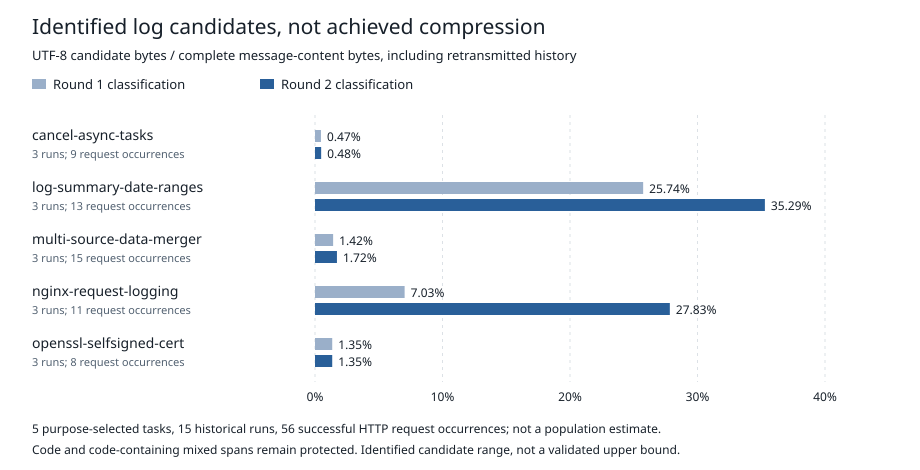

# prompt-compression-billing-bench

Documentation: [current Korean follow-up](docs/experiment/02-follow-up/README.md) ·
[current English follow-up](docs_en/experiment/02-follow-up/README.md) ·
[Korean experiment records](docs/experiment/README.md) (preserved historical index) ·
[English GBB documentation](docs_en/README.md) ·
[snapshot provenance](docs_en/SNAPSHOT.md)

The current follow-up keeps its two attempted studies separate:
[Cache reuse (한국어)](docs/experiment/02-follow-up/cache-reuse/README.md) ·
[Cache reuse (English)](docs_en/experiment/02-follow-up/cache-reuse/README.md) ·
[SWE-Lancer (한국어)](docs/experiment/02-follow-up/swe-lancer/README.md) ·
[SWE-Lancer (English)](docs_en/experiment/02-follow-up/swe-lancer/README.md).
The [Korean](docs/experiment/README.md) and
[English](docs_en/experiment/README.md) experiment indexes are preserved historical
records; their older status text is not the current follow-up entry.

## In three seconds

Measure **candidate share**—code-excluded identified candidate bytes divided by
each task's request-content UTF-8 bytes—without confusing it with achieved
compression, tool estimates, local token counts or provider usage.



| Observed minimum | Observed maximum | Observed sample |
|:---:|:---:|:---:|
| **0.48%** | **35.29%** | **5 purpose-selected tasks** |

These are Terminal-Bench 2.1 purpose-selected tasks, not a representative sample.
Each task aggregates its existing three runs, including retransmitted message history.
Code-reading and mixed-code spans are excluded. This is an **identified candidate
range, not a validated upper bound**. Actual compression rate, quality and billed
savings were not measured.

## Decide in 30 seconds

The chart is generated from [aggregate bytes and sample counts](data/eda/task-candidate-share.csv),
not from a new compression or billing experiment. The instruction classifications
for the two benchmarks contain no review-only task; current performance on mixed
review-and-fix tasks is unmeasured.

The [two-round EDA review (Korean)](docs/eda/README.md) collects the existing
benchmark/input figures and tables with sample counts, denominators and measurement
labels. Its ten figures use relative paths; tool-behavior experiments are separate.

For external sharing, start with the [first-study one-page summary](docs/experiment/01-preliminary-comparison/README.md),
then use the [plain-language Korean summary](docs/experiment/01-preliminary-comparison/plain-language-results-20260917.md),
the [Korean experiment-design appendix](docs/experiment/01-preliminary-comparison/experiment-briefing-20260919.md)
and [plain-language visualization guide](docs/experiment/01-preliminary-comparison/visualization-guide-20260919.md),
then use the [technical evidence report](docs/experiment/01-preliminary-comparison/preliminary-comparison-20260916.md)
for condition-level figures, run identifiers and hashes. The preserved historical
[experiment record (Korean)](docs/experiment/README.md) separates the fixed protocol,
the measured none baseline, static compressor measurements, preliminary comparison
and open decisions as recorded before the current follow-up. The none baseline completed 20 repetitions but stopped
inconclusive under its predeclared rule; the preliminary comparison is one run per
condition, not the preregistered repeated evaluation.

Static token reductions do not establish native quality, prompt-cache behavior,
recovery overhead or cost savings. Setting temperature to zero or reasoning effort
to none does not make a model deterministic or undo the native harness's existing
output elision.

A [deterministic local static-site candidate](docs/pages-static.md) renders the
public allowlist as a navigable first page and evidence documents. Its workflow
builds and checks only; GitHub Pages deployment and repository visibility changes
remain disabled.

## Try it in five minutes

### Cached accountless native run

The repository now has a measured accountless path that makes a real local
model call and applies a native exact-answer judge. One corrected execution with
the pinned Qwen2.5 0.5B snapshot completed in **7.761 seconds** and returned
`wrong_format`. That non-passing verdict is preserved; the proof is about path
completion, not model quality.

Use Python 3.10.12 with the exact versions in
[`requirements/accountless-native.txt`](requirements/accountless-native.txt)
and an already-present model snapshot matching
[`ledgers/accountless-native.json`](ledgers/accountless-native.json). Then choose
a new output root and run ID:

```bash
export ACCOUNTLESS_MODEL_ROOT=/path/to/the/pinned/local/snapshot
export ACCOUNTLESS_NATIVE_OUTPUT_ROOT="$PWD/_work/accountless-native-runs"

python3 -B -m src.accountless_native check ledgers/accountless-native.json
python3 -B -m src.accountless_native run ledgers/accountless-native.json \
  --run-id accountless-native-001
python3 -B -m src.accountless_native verify \
  "$ACCOUNTLESS_NATIVE_OUTPUT_ROOT/accountless-native-001"
```

Exit 0 is a native pass; exit 1 is a completed `wrong_answer` or `wrong_format`.
The cached measurement includes asset preflight, a fresh Python process, runtime
import, model load, inference, judging, and result write. Dependency installation,
model download, and repository clone time are excluded. The proof used no service,
credential, VM, container, paid call, or external provider. It does not establish
cold setup time, representative GSM8K performance, rank, non-inferiority,
determinism, or cost savings. See the [accountless native contract and measured
record](docs/accountless-native.md) for source rights, hashes, timings, the
preserved recorder red, and failure diagnostics.

### Provider-backed benchmark contract check

Run from a clean committed checkout with Python 3.12+ and `uv`. The YAML names
one real Terminal-Bench 2.1 task. The default command validates the task, current
Git commit, public reference ledger and JSON output contract without calling a model.

```bash
uv sync --locked
uv run --locked python run.py experiment examples/experiment/benchmark.yaml
uv run --locked python run.py experiment \
  --verify-result runs/readme-benchmark-result.json
```

The user-facing fields are the experiment type, endpoint environment-variable
name, benchmark name/revision/task, model, condition and JSON output. The wrapper
selects the committed low-level reference ledger and records its SHA-256, replay
protection and retry settings. It detects the current clean `HEAD`; no
`SOURCE_COMMIT` input is needed. `status=checked` with
`outcome=preflight_passed` means the real task identifier and contracts passed
without a provider call. It is not a quality result.

Actual execution is opt-in only:

```bash
uv sync --locked --extra native
# A deployment operator supplies the named endpoint, approved operational ledger,
# benchmark checkout, inventory, queue, retrieval and tokenizer environment values.
uv run --locked python run.py experiment examples/experiment/benchmark.yaml --execute
```

`--execute` verifies that the approved operational ledger changes only the
runtime evidence, approval, calculated-cost ceilings and UTC deadline fields
allowed by the public reference. The fixed call, wall-time, request-size and
output-token boundaries are documented in the
[provider execution safety policy](docs/experiment/execution-safety-policy.md). It then
delegates the selected task to the existing `screening_run --diagnose-task`
path; it does not implement another benchmark engine. The checked path above is
measured in the [current repository validation record](data/experiment/readme-benchmark-validation-20260920.json).
A provider-backed five-minute
completion is a target, not a verified result: this change made no provider call.
`status=failed` with `outcome=technical_incomplete` is not a wrong answer.

The earlier synthetic static example remains a wiring fixture, not the default
five-minute path. Its YAML and result are available in `examples/experiment/`
for offline contract tests only.

For squeez, supply the executable matching the version and SHA-256 in the ledger
through `SQUEEZ_BINARY`. Change **only** `compressor.name` in a ledger copy:

```bash
mkdir -p _work
sed 's/^name = "none"$/name = "squeez"/' ledgers/demo.toml > _work/demo-squeez.toml
uv run --locked python run.py static --source-commit "$SOURCE_COMMIT" _work/demo-squeez.toml
```

The pinned Linux x86-64 binary is version 1.48.4, 2,056,992 bytes, with SHA-256
`ef956365ace3aa5f362847afc000aa008d5b4a26db4ee2c5bcc0d2718d043773`. On
2026-09-19, its versioned release and tag URLs returned `404`. An authenticated
GitHub Actions artifact linked to source commit
`6d7be4e633f04f2276f5384175d435b29141562e` matched the pinned binary, but the
artifact is scheduled to expire on 2026-12-02 and is not a permanent anonymous
download. Keep `SQUEEZ_BINARY` bring-your-own: the npm package's 1.48.4 installer
points to `releases/latest`, so the package version does not pin the downloaded
binary. Verify the final executable's version and SHA-256 before use. There is no
automatic download or fallback to a newer version, and the binary and archive are
not part of this repository's public file set.

## Implementation

- Two static conditions and four native conditions, one frozen-observation pipeline, pinned execution ledgers and result schemas.
- A user-facing YAML request binds to one hash-pinned low-level TOML ledger. `run.py experiment` checks by default and delegates execution to the existing runner; it does not implement a second execution path.
- Separate `tool_reported`, `measured_local` and `measured_billed` fields. No API calls means billing is **not measured**, not a measured zero.
- A reproducible aggregate EDA chart; raw historical requests are not distributed.
- A deterministic static-document renderer with independent Markdown comparison,
  repository-prefix HTTP checks and narrow/wide Chromium checks; it does not deploy.
- A measured [accountless cached local-model path](docs/accountless-native.md)
  for one rights-cleared GSM8K item, separate from the historical
  [Ollama native runner](docs/local-native.md) and not connected to the
  compressor pipeline.
- An opt-in [Harbor/Foundry candidate-compression runner](docs/native-contract.md) for none, squeez, a Headroom paths-only profile and LLMLingua-2, with a shared protected transport, per-task workload metrics, a five-repetition continuation gate and local-first Blob result retrieval. A none baseline is measured; a preliminary native comparison for 26 tasks × four conditions is complete with one run per condition, but the preregistered repeated evaluation remains unexecuted.
- A disabled [local squeez recovery contract](docs/squeez-recovery.md) with byte-exact source verification, run-scoped stores, exact-file cleanup and an owner-only UNIX-socket capability boundary. It is not wired into an agent or the native runner.

## Protection

The offline path applies either **no added compression** (`none`) or **squeez**
to the same hash-bound log spans. Code, mixed-code output, instructions, message
roles and request settings remain protected. The shared pipeline stops on a
protection failure; it does not silently switch to a different baseline path.

The protected-span check is structural, not proof that every log is safe to lose.
The frozen classification and conservative live Harbor policy are separate.

## Reproduce and compare

Replace the directory placeholders with the paths printed by completed runs.

```bash
uv run --locked python run.py static --verify runs/<run-id>
uv run --locked python -m src.compare runs/<none-run-id> runs/<squeez-run-id> \
  --source-commit "$SOURCE_COMMIT" --output _work/static-comparison
uv run --locked python -m src.eda --check
uv run --locked python -m unittest discover -s tests -v
uv run --locked python evidence.py audit-files .
```

Comparison refuses differences beyond `compressor.name`. It emits JSON/CSV,
including a swap proof, task aggregates, local span counts and separate tool diagnostics.
Full stdout, including squeez headers and retrieval markers, counts toward size;
an expanding result is recorded as an expansion rather than hidden.

## Contracts and next steps

The real accountless Ollama path remains available separately, but its historical
cached runs exceeded five minutes. The no-call benchmark check is not a substitute
for measuring provider-backed wall time.
The native path has one real none baseline with verified result retrieval and
host deallocation. A compressor comparison and deployment-wide caller isolation
have not been validated.

| Need | Read |
|---|---|
| First preliminary comparison in one page | [First-study summary](docs/experiment/01-preliminary-comparison/README.md) |
| Experiment-design review and remaining gaps | [Experiment-design appendix](docs/experiment/01-preliminary-comparison/experiment-briefing-20260919.md) |
| Preliminary results in plain Korean | [Plain-language sharing summary](docs/experiment/01-preliminary-comparison/plain-language-results-20260917.md) |
| User-facing benchmark YAML and JSON contract | [Single-task YAML](examples/experiment/benchmark.yaml) · [Result schema](schemas/experiment-result.schema.json) |
| Offline synthetic contract fixture | [Static YAML](examples/experiment/static.yaml) · [Static JSON](examples/experiment/static-result.json) |
| All EDA and preliminary-result charts | [Plain-language visualization guide](docs/experiment/01-preliminary-comparison/visualization-guide-20260919.md) |
| Condition-level evidence, run identifiers and hashes | [Preliminary comparison evidence](docs/experiment/01-preliminary-comparison/preliminary-comparison-20260916.md) |
| Exact execution, provenance, adapter and measurement contracts | [Static contract](docs/static-contract.md) |
| Disabled local squeez source recovery and lifecycle boundary | [Local recovery contract](docs/squeez-recovery.md) |
| Accountless native execution and historical evidence | [Local native runner](docs/local-native.md) |
| Opt-in Foundry path, workload metrics and proposed baseline rule | [Native contract](docs/native-contract.md) |
| Hash-bound cache runtime launcher and its still-required owner context | [Cache reuse contract](docs/cache-reuse.md) |
| Provider-backed Cache execution with zero valid cycles and no comparison | [Complete English execution result](docs_en/experiment/02-follow-up/cache-reuse/execution-20260923.md) |
| Current follow-up study and separate Cache/SWE reading paths | [한국어](docs/experiment/02-follow-up/README.md) · [English](docs_en/experiment/02-follow-up/README.md) |
| Historical protocol, baseline, static compressors and open decisions | [Preserved experiment record](docs/experiment/README.md) |
| Deferred SWE-Lancer candidate evaluation and no-trace boundary | [SWE-Lancer candidate evaluation](docs/experiment/swe-lancer-candidate-evaluation-20260920.md) |
| SWE-Lancer fixed trace with zero valid protocol traces and zero provider calls | [Complete English fixed-trace result](docs_en/experiment/02-follow-up/swe-lancer/fixed-trace-20260923.md) |
| Unsupported paths and readiness gaps | [Status](STATUS.md) |
| What may be shared and what stays private | [Publication grades](docs/publication.md) |
| Third-party provenance and exact license copies | [Third-party notices](THIRD_PARTY_NOTICES.md) |
| Local static first page, checks and non-deployment boundary | [Static Pages candidate](docs/pages-static.md) |

## License

Project-authored source is licensed under the [MIT License](LICENSE).
Third-party materials remain subject to their own terms; see
[Third-party notices](THIRD_PARTY_NOTICES.md). The root license does not grant
rights to unapproved assets or resolve the documented DeepSWE and LLMLingua2
redistribution boundaries.

No raw run, prompt, recovery stash, imported tree or private work note is published automatically.
