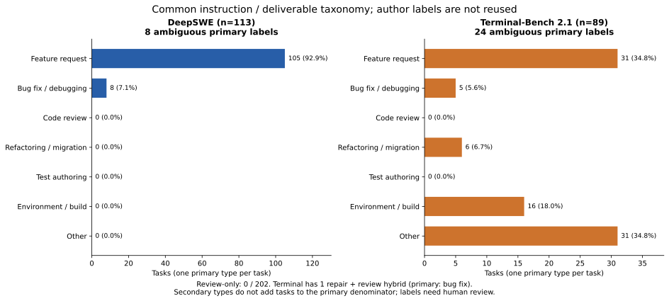
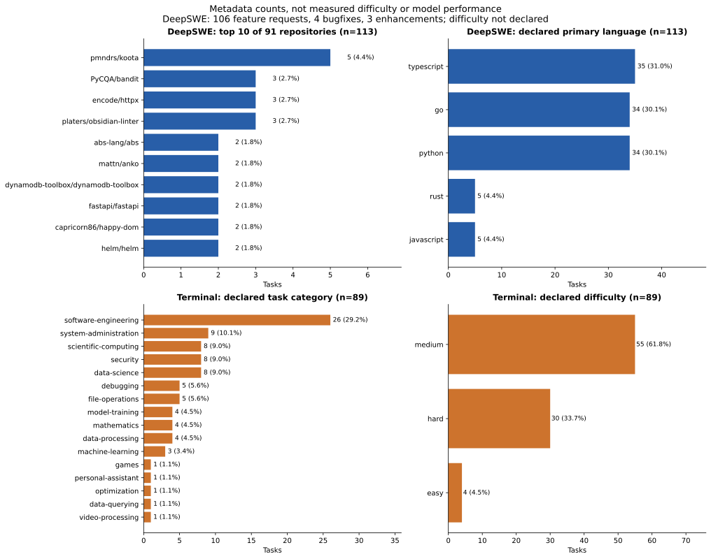
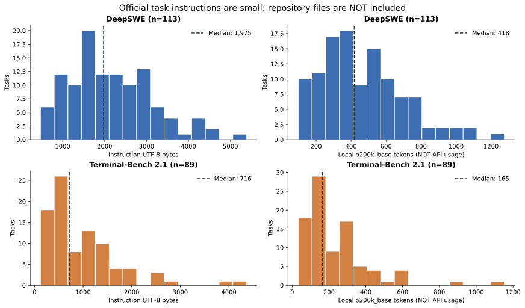
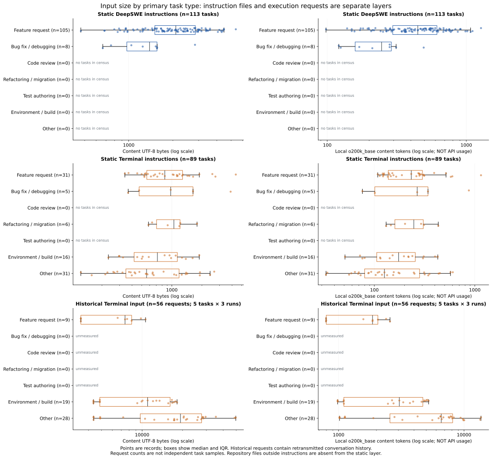
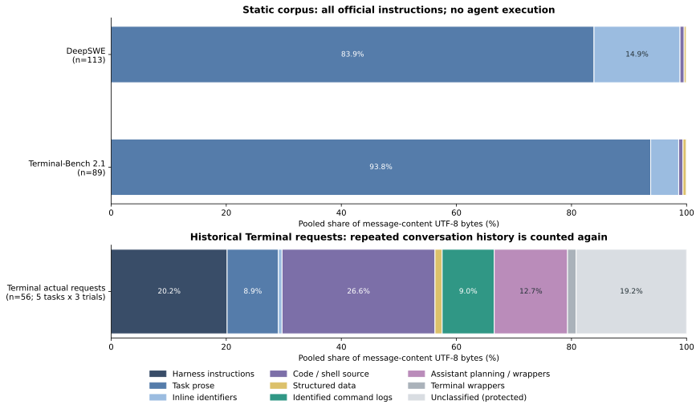
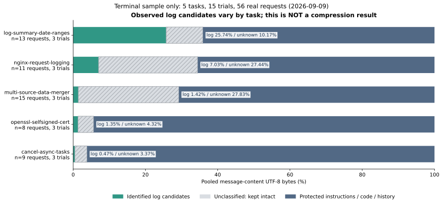
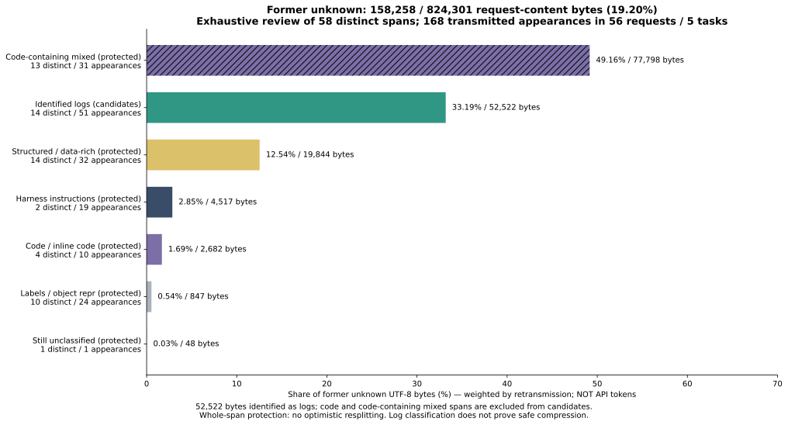
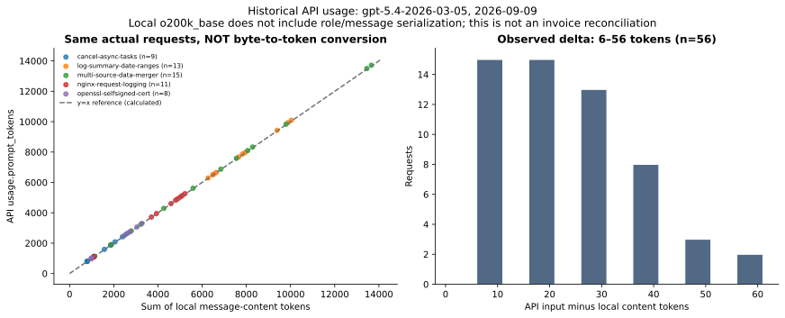

# Input Composition of Two Benchmarks — EDA

Round 1 analysis: 2026-09-10 · Round 2 analysis: 2026-09-11.

- Instruction: the task's `instruction.md` body. It excludes the repository's full code and tool output produced during a run.
- Actual request: the message body sent to the API. Earlier conversation is counted again when it is included in a later request.
- Tool result: content returned by file reads, command execution, and similar operations. In this Terminal sample, it was delivered as a `user`-role message rather than through a separate `tool_result` field or `tool` role.
- Bytes: UTF-8 body size. Local tokens: body tokens counted with `tiktoken o200k_base`. API usage and invoice-reconciled amounts are distinct.
- Compression candidates: log segments identified after excluding protected code, code-containing mixed content, instructions, data, and uncertain segments. **This is an identified candidate range, not a validated upper bound.**
- Classification judgment: results divided under human-defined rules. Different rules would produce different values, and some boundaries are ambiguous.

[Two benchmarks](#benchmarks) · [Task input composition](#composition) · [Compression candidates](#candidates) · [What this analysis does not show](#limits)

How these values were counted

- **Dates:** Historical actual requests were generated on 2026-09-09. Official instructions and historical requests were aggregated on 2026-09-10; task types and unclassified segments were classified on 2026-09-11.
- **Sample:** Official English instructions and metadata cover 113/113 DeepSWE tasks and 89/89 Terminal-Bench 2.1 tasks. Historical actual requests comprise 56 successful HTTP requests from 5 purpose-selected Terminal tasks × 3 runs and are not a random sample.
- **Model:** The 56 historical actual requests were generated with `gpt-5.4-2026-03-05`.
- **UTF-8 bytes:** Body size after encoding the source string as UTF-8, distinct from HTTP JSON body size or on-disk file size.
- **Local tokens:** Body tokens counted with `o200k_base` from `tiktoken 0.14.0`. Static instructions use the full string; actual requests use the sum of message-body tokens and exclude service serialization overhead.
- **Billing tokens:** Input, output, and cached-input tokens recorded in API-response `usage` for the 56 historical actual requests. Cached input is a subset of input, and these values are not invoice-reconciled amounts.
- **All-candidate-deletion calculation:** A hypothetical calculation that deletes identified candidates and recounts with the same local tokenizer. It does not measure compression-tool performance, quality, or cost savings.

## Two Benchmarks — Task Counts, Type Distribution, and Repository Concentration

### Round 2 · Common Primary-Type Distribution and Ambiguity in the 113 and 89 Official Tasks

Common primary-type distribution and ambiguity in the 113 and 89 official tasks

Each task contributes one primary type.

**Observation.** Task types were reclassified by the primary deliverable requested in the instruction rather than by directly pooling author labels.

DeepSWE was already weighted toward feature requests in its source metadata. After applying a shared distinction between restoring existing behavior and extending functionality, 105/113 tasks still remained feature requests.

**Interpretation.** The small debugging sample reflects the original task composition rather than compression-oriented exclusion in this analysis. Combined totals from the two sets must not be read as debugging or code-review performance.

**Limitation.** This analysis did not establish why the dataset creators chose this composition or independently validate agreement against a classification ground truth.

- **Sample:** DeepSWE n=113 · Terminal n=89
- **Denominator · unit:** Task count in each benchmark · tasks / %
- **Kind:** Classification judgment · aggregation

Source figure basis: Round 2 README table 2.

#### Round 2 · 1. Complete Task-Type Inventory

| Primary type | DeepSWE, n=113 | Terminal, n=89 |
| --- | --- | --- |
| Feature request | 105 | 31 |
| Bug fix / debugging | 8 | 5 |
| Code review | 0 | 0 |
| Refactoring / migration | 0 | 6 |
| Test authoring | 0 | 0 |
| Environment / build | 0 | 16 |
| Other | 0 | 31 |

- **Sample:** DeepSWE n=113 · Terminal n=89
- **Denominator · unit:** Task count in each benchmark · tasks / %
- **Kind:** Classification judgment · aggregation

Source table: Round 2 analysis · table 2.

Neither set has a review-only task. Tasks that include review number 0/113 in DeepSWE and 1/89 in Terminal.

No independent human-label validation was performed.

### Round 1 · DeepSWE Repositories and Languages; Terminal Author Category and Difficulty

DeepSWE repositories and languages; Terminal author category and difficulty

Difficulty is author metadata, not a performance measurement for this model.

**Observation.** Repositories, languages, and difficulty values count task metadata; they do not measure the model's answer accuracy.

Because one repository can contribute multiple tasks, task count differs from distinct-codebase count, and URL variants for the same repository must first be normalized.

**Interpretation.** Comparisons between the benchmarks must account for this composition; missing language or difficulty fields in one set must not be filled from the other set's distribution.

**Limitation.** This analysis cannot determine whether the concentration shown here causes model-performance differences.

- **Sample:** DeepSWE n=113 · Terminal n=89
- **Denominator · unit:** Task count in each benchmark · tasks / %
- **Kind:** Calculation · metadata aggregation

Source figure basis: Round 1 measurement tables 8–14.

Round 1 metadata's 106/113 `feature_request` count and Round 2's shared-taxonomy 105/113 feature-request count use **different criteria**.

#### Round 1 · Top DeepSWE repositories

| Top DeepSWE repositories | Task count | Task share |
| --- | --- | --- |
| pmndrs/koota | 5 | 4.42% |
| PyCQA/bandit | 3 | 2.65% |
| encode/httpx | 3 | 2.65% |
| platers/obsidian-linter | 3 | 2.65% |
| abs-lang/abs | 2 | 1.77% |
| mattn/anko | 2 | 1.77% |
| dynamodb-toolbox/dynamodb-toolbox | 2 | 1.77% |
| fastapi/fastapi | 2 | 1.77% |
| capricorn86/happy-dom | 2 | 1.77% |
| helm/helm | 2 | 1.77% |

- **Sample:** DeepSWE n=113 tasks · 91 repositories
- **Denominator · unit:** 113 tasks · tasks / %
- **Kind:** Calculation · metadata aggregation

Source table: Round 1 measurement table · table 14.

#### Round 1 · DeepSWE (n=113) — language

| Metadata value | Task count | Task share |
| --- | --- | --- |
| typescript | 35 | 30.97% |
| go | 34 | 30.09% |
| python | 34 | 30.09% |
| rust | 5 | 4.42% |
| javascript | 5 | 4.42% |

- **Sample:** DeepSWE n=113 tasks
- **Denominator · unit:** 113 tasks · tasks / %
- **Kind:** Calculation · metadata aggregation

Source table: Round 1 measurement table · table 8.

#### Round 1 · Terminal-Bench 2.1 (n=89) — category

| Metadata value | Task count | Task share |
| --- | --- | --- |
| software-engineering | 26 | 29.21% |
| system-administration | 9 | 10.11% |
| scientific-computing | 8 | 8.99% |
| security | 8 | 8.99% |
| data-science | 8 | 8.99% |
| debugging | 5 | 5.62% |
| file-operations | 5 | 5.62% |
| model-training | 4 | 4.49% |
| mathematics | 4 | 4.49% |
| data-processing | 4 | 4.49% |
| machine-learning | 3 | 3.37% |
| games | 1 | 1.12% |
| personal-assistant | 1 | 1.12% |
| optimization | 1 | 1.12% |
| data-querying | 1 | 1.12% |
| video-processing | 1 | 1.12% |

- **Sample:** Terminal n=89 tasks
- **Denominator · unit:** 89 tasks · tasks / %
- **Kind:** Calculation · metadata aggregation

Source table: Round 1 measurement table · table 12.

#### Round 1 · Terminal-Bench 2.1 (n=89) — difficulty

| Metadata value | Task count | Task share |
| --- | --- | --- |
| medium | 55 | 61.80% |
| hard | 30 | 33.71% |
| easy | 4 | 4.49% |

- **Sample:** Terminal n=89 tasks
- **Denominator · unit:** 89 tasks · tasks / %
- **Kind:** Calculation · author-metadata aggregation

Source table: Round 1 measurement table · table 13.

Concentration and language

#### Round 1 · DeepSWE (n=113) — category

| Metadata value | Task count | Task share |
| --- | --- | --- |
| feature_request | 106 | 93.81% |
| bugfix | 4 | 3.54% |
| enhancement | 3 | 2.65% |

- **Sample:** DeepSWE n=113 · Terminal n=89
- **Denominator · unit:** Task count in each benchmark · tasks / %
- **Kind:** Calculation · metadata aggregation

Source table: Round 1 measurement table · table 9.

#### Round 1 · DeepSWE (n=113) — difficulty

| Metadata value | Task count | Task share |
| --- | --- | --- |
| not_declared | 113 | 100.00% |

- **Sample:** DeepSWE n=113 · Terminal n=89
- **Denominator · unit:** Task count in each benchmark · tasks / %
- **Kind:** Calculation · metadata aggregation

Source table: Round 1 measurement table · table 10.

#### Round 1 · Terminal-Bench 2.1 (n=89) — language

| Metadata value | Task count | Task share |
| --- | --- | --- |
| not_declared | 89 | 100.00% |

- **Sample:** DeepSWE n=113 · Terminal n=89
- **Denominator · unit:** Task count in each benchmark · tasks / %
- **Kind:** Calculation · metadata aggregation

Source table: Round 1 measurement table · table 11.

## Task Input Composition — Share by Segment

### Round 1 · UTF-8 Byte and Local-Token Histograms for the Official 113 DeepSWE and 89 Terminal Instructions

UTF-8 byte and local-token histograms for the official instructions from 113 DeepSWE and 89 Terminal tasks

Both sets begin by specifying the work to perform; the agent then expands its observations by reading files and running commands in the environment.

**Observation.** Here, an instruction is the task's `instruction.md` file. It excludes the full repository and conversation history accumulated during a run.

**Possible explanation.** Because code and data remain in the run environment for the agent to read as needed, the medians of 418 local tokens for DeepSWE and 165 for Terminal primarily describe instructions that communicate the work to perform.

**Interpretation.** File-read and command-execution results accumulate in later inputs, so content passed during execution is a more relevant place to look for compression candidates than the short instruction itself.

**Limitation.** This does not establish that most actual input consists of tool results; DeepSWE run-request composition has not yet been measured.

- **Sample:** Official DeepSWE n=113 · Terminal n=89
- **Denominator · unit:** Official instruction files · UTF-8 bytes / local `o200k_base` tokens
- **Kind:** Measurement · quantile calculation

Source figure basis: Round 1 measurement table 1.

#### Round 1 · 1. Instruction Size

| Input layer | Sample tasks | UTF-8 bytes | local o200k_base tokens |
| --- | --- | --- | --- |
| DeepSWE (n=113) | 113 | 471 / 1,975 / 4,198.4 / 5,385 | 98 / 418 / 906.4 / 1,276 |
| Terminal-Bench 2.1 (n=89) | 89 | 123 / 716 / 2,491.2 / 4,365 | 33 / 165 / 575.4 / 1,153 |
| Imported English + appendix (n=113) | 113 | 570 / 2,074 / 4,295.6 / 5,483 | 118 / 438 / 926.4 / 1,296 |
| Imported Korean translation (n=113) | 113 | 748 / 2,550 / 5,069.0 / 6,170 | 174 / 614 / 1,205.8 / 1,520 |

- **Sample:** Official DeepSWE 113 · Terminal 89 · imported English/Korean, 113 each
- **Denominator · unit:** Each instruction file · bytes / local o200k_base tokens
- **Kind:** Measurement · quantile calculation

Source table: Round 1 measurement table · table 1.

Minimum / median / P95 / maximum by unit. P95 uses linear interpolation and need not be an observed value.

Official source text and migrated translations are separate.

### Round 2 · Byte and Local-Token Box-and-Point Plots by Type for Both Official Sets and 56 Terminal Requests

Byte and local-token box-and-point plots by type for both official sets and 56 Terminal requests

Units are UTF-8 bytes and local `o200k_base` tokens, not API tokens.

**Observation.** Official instructions count one file per task; historical runs count each successive request from the same task.

**Possible explanation.** Later requests include earlier command results and conversation history, so the difference between instruction size and request size is consistent with this input structure.

**Interpretation.** Size comparisons by type must account for the input layer and counts of tasks, runs, and requests. A task with many requests must not be treated as many independent tasks.

**Limitation.** Instruction distributions cannot substitute for request sizes in debugging and review categories absent from the historical runs.

- **Sample:** Official DeepSWE 113 · Terminal 89 · historical Terminal 56 requests
- **Denominator · unit:** Instructions / request bodies · UTF-8 bytes / local tokens
- **Kind:** Measurement · quantile calculation

Source figure basis: Round 2 measurement tables 1, 3, and 6.

#### Round 2 · deep-swe

| Primary type | n tasks | Minimum bytes | p25 bytes | Median bytes | p75 bytes | Maximum bytes | Median local tokens | p95 local tokens | Instruction candidate share |
| --- | --- | --- | --- | --- | --- | --- | --- | --- | --- |
| Feature request | 105 | 471 | 1,508 | 2,097 | 2,849 | 5,385 | 448 | 908.8 | 0.00% |
| Bug fix / debugging | 8 | 665 | 970.75 | 1,387.5 | 1,560.25 | 2,835 | 246 | 430.65 | 0.00% |
| Code review | 0 | — | — | — | — | — | — | — | Not measured |
| Refactoring / migration | 0 | — | — | — | — | — | — | — | Not measured |
| Test authoring | 0 | — | — | — | — | — | — | — | Not measured |
| Environment / build | 0 | — | — | — | — | — | — | — | Not measured |
| Other | 0 | — | — | — | — | — | — | — | Not measured |

- **Sample:** DeepSWE n=113 tasks
- **Denominator · unit:** Each official instruction · UTF-8 bytes / local tokens
- **Kind:** Measurement · quantile calculation

Source table: Round 2 measurement table · table 1.

#### Round 2 · terminal-bench-2.1

| Primary type | n tasks | Minimum bytes | p25 bytes | Median bytes | p75 bytes | Maximum bytes | Median local tokens | p95 local tokens | Instruction candidate share |
| --- | --- | --- | --- | --- | --- | --- | --- | --- | --- |
| Feature request | 31 | 339 | 562 | 851 | 1,280 | 4,365 | 233 | 587.5 | 0.00% |
| Bug fix / debugging | 5 | 366 | 471 | 975 | 1,629 | 3,873 | 267 | 766.8 | 0.00% |
| Code review | 0 | — | — | — | — | — | — | — | Not measured |
| Refactoring / migration | 6 | 584 | 703.5 | 1,049 | 1,208.5 | 1,788 | 247 | 402.75 | 0.00% |
| Test authoring | 0 | — | — | — | — | — | — | — | Not measured |
| Environment / build | 16 | 232 | 419.5 | 717.5 | 1,135.75 | 1,882 | 174.5 | 408.5 | 0.00% |
| Other | 31 | 123 | 347 | 559 | 1,182 | 2,655 | 126 | 511 | 0.00% |

- **Sample:** Terminal n=89 tasks
- **Denominator · unit:** Each official instruction · UTF-8 bytes / local tokens
- **Kind:** Measurement · quantile calculation

Source table: Round 2 measurement table · table 3.

Request-size distribution

#### Round 2 · Request-Size Distribution

| Primary type | n requests | Minimum bytes | p25 bytes | Median bytes | p75 bytes | Maximum bytes | Minimum local tokens | Median local tokens | Maximum local tokens |
| --- | --- | --- | --- | --- | --- | --- | --- | --- | --- |
| Feature request | 9 | 3,504 | 3,504 | 7,466 | 8,361 | 10,606 | 794 | 1,865 | 2,570 |
| Bug fix / debugging | 0 | — | — | — | — | — | — | — | — |
| Code review | 0 | — | — | — | — | — | — | — | — |
| Refactoring / migration | 0 | — | — | — | — | — | — | — | — |
| Test authoring | 0 | — | — | — | — | — | — | — | — |
| Environment / build | 19 | 4,348 | 4,849 | 10,994 | 16,152.5 | 18,196 | 983 | 3,051 | 5,221 |
| Other | 28 | 4,358 | 9,691.75 | 19,284.5 | 27,677.5 | 49,720 | 1,017 | 6,586 | 13,661 |

- **Sample:** Terminal 5 tasks · 56 requests
- **Denominator · unit:** Each request body · UTF-8 bytes / local tokens
- **Kind:** Measurement · quantile calculation

Source table: Round 2 measurement table · table 6.

### Round 1 · Body Composition of Both Official Sets and 56 Historical Terminal Requests

Body composition of both official sets and 56 historical Terminal requests

This is neither the average per-request share nor a share of API tokens.

**Observation.** Body segmentation considers provenance and protection policy as well as content format; command output is not automatically a log candidate.

Code-read results and commands written by the assistant are also protected, so increased input length during a run does not imply an equal amount is compressible.

**Interpretation.** Because conversation history is counted again when included in the next request, these shares also differ from shares of unique files or outputs.

**Limitation.** Segments not identified by automated rules remain protected; the next section reclassifies that unclassified content from the same source text.

- **Sample:** Official instructions 113 and 89 · Terminal actual requests 56
- **Denominator · unit:** Total UTF-8 body bytes in each input layer · %
- **Kind:** Classification judgment · byte aggregation

Source figure basis: Round 1 measurement table 2.

#### Round 1 · 2. Segment Shares

| Segment | DeepSWE instructions n=113 | Terminal instructions n=89 | Terminal actual requests n=56 |
| --- | --- | --- | --- |
| system role | 0.00% | 0.00% | 0.00% |
| Harness instructions and initial state | 0.00% | 0.00% | 20.16% |
| Task-instruction prose | 83.92% | 93.77% | 8.91% |
| Inline identifiers and code | 14.94% | 4.86% | 0.64% |
| Code, shell commands, and code echo | 0.72% | 0.75% | 26.58% |
| Structured data such as JSON, YAML, and CSV | 0.42% | 0.62% | 1.25% |
| Identified command logs | 0.00% | 0.00% | 9.05% |
| Test output | 0.00% | 0.00% | 0.00% |
| Stack trace | 0.00% | 0.00% | 0.00% |
| diff | 0.00% | 0.00% | 0.00% |
| PR comment | 0.00% | 0.00% | 0.00% |
| Assistant plan and JSON envelope | 0.00% | 0.00% | 12.74% |
| Terminal envelope | 0.00% | 0.00% | 1.48% |
| Unclassified and protected | 0.00% | 0.00% | 19.20% |

- **Sample:** Official instructions 113 and 89 · Terminal actual requests 56
- **Denominator · unit:** Total UTF-8 body bytes in each input layer · %
- **Kind:** Classification judgment · byte aggregation

Source table: Round 1 measurement table · table 2.

Not all stdout is counted as logs.

Distribution of segment shares by task and request

Each cell shows median / P95 / maximum byte share.

#### Round 1 · Distribution of Segment Shares by Task and Request

| Segment | DeepSWE n=113 | Static Terminal n=89 | Terminal requests n=56 |
| --- | --- | --- | --- |
| Harness instructions and initial state | 0.00% / 0.00% / 0.00% | 0.00% / 0.00% / 0.00% | 24.35% / 72.35% / 84.67% |
| Task-instruction prose | 87.87% / 100.00% / 100.00% | 100.00% / 100.00% / 100.00% | 9.65% / 32.92% / 33.22% |
| Inline identifiers and code | 12.09% / 37.84% / 51.70% | 0.00% / 21.90% / 36.59% | 0.50% / 4.52% / 5.59% |
| Code, shell commands, and code echo | 0.00% / 0.00% / 51.29% | 0.00% / 0.00% / 15.92% | 21.14% / 38.50% / 40.54% |
| Structured data such as JSON, YAML, and CSV | 0.00% / 0.00% / 23.96% | 0.00% / 0.00% / 16.27% | 0.00% / 4.82% / 6.37% |
| Identified command logs | 0.00% / 0.00% / 0.00% | 0.00% / 0.00% / 0.00% | 0.77% / 33.66% / 44.64% |
| Assistant plan and JSON envelope | 0.00% / 0.00% / 0.00% | 0.00% / 0.00% / 0.00% | 9.14% / 31.62% / 57.90% |
| Terminal envelope | 0.00% / 0.00% / 0.00% | 0.00% / 0.00% / 0.00% | 1.20% / 2.95% / 3.83% |
| Unclassified and protected | 0.00% / 0.00% / 0.00% | 0.00% / 0.00% / 0.00% | 4.83% / 39.69% / 44.60% |

- **Sample:** Official instructions 113 and 89 · Terminal 56 requests
- **Denominator · unit:** Each instruction or request body · UTF-8 bytes / %
- **Kind:** Classification judgment · quantile calculation

Source table: Round 1 measurement table · table 3.

Static official instructions — n=202 tasks

#### Round 2 · deep-swe

| Primary type | n tasks | Code and inline code byte share | Identified log candidates byte share | Task and runner-instruction byte share | Structured and data-centered segments byte share | Unclassified and protected byte share |
| --- | --- | --- | --- | --- | --- | --- |
| Feature request | 105 | 16.30% | 0.00% | 83.26% | 0.44% | 0.00% |
| Bug fix / debugging | 8 | 2.37% | 0.00% | 97.63% | 0.00% | 0.00% |
| Code review | 0 | Not measured | Not measured | Not measured | Not measured | Not measured |
| Refactoring / migration | 0 | Not measured | Not measured | Not measured | Not measured | Not measured |
| Test authoring | 0 | Not measured | Not measured | Not measured | Not measured | Not measured |
| Environment / build | 0 | Not measured | Not measured | Not measured | Not measured | Not measured |
| Other | 0 | Not measured | Not measured | Not measured | Not measured | Not measured |

- **Sample:** DeepSWE n=113 tasks
- **Denominator · unit:** Total UTF-8 bytes in official instructions by type · %
- **Kind:** Classification judgment · byte aggregation

Source table: Round 2 measurement table · table 2.

#### Round 2 · terminal-bench-2.1

| Primary type | n tasks | Code and inline code byte share | Identified log candidates byte share | Task and runner-instruction byte share | Structured and data-centered segments byte share | Unclassified and protected byte share |
| --- | --- | --- | --- | --- | --- | --- |
| Feature request | 31 | 7.71% | 0.00% | 91.64% | 0.65% | 0.00% |
| Bug fix / debugging | 5 | 0.59% | 0.00% | 99.41% | 0.00% | 0.00% |
| Code review | 0 | Not measured | Not measured | Not measured | Not measured | Not measured |
| Refactoring / migration | 6 | 4.95% | 0.00% | 95.05% | 0.00% | 0.00% |
| Test authoring | 0 | Not measured | Not measured | Not measured | Not measured | Not measured |
| Environment / build | 16 | 10.71% | 0.00% | 89.29% | 0.00% | 0.00% |
| Other | 31 | 1.70% | 0.00% | 97.08% | 1.23% | 0.00% |

- **Sample:** Terminal n=89 tasks
- **Denominator · unit:** Total UTF-8 bytes in official instructions by type · %
- **Kind:** Classification judgment · byte aggregation

Source table: Round 2 measurement table · table 4.

## Compression Candidates — Overall and by Task

### Round 1 · Initially Identified Candidate, Unclassified, and Protected Shares for 5 Terminal Tasks

Initially identified candidate, unclassified, and protected shares for 5 Terminal tasks

This is body-byte composition, not a compression result.

- **Sample:** 5 tasks · n=3 runs each · 56 requests
- **Denominator · unit:** Total body UTF-8 bytes by task · %
- **Kind:** Classification judgment · byte aggregation

Source figure basis: Round 1 measurement table 4.

#### Round 1 · 3. Compression Candidates in Actual Requests

| Terminal task | Request count / run count | Candidate byte share | Unclassified byte share |
| --- | --- | --- | --- |
| cancel-async-tasks | 9 / 3 | 0.47% | 3.37% |
| log-summary-date-ranges | 13 / 3 | 25.74% | 10.17% |
| multi-source-data-merger | 15 / 3 | 1.42% | 27.83% |
| nginx-request-logging | 11 / 3 | 7.03% | 27.44% |
| openssl-selfsigned-cert | 8 / 3 | 1.35% | 4.32% |

- **Sample:** 5 tasks · n=3 runs each · 56 requests
- **Denominator · unit:** Total body UTF-8 bytes by task · %
- **Kind:** Classification judgment · byte aggregation

Source table: Round 1 measurement table · table 4.

Across all 56 requests, the candidate share is 9.05% and the unclassified share is 19.20%.

### Round 2 · Seven-Category Decomposition of 158,258 Formerly Unclassified Bytes

Seven-category decomposition of 158,258 formerly unclassified bytes

This is a complete review of unclassified content within this historical request set, not an estimate from a random sample.

- **Sample:** 58 distinct segments · 168 occurrences including retransmission · 56 requests · 5 tasks
- **Denominator · unit:** Unclassified 158,258 bytes / all request-body 824,301 bytes
- **Kind:** Classification judgment · byte aggregation

Source figure basis: Round 2 UNKNOWN_REVIEW table 1.

#### Round 2 · Review and Actual Examples of Round 1 Unclassified Segments

| Reclassification | Distinct-segment count | Occurrences including retransmission | Bytes excluding duplicates | Bytes including retransmission | Share of formerly unclassified bytes | Share of all request bytes |
| --- | --- | --- | --- | --- | --- | --- |
| Code-containing mixed content | 13 | 31 | 30,830 | 77,798 | 49.16% | 9.44% |
| Identified log candidates | 14 | 51 | 19,598 | 52,522 | 33.19% | 6.37% |
| Structured and data-centered segments | 14 | 32 | 9,122 | 19,844 | 12.54% | 2.41% |
| Runner instructions and protected content | 2 | 19 | 527 | 4,517 | 2.85% | 0.55% |
| Code and inline code | 4 | 10 | 973 | 2,682 | 1.69% | 0.33% |
| Delimiters and other protected content | 10 | 24 | 346 | 847 | 0.54% | 0.10% |
| Unclassified and protected | 1 | 1 | 48 | 48 | 0.03% | 0.01% |

- **Sample:** 58 distinct segments · 168 occurrences including retransmission · 56 requests · 5 tasks
- **Denominator · unit:** Unclassified 158,258 bytes / all request-body 824,301 bytes
- **Kind:** Classification judgment · byte aggregation

Source table: unknown-segment review · table 1.

The 6.37% additional-log share uses the **entire request body** as its denominator (+6.37 percentage points). Its share within the formerly unclassified 19.20% is 33.19%.

How to read these values

The 9.44% protected-whole share is 77,798 bytes of code-containing mixed content + 48 remaining unclassified bytes = 77,846 bytes. The 77,798 mixed-content bytes alone also round to 9.44%, so exact bytes are retained. This is not the sum of all protected segments.

### Round 2 · Terminal Candidate and Full Protected-Composition View by Type, from Round 1 to Round 2

Terminal candidate and full protected-composition view by type, from Round 1 to Round 2

Units are UTF-8 bytes; types without samples, such as debugging and review, are not measured.

**Observation.** In the historical sample, log-file listings and excerpts formed large candidates in `log-summary-date-ranges`, while installation output formed large candidates in `nginx-request-logging`.

**Possible explanation.** The 0.48%–35.29% task-level spread is consistent with input differences between these two log-heavy tasks and tasks whose inputs mostly protected code and structured data.

**Limitation.** Variation remains large within a type, and runner-output behavior also contributes; this analysis does not isolate a causal effect of task type.

**Interpretation.** For this purpose-selected sample, task-level inputs should be read alongside any overall share. Candidate shares cannot be converted into actual token or billing savings.

- **Sample:** Terminal 5 tasks · 15 runs · 56 requests
- **Denominator · unit:** Total body UTF-8 bytes by type · %
- **Kind:** Classification judgment · byte aggregation

Source figure basis: Round 2 measurement tables 5 and 7.

**This is an identified candidate range, not a validated upper bound.**

#### Round 2 · Input and Candidate Shares by Type

| Primary type of historical requests | Tasks/runs/requests | body UTF-8 bytes | Candidate byte share | Hypothetical local-token reduction if all candidates were deleted |
| --- | --- | --- | --- | --- |
| Feature request | 1/3/9 | 61,069 | 0.48% | 1.01% |
| Environment / build | 2/6/19 | 208,299 | 19.53% | 25.39% |
| Other | 2/6/28 | 554,933 | 15.52% | 23.84% |
| Debugging, review, refactoring/migration, and test authoring | 0/0/0 | Not measured | Not measured | Not measured |
| All historical requests | 5/15/56 | 824,301 | 15.42% | 22.83% |

- **Sample:** Terminal 5 tasks · 15 runs · 56 requests
- **Denominator · unit:** Body UTF-8 bytes / 242,937 local body tokens
- **Kind:** Classification judgment · hypothetical all-candidate deletion calculation

Source table: Round 2 analysis · table 3.

This is neither a compressor result, actual billing savings, nor a recommendation that deletion is safe.

#### Round 2 · By Task — n=3 Runs Each

| Task | Primary type | n requests | Body bytes | Round 1 candidate share | Round 2 candidate share | Local-token reduction if all candidates were deleted |
| --- | --- | --- | --- | --- | --- | --- |
| cancel-async-tasks | Feature request | 9 | 61,069 | 0.47% | 0.48% | 1.01% |
| log-summary-date-ranges | Other | 13 | 228,178 | 25.74% | 35.29% | 46.89% |
| multi-source-data-merger | Other | 15 | 326,755 | 1.42% | 1.72% | 2.63% |
| nginx-request-logging | Environment / build | 11 | 143,010 | 7.03% | 27.83% | 35.18% |
| openssl-selfsigned-cert | Environment / build | 8 | 65,289 | 1.35% | 1.35% | 2.25% |

- **Sample:** 5 tasks · n=3 runs each · 56 requests
- **Denominator · unit:** Body bytes by task / local tokens · %
- **Kind:** Classification judgment · hypothetical deletion calculation

Source table: Round 2 measurement table · table 8.

This is not interpreted as a causal effect of type or a representative value for the full benchmark.

The 9.05% Round 1 candidate share and 15.42% Round 2 share reflect reclassification of the same input, not a comparison of compression effects.

Candidates and hypothetical calculation by type

#### Round 2 · Candidates and Hypothetical Calculation by Type

| Primary type | n tasks/runs/requests | Total body bytes | Candidate bytes | Round 1 candidates byte share | Round 2 candidates byte share | Local-token reduction if all candidates were deleted |
| --- | --- | --- | --- | --- | --- | --- |
| Feature request | 1/3/9 | 61,069 | 295 | 0.47% | 0.48% | 1.01% |
| Bug fix / debugging | 0/0/0 | — | — | Not measured | Not measured | Not measured |
| Code review | 0/0/0 | — | — | Not measured | Not measured | Not measured |
| Refactoring / migration | 0/0/0 | — | — | Not measured | Not measured | Not measured |
| Test authoring | 0/0/0 | — | — | Not measured | Not measured | Not measured |
| Environment / build | 2/6/19 | 208,299 | 40,682 | 5.25% | 19.53% | 25.39% |
| Other | 2/6/28 | 554,933 | 86,137 | 11.42% | 15.52% | 23.84% |

- **Sample:** Terminal 5 tasks · 15 runs · 56 requests
- **Denominator · unit:** Body UTF-8 bytes / 242,937 local body tokens
- **Kind:** Classification judgment · hypothetical all-candidate deletion calculation

Source table: Round 2 measurement table · table 5.

Composition by type — same request-body byte denominator

#### Round 2 · Composition by Type — Same Request-Body Byte Denominator

| Primary type | n requests | Code and inline code | Code-containing mixed content | Identified log candidates | Task and runner instructions | Structured and data-centered segments | Assistant plan and envelope | Terminal envelope and other | Unclassified and protected |
| --- | --- | --- | --- | --- | --- | --- | --- | --- | --- |
| Feature request | 9 | 30.32% | 2.15% | 0.48% | 50.56% | 0.00% | 14.67% | 1.81% | 0.00% |
| Bug fix / debugging | 0 | Not measured | Not measured | Not measured | Not measured | Not measured | Not measured | Not measured | Not measured |
| Code review | 0 | Not measured | Not measured | Not measured | Not measured | Not measured | Not measured | Not measured | Not measured |
| Refactoring / migration | 0 | Not measured | Not measured | Not measured | Not measured | Not measured | Not measured | Not measured | Not measured |
| Test authoring | 0 | Not measured | Not measured | Not measured | Not measured | Not measured | Not measured | Not measured | Not measured |
| Environment / build | 19 | 23.08% | 3.16% | 19.53% | 41.04% | 0.73% | 10.50% | 1.96% | 0.00% |
| Other | 28 | 28.91% | 12.60% | 15.52% | 23.02% | 5.16% | 13.37% | 1.42% | 0.01% |

- **Sample:** Terminal 5 tasks · 15 runs · 56 requests
- **Denominator · unit:** Total body UTF-8 bytes by type · %
- **Kind:** Classification judgment · byte aggregation

Source table: Round 2 measurement table · table 7.

Totals by run — n=15 runs

#### Round 2 · Totals by run — n=15 runs

| Run | n requests | Body bytes | Candidate byte share | Local-token reduction if all candidates were deleted |
| --- | --- | --- | --- | --- |
| terminal-cancel-async-tasks-r1-v2 | 2 | 11,248 | 0.84% | 1.76% |
| terminal-cancel-async-tasks-r2-v2 | 3 | 19,331 | 1.03% | 2.16% |
| terminal-cancel-async-tasks-r3-v2 | 4 | 30,490 | 0.00% | 0.00% |
| terminal-log-summary-date-ranges-r1-v2 | 4 | 63,295 | 39.72% | 50.92% |
| terminal-log-summary-date-ranges-r2-v2 | 6 | 124,936 | 32.48% | 43.81% |
| terminal-log-summary-date-ranges-r3-v2 | 3 | 39,947 | 37.02% | 50.14% |
| terminal-multi-source-data-merger-r1-v2 | 6 | 166,266 | 2.26% | 3.51% |
| terminal-multi-source-data-merger-r2-v2 | 5 | 91,031 | 0.94% | 1.39% |
| terminal-multi-source-data-merger-r3-v2 | 4 | 69,458 | 1.45% | 2.11% |
| terminal-nginx-request-logging-r1-v2 | 3 | 37,154 | 27.38% | 34.52% |
| terminal-nginx-request-logging-r2-v2 | 4 | 52,077 | 28.70% | 36.19% |
| terminal-nginx-request-logging-r3-v2 | 4 | 53,779 | 27.30% | 34.64% |
| terminal-openssl-selfsigned-cert-r1-v2 | 3 | 23,636 | 2.49% | 4.21% |
| terminal-openssl-selfsigned-cert-r2-v2 | 2 | 14,259 | 2.06% | 3.46% |
| terminal-openssl-selfsigned-cert-r3-v2 | 3 | 27,394 | 0.00% | 0.00% |

- **Sample:** Terminal n=15 runs
- **Denominator · unit:** Body bytes by run / local tokens · %
- **Kind:** Classification judgment · hypothetical deletion calculation

Source table: Round 2 measurement table · table 9.

Repetition and duplication

#### Round 1 · 6. Repetition and Duplication

| Input layer | Sample | Additional bytes from exact duplicate lines | Date-like strings / repeated path prefixes / repeated key occurrences |
| --- | --- | --- | --- |
| DeepSWE (n=113) | 113 | 0 | 0 / 4 / 4 |
| Terminal-Bench 2.1 (n=89) | 89 | 349 | 4 / 167 / 10 |
| Terminal actual requests (n=56; 5 tasks x 3 trials) | 56 | 58,627 | 1,587 / 1,600 / 2,396 |

- **Sample:** Official instructions 113 and 89 · Terminal 56 requests
- **Denominator · unit:** Each document or request · UTF-8 bytes / occurrence count
- **Kind:** Measurement · pattern counting

Source table: Round 1 measurement table · table 7.

Repetition counts exclude the first occurrence within each document or request.

Within **candidate segments only** across 56 requests, exact duplicate lines add 1,020 bytes.

## What This Analysis Does Not Show

### Round 1 · Comparison and Difference Distribution for API Input and Local Body Tokens in the Same 56 Terminal Requests

Comparison and difference distribution for API input and local body tokens in the same 56 Terminal requests

Do not transfer this difference to another agent, model, or tool schema as a correction constant.

- **Sample:** Terminal 5 tasks · 15 runs · 56 requests
- **Denominator · unit:** Request / run · API usage tokens / local body tokens
- **Kind:** Historical API and local measurement · statistical calculation

Source figure basis: Round 1 measurement table 5.

#### Round 1 · 4. API Usage Compared with Local Tokens

| Measure | Sample | Minimum / median / P95 / maximum |
| --- | --- | --- |
| Per-request API input tokens | 56 requests | 800 / 3,272.5 / 9,975.2 / 13,717 |
| Per-run API input token total | 15 runs | 2,688 / 13,814 / 45,211.6 / 45,696 |
| API input − local body tokens | 56 requests | 6 / 16 / 46 / 56 |

- **Sample:** Terminal 5 tasks · 15 runs · 56 requests
- **Denominator · unit:** Request / run · API usage tokens / local body tokens
- **Kind:** Historical API and local measurement · statistical calculation

Source table: Round 1 measurement table · table 5.

The API-versus-local difference is 0.24%–1.38%, using API input as the denominator.

Cached input is a subset of input, not additional input.

Historical API usage — not current spending

#### Round 2 · Historical API Usage — Not Current Spending

| Primary type | n requests | API input tokens | API output tokens | API cached-input tokens |
| --- | --- | --- | --- | --- |
| Feature request | 9 | 14,871 | 2,432 | 5,888 |
| Bug fix / debugging | 0 | — | — | — |
| Code review | 0 | — | — | — |
| Refactoring / migration | 0 | — | — | — |
| Test authoring | 0 | — | — | — |
| Environment / build | 19 | 58,054 | 7,256 | 29,568 |
| Other | 28 | 171,218 | 18,915 | 113,408 |

- **Sample:** Terminal 5 tasks · 15 runs · 56 requests
- **Denominator · unit:** Request / run · API usage tokens / local body tokens
- **Kind:** Historical API and local measurement · statistical calculation

Source table: Round 2 measurement table · table 10.

Total API usage is 244,143 input tokens, 28,603 output tokens, and 148,864 cached-input tokens (n=56 requests).

### Round 1 · Cumulative Distribution of Shared Leading Local Token-ID Length for Static Instructions, First Requests, and Adjacent Requests

Cumulative distribution of shared leading local token-ID length for static instructions, first requests, and adjacent requests

Task pairs are not mutually independent samples.

- **Sample:** Static instruction pairs 6,328 / 3,916 · historical request pairs 41 / 10 / 15
- **Denominator · unit:** Pair count by comparison layer · common leading local token-ID length
- **Kind:** Measurement · statistical calculation

Source figure basis: Round 1 measurement table 6.

#### Round 1 · 5. Shared prefix

| Comparison layer | Pair count | Local tokens, minimum / median / P95 / maximum | Pairs at or above 1,024 |
| --- | --- | --- | --- |
| deep-swe-import-ko/instructions | 6,328 | 0 / 0 / 0 / 2 | 0 |
| deep-swe/instructions | 6,328 | 0 / 0 / 1 / 4 | 0 |
| terminal-bench-2.1/instructions | 3,916 | 0 / 0 / 1 / 12 | 0 |
| terminal-native/adjacent-turns | 41 | 793 / 2,790 / 9,792 / 13,450 | 32 |
| terminal-native/cross-task-first | 10 | 650 / 650 / 650 / 650 | 0 |
| terminal-native/same-task-new-container | 15 | 782 / 1,004 / 1,109 / 1,109 | 6 |

- **Sample:** Pair counts for each comparison layer in the table
- **Denominator · unit:** Common leading local token ID · tokens / pairs
- **Kind:** Measurement · statistical calculation

Source table: Round 1 measurement table · table 6.

A local prefix longer than the cache minimum does not by itself guarantee a service cache hit.

- Code and code-containing mixed content are excluded; preservation of log meaning, actual compression rate, quality, and billing savings remain unvalidated.

- Actual DeepSWE run history was not collected for this analysis.

- This purpose-selected sample was chosen in advance to inspect files, logs, structured data, and similar content; it was not randomly sampled.

- Quantiles use linear interpolation, and 56 requests are not 56 independent tasks.

- The observed 0 instruction-candidate bytes result from protection rules and do not mean that a full run has zero candidates.

- `none` is the condition without an added compressor; it does not guarantee that original terminal output was never truncated.

- Historical generation settings were temperature 0, reasoning effort none, max completion 2,048, and automatic summarization off.

- These settings do not guarantee determinism or lossless observation (Round 1 README table 2).

## Sources and Scope

- [Official DeepSWE dataset](https://huggingface.co/datasets/datacurve/deep-swe/tree/6d6f134460c137e24c6bb7e1e69954116ea9dbb3): official English instructions and task metadata at pinned revision `6d6f134460c137e24c6bb7e1e69954116ea9dbb3`.
- [Official Terminal-Bench 2.1 tasks](https://github.com/harbor-framework/terminal-bench-2-1/tree/7131e4375048a0e408a8fb404b5f499d726b695b): official English instructions and task metadata at pinned revision `7131e4375048a0e408a8fb404b5f499d726b695b`.
- Historical actual requests: 2026-09-09, 5 purpose-selected tasks × 3 runs and 56 requests from `gpt-5.4-2026-03-05`. Raw request text is not distributed.
- The [public task-level candidate aggregate](../../data/eda/task-candidate-share.csv) and its [provenance and conditions](../../data/eda/lineage.json) contain two classification rounds over the same historical sample.
- Source table numbers follow their order in the original Round 1 and Round 2 measurement documents; they are not section numbers in this document.
- This is a static analysis of all instructions and a historical run sample, not a new compression, quality, or billing experiment.
