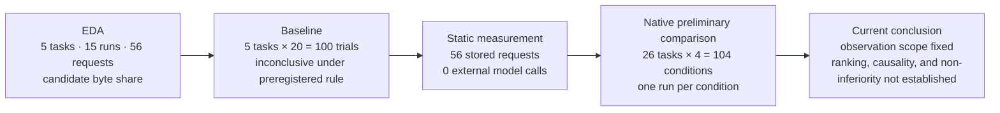

# Experiment-Design Review Appendix: Current Evidence and the Next Decision

This appendix connects measurements to questions for a future validation design. Start
with the [plain-language guide](plain-language-results-20260917.md) if you are not a
specialist. A **task** is one problem to solve; a **condition** is one way to solve the
same problem. `none` does not mean no work: the model solves the task **without additional
compression**. A **native trial** is one execution in which the model solves a task and
the built-in grader evaluates the result.

Suggested order: **this 30-second summary → [visual guide](visualization-guide-20260919.md)
→ [technical evidence](preliminary-comparison-20260916.md) →
[one-task YAML walkthrough](../../README.md#try-it-in-five-minutes)**.

## 30-Second Summary

- The scope in which all four conditions completed is **26 tasks × 4 conditions = 104
  conditions**. Built-in task grading returned 40 `pass` and 64 `wrong_answer`. This is
  not 104 independent tasks.
- Actual strings changed in 209 spans across 23 conditions. Recounting those 209 spans
  locally with `o200k_base` gives `97,723 → 50,824` tokens. This does not mean total API
  input tokens or an invoice fell by that amount.
- Requests sent to the model, external API-call attempts, successful responses, and
  responses returned to the task are distinct events. All four observed counts happened
  to be 1,027 across 104 conditions. Cost calculated from API-reported usage was
  `$22.3333885`, not an invoice-reconciled amount. The
  [arithmetic value per passing condition in the completed cohort](preliminary-comparison-20260916.md#exact-scope-for-reading-cost-with-outcomes)
  is `$0.5583347125` after division by 40 `pass` conditions; `pass` has not been
  validated as a proxy for customer acceptance.
- The comparison has **one run per condition**. Cache, request count, model execution path,
  and cross-condition concurrency were uncontrolled. `temperature=0` does not guarantee
  identical answers. Some judgments differed with zero actual string changes, and a
  verifier false failure was also found.
- An operator stopped five long-running executions after reviewing their state at
  `2026-09-17 23:59 KST`. Four were operator stops and one was stalled waiting for an
  HTTP response; all ended before grading and have unknown quality. Confirmed calculated
  API cost of `$87.771254` and a separate `$0.1294175` input-only estimate for one
  request without usage are not combined with the 26-task primary analysis.

> This material does not decide product adoption, compressor ranking, quality
> non-inferiority, or population cost savings. It identifies what a controlled follow-up
> should fix and measure again.

## Next-Design Decisions Supported by This Material

| What can be decided now | Basis | Still required |
|---|---|---|
| Priorities for a follow-up | Actual changes and nonchanges, judgment transitions, requests, usage, and cost were observed together | Repetition count and preregistered stopping criteria |
| Units that must remain separate | Local changed-span tokens, full API usage, calculated API cost, and invoices have different scopes | Actual invoice reconciliation |
| Failure classification | Wrong answer, technical incompletion, and operator stop are distinct | Recovery protocol for incomplete runs |
| Fixed scope for public results | 26 tasks and 104 evidence-complete conditions | Representative sample and repeated evaluation |

## Measurement Sequence

**Figure 1 alternative text.** The sequence begins with EDA of input composition for five
purposively selected tasks, then a 100-run five-task baseline, model-free static
measurement, a 26-task and 104-condition native preliminary comparison, and the current
conclusion. Each stage has a different sample and unit; values are not combined under one
denominator.

*Figure 1. Stage-level samples are 5 tasks, 15 runs, and 56 requests; 100 native trials;
56 stored requests; and 26 tasks and 104 conditions. The flow shows evidence order, not
performance improvement or causal compression effects.*

| Stage | What was measured | Main observation | What it does not establish |
|---|---|---|---|
| Exploratory data analysis (EDA) | Share of UTF-8 message-content bytes classified as compression candidates in 56 successful HTTP requests from 5 purposively selected tasks and 15 runs | 0.48%–35.29% by task and 15.42% overall; hypothetical deletion of all candidates 22.83% | Achieved compression, safety, quality, or cost savings |
| Baseline without additional compression | Grading variability across 100 native trials, 20 repetitions of the same 5 tasks | Preregistered rule returned `stop_inconclusive`, so a comparison tolerance could not be fixed | Stable quality baseline |
| Static measurement | String and local-token changes from applying compressors to 56 stored requests | 0 external model calls; measured input-transformation sizes and samples | Native quality, provider usage, or billed cost |
| Native preliminary comparison | One run of 26 tasks under `none`, squeez, Headroom, and LLMLingua-2 | 104 conditions; 40 `pass`, 64 `wrong_answer`; actual changes in 209 spans across 23 conditions | Compressor ranking, causality, non-inferiority, or population savings |
| Long-running incomplete work | Requests, responses, usage, and stop states for 5 executions that did not finish before grading | 4 operator stops and 1 HTTP stall; quality unknown | `pass` or `wrong_answer` |

**Figure 2 alternative text.** The figure compares first- and second-pass candidate shares
within message-content UTF-8 bytes by type for 5 historical Terminal tasks, 15 runs, and
56 requests. Types without tasks are unmeasured, and the chart does not show API-token
share.

*Figure 2. Candidate byte share was 0.48%–35.29% by task and 15.42% overall across the
purposively selected 5 tasks, 15 runs, and 56 requests. The denominator is message-content
UTF-8 bytes. The 22.83% hypothetical deletion of all candidates is neither an achievable
compression rate nor a validated upper bound. The reviewed SVG SHA-256 is
`89cfaf57fc4c59ff8afd5c71fa6f64bf2c5c7fbf044fd799c21d29f0b0d3ff61`.*

## Measurement Conditions

| Category | Fixed or recorded | Uncontrolled |
|---|---|---|
| Model | `gpt-5.4`, provider-reported `gpt-5.4-2026-03-05`; `temperature=0`, reasoning effort `none` | Determinism for identical input |
| Tasks | Pinned Terminal-Bench 2.1 revision and built-in task grading | Random sample representing all 89 tasks |
| Conditions | `none`, squeez `1.48.4`, Headroom `0.36.5`, LLMLingua-2 `0.2.2` | Repeated runs by condition |
| Execution | Task image, manifest, remote hash, and restoration-regrade records | Cache, request count, execution path, and cross-condition concurrency |
| Units | UTF-8 bytes, local `o200k_base`, provider usage, and usage-times-price-table cost kept separate | Actual invoice reconciliation and some condition-level VM allocation |

A `pass` means execution and evidence retention completed and the built-in grader passed.
A `wrong_answer` means execution completed but did not pass that grader. **Technical
incompletion**, where communication, execution, or evidence retention did not finish, and
an **operator stop** during execution are not quality judgments.

Two nginx cases in the baseline were later found in static comparison to be false failures
where the original grader rejected equivalent syntax. The original measurements remain,
but they are not generalized as “37 actual wrong answers.” The preliminary comparison
also verified restoration regrades and remote hashes, but one example does not establish
that every task grader is fully validated.

## Observation, Possible Explanation, and Limitation

**Observation.** Across 104 conditions, 40 were `pass` and 64 `wrong_answer`. Actual
strings changed in 209 spans across 23 conditions, and local tokens in changed spans went
from `97,723 → 50,824`. Logical requests, provider HTTP attempts, successful responses,
and task deliveries each totaled 1,027. Calculated cost from API usage was
`$22.3333885`.

**Possible explanation.** Request count, cache hits, model path, and concurrent work
differed by condition and may all be mixed into quality, usage, and cost differences.
Judgment changes with zero actual string changes are consistent with execution
variability, but the study did not isolate which explanation caused them.

**Limitation.** There was one run per condition in a purposive, candidate-focused sample.
The 100-trial baseline also failed its preregistered stability rule. This evidence cannot
estimate a causal compression effect, rank compressors, establish quality non-inferiority,
or calculate population savings.

## Ten Experiment-Design Questions

| Question | Current answer | Gap |
|---|---|---|
| 1. What decision does the result support? | Fixes variables and evidence for a repeated follow-up | No product-adoption criterion |
| 2. What would falsify the hypothesis? | Unchanged strings or judgment differences within repeated variability would not support compression causality | Preregistered effect threshold and rejection rule not executed |
| 3. How many axes moved? | Request count, cache, execution path, and concurrency could move with compression | Needs redesign with one changing axis |
| 4. Was variability measured first? | A 5-task × 20 baseline was measured but was inconclusive under the preregistered rule | No condition-level repetition across 26 tasks |
| 5. Was the judge validated? | Built-in grading, restoration regrading, and remote hashes were linked | Independent validation incomplete after a false-failure case |
| 6. Was configuration controlled? | Settings and provider-reported model were recorded | `temperature=0` does not guarantee determinism |
| 7. What does the tool measure? | Changed-span local tokens, full API usage, and calculated cost were separated | Invoice reconciliation and some retrospective VM allocation unresolved |
| 8. Does input favor the intervention? | The purposive, allowed-log-candidate sample is disclosed | No representative sample or external validity |
| 9. When does it stop? | Historical protocol existed, but the five long runs were stopped post hoc after inspection | A resumed run needs preregistered stopping and censoring rules |
| 10. Is it tied to a customer environment? | Environment values are separated as variable names in a new YAML | Generalization to other providers, work, and organizations unmeasured |

## Supported and Unsupported Statements

| Supported | Unsupported |
|---|---|
| Observed quality judgments across 26 tasks and 104 conditions were 40/64 | One compressor is more accurate |
| Actual changes occurred in 209 spans across 23 conditions | Those changes caused the quality difference |
| Changed-span local tokens went from `97,723 → 50,824` | API input or billing fell by the same proportion |
| Four request counters describe distinct events and each totaled 1,027 | Request count measures progress or proximity to a correct answer |
| Calculated cost from API usage was `$22.3333885` | Invoice-reconciled spend or population savings |

## Discussion Order

1. Agree first on the decision: product adoption or design of the next experiment.
2. Keep the 26-task and 104-condition observations separate from the five long-running incomplete attempts.
3. Do not mix changed-span local tokens, full API usage, calculated cost, and invoices.
4. Use zero-change judgment transitions and verifier false failures to design repetition and judge validation.
5. Decide on another run only after fixing repetition count, cache and concurrency controls, and preregistered stopping criteria.

## Public Evidence

- [Plain-language results](plain-language-results-20260917.md) — quality, changes, requests, usage, and cost across 26 tasks and 104 conditions
- [Visual guide](visualization-guide-20260919.md) — 10 EDA figures, measurement flow, and unit-specific preliminary charts
- [Technical preliminary-comparison evidence](preliminary-comparison-20260916.md) — condition-level execution identifiers, remote hashes, and detailed tables
- [EDA source and figure lineage](../../eda/README.md) and [figure manifest](../../eda/manifest.json) — denominators and SVG hashes for 5 tasks, 15 runs, and 56 requests
- [Baseline](../baseline.md) and [static measurements](../compressors.md) — 100 native trials and model-free transformations
- [Experiment documentation index](../README.md) — current decision, historical protocols, and public reading order
- [One-task YAML](../../../../examples/experiment/benchmark.yaml) and [five-minute walkthrough](../../README.md#try-it-in-five-minutes) — default no-call check and explicit live-execution boundary

Public evidence excludes raw prompts, credentials, endpoint addresses, and private execution
paths.
