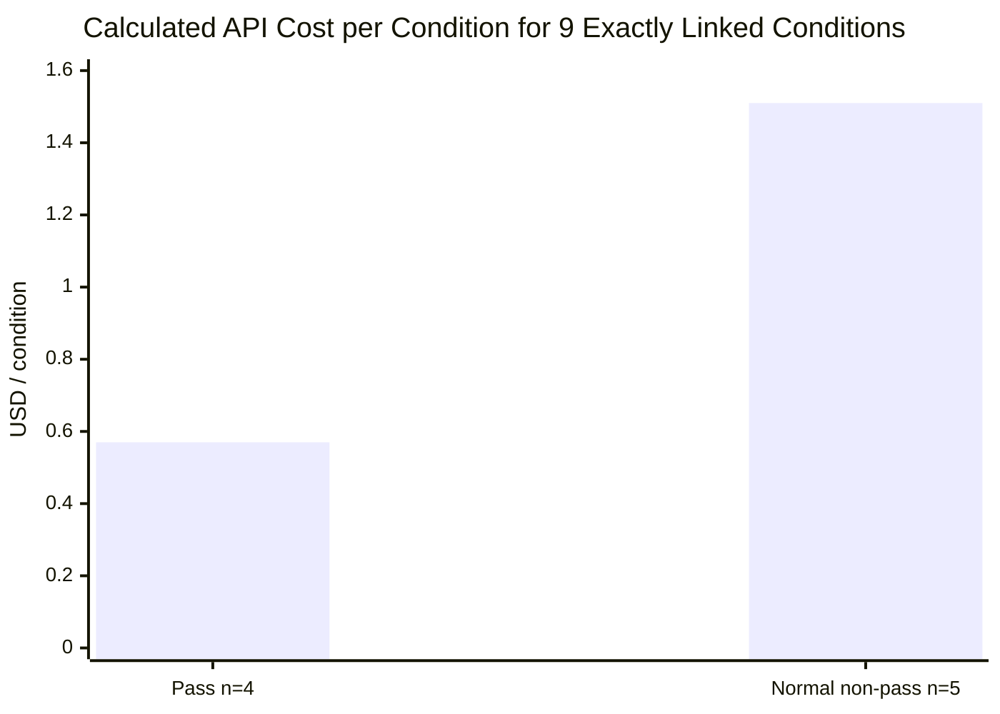

# Preliminary Experiment at a Glance: Observed String Changes and Cost by Outcome

> **Reading the numbers**
>
> Dollar amounts in this document are rounded to two decimal places for readability.
> Exact calculated values remain in [Cost Accounting by Outcome](outcome-cost-accounting-20260918.md)
> and the [public aggregate JSON](../../../data/experiment/outcome-cost-accounting.json).
> Local tokens in changed spans, provider API usage, calculated API cost, directly
> attributable infrastructure cost, and an actual invoice are different units and
> must not be treated as interchangeable.

## What the Preliminary Experiment Established

When the UTF-8 bytes of message content from 56 requests collected across 5 purposively
selected tasks and 15 historical runs were classified, compression candidates accounted
for 15.42% overall and 0.48%–35.29% by task. This is the **candidate scope** identified
after protecting code, mixed-code spans, structured data, instructions, and uncertain
spans. It is not an achieved compression rate or a validated upper bound.

Among 78 conditions produced by applying three compression conditions once each to 26
tasks, the recorded transformed string actually changed in 23 conditions and did not
change in 55. An unchanged string can mean either that no candidate existed or that a
candidate existed but the profile's rules did not change it. The current public aggregate
cannot distinguish those cases.

Recounting the 209 changed spans in those 23 conditions with tiktoken `0.14.0` and
`o200k_base` gives `97,723 → 50,824` tokens, a reduction of about 48%. **The denominator
for 48% is only the 209 spans whose strings changed.** It does not mean that the model's
full context or the provider's total billed tokens fell by 48%. Across the four conditions,
9–11 tasks passed and calculated API cost ranged from `$4.69` to `$6.66`, but one run per
condition cannot attribute those differences to compression.

## Appropriate Use of This Record

| Category | What this material supports |
|---|---|
| Established by current evidence | It supports the observation that strings and local-token counts fell in some protected spans, the limitation that quality and cost differences cannot be separated as compression effects, and a record format that separates cost by outcome. It does not decide default compression adoption or rank compressors. |
| If further evidence is needed | Before execution, jointly define a representative work sample, repetitions by condition, quality and work-acceptance criteria, cache and concurrency controls, cost scope, and stopping rules. State whether cost means calculated API cost, directly attributable infrastructure cost, or invoice-reconciled spend. |

No decision has been made to run additional validation. This table separates what the
current material establishes from conditions required for further work; it does not urge
a particular choice.

## What Ran

| Item | Scope of this record |
|---|---|
| Experiment data | [26 Terminal-Bench 2.1 tasks](tasks.md) |
| Execution period | 2026-09-16–17 UTC |
| Comparison conditions | `none`, squeez `1.48.4`, Headroom `0.36.5`, LLMLingua-2 `0.2.2` |
| Execution count | One run per task and condition, 104 conditions total |
| Model | `gpt-5.4`; provider-reported `gpt-5.4-2026-03-05` |
| Generation settings | `temperature=0`, `reasoning_effort=none`; settings record, not a guarantee of identical answers |
| Quality judgment | Built-in task grading and regrading after workspace restoration. A separate baseline exposed a verifier false-failure case, so `pass` and `wrong_answer` mean only that verifier's judgment. |
| Cost | Calculated from provider API usage and a fixed price table; not reconciled to an actual invoice |

`none` does not mean the model skipped the task. It is the reference condition that solved
the same task **without additional compression**.

## Why Tool Changes Required Protection Boundaries

The following public before-and-after examples come from model-free static measurements.
The native runs for 104 conditions established condition-level change counts and sizes;
they do not newly publish private source text here.

| Profile | Public before-and-after example (static) | Observed risk or classification |
|---|---|---|
| squeez `1.48.4` | Installation diagnostics and completion signals after the 30th content line disappeared. In a separate compound command, an earlier listing filled 30 lines and all 10 lines of a later `find` result disappeared. | Lossy compression that discards trailing content by length |
| Headroom `0.36.5` paths-only | A repeated path prefix such as `<LOG_DIR>/2025-07-03_api.log` appeared once while file names remained. Reverse transformation of 107 occurrences in the static sample reproduced the original bytes. | Lossless transformation that groups common paths; an observation of a restricted profile, not the whole Headroom product |
| LLMLingua-2 `0.2.2` | `[ERROR]` and `[WARNING]` disappeared, `1.22.1` became `. 22. 1`, and `denied` disappeared from a refusal state. | Lossy within-line token selection that can change severity, identifiers, versions, and state |

**Design proposal.** If additional validation is run, use these risks to fix compression
and protection targets before execution and test them separately. In the preliminary
experiment, the system first separated protected spans from log candidates and sent only
candidates to the tool. This evidence does not establish that every product and setting
requires the same protection mechanism.

## Observations Across 104 Conditions

| Condition | Passes / 26 conditions | Conditions with changed strings | Changed spans | Calculated API cost |
|---|---:|---:|---:|---:|
| `none` | 11 | 0 | 0 | `$5.62` |
| squeez | 10 | 1 | 2 | `$6.66` |
| Headroom | 9 | 4 | 53 | `$5.36` |
| LLMLingua-2 | 10 | 18 | 154 | `$4.69` |
| **Total** | **40 / 104 conditions** | **23 conditions** | **209** | **`$22.33`** |

The [task-level changed-condition comparison](metrics.md) places the 23 changed-string
conditions beside the corresponding task's `none` result and groups the 55 compression
conditions with zero changes separately.

Actual changes occurred in log candidates that passed the system's protection rules. The
public aggregate does not reclassify the 209 spans as file lists, installation logs,
command output, or other types, so the examples above remain static illustrations of tool
behavior.

Logical requests sent to the model, external API-call attempts, successful responses, and
responses delivered to the task are distinct events. All four counters happened to be
1,027 in these 104 conditions, but their definitions remain separate.

### What One Run Per Condition Could Not Distinguish

Each task was compared once under `none` and each compression condition. Seven squeez or
Headroom pairs received different judgments from `none` even though the recorded
transformed-string change count was zero.

| Compression condition | `pass→wrong_answer` | `wrong_answer→pass` | Judgment changes |
|---|---:|---:|---:|
| squeez | 2 | 1 | 3 |
| Headroom | 3 | 1 | 4 |
| **Total** | **5** | **2** | **7** |

These are not repeated runs of the same uncompressed condition, and there is no evidence
that full request history, request count, cache state, or execution path matched. The
observation is that one run per condition cannot separate execution variation from a
condition effect. Repeated execution is a design condition for any further validation,
not a procedure already completed here.

## Cost by Outcome

### What `$22.33` and `$87.77` Refer To

| Execution scope | Request and response events | Confirmed calculated API cost | Quality status |
|---|---|---:|---|
| 104 conditions completed and graded across four conditions and 26 tasks | 1,027 each for logical requests, HTTP attempts, successful responses, and task deliveries | `$22.33` | 40 passes; 64 normal non-passes |
| 5 long-running attempts that ended before grading | 2,783 logical requests; 2,783 HTTP attempts; 2,782 successful responses; 2,778 task deliveries | `$87.77` | 4 operator stops and 1 stalled HTTP response; all quality-unknown |

Each of the five long-running attempts ran for about 10 hours. Their combined confirmed
calculated API cost was about 3.9 times the total for all 104 completed conditions.
Requests and cost accumulated while the experiment runner had no automatic call, cost,
or time stopping limit, and an operator stopped the runs after inspecting their state.
The study did not isolate absence of a limit as the sole cause of the cost difference.
The observation is limited to the request, response, and cost differences between the
two scopes; a preregistered stopping rule is a proposal for further validation.

> Dividing the `$22.33` calculated API cost of the 104 completed conditions by the 40
> built-in-grader passes gives an **arithmetic value of `$0.56` per passing condition**.
> Its numerator includes the cost of 64 normal non-passes. It excludes the five
> long-running attempts, and `pass` is not a jointly agreed business-acceptance criterion.

### Nine Conditions With Exact Outcome-to-Cost Linkage

| Exactly linked scope | Pass | Normal non-pass |
|---|---:|---:|
| Quality-result count | 4 conditions | 5 conditions |
| Total calculated API cost | `$2.28` | `$7.56` |
| Calculated API cost per condition | **`$0.57`** | **`$1.51`** |
| Coverage within the full classification | 4 of 40 passing conditions | 5 of 64 normal non-passing conditions |

*Figure 1. Bars are means within the nine conditions with exact outcome-to-cost linkage.
This is a convenience sample with exact linkage, not a representative sample. Do not
extend it to outcome-level means for all 104 conditions or the general cost of failure.*

The remaining `$12.49` in calculated API cost across 95 conditions was not allocated by
outcome. An input-only estimate of about `$0.13` for one long-running request without
usage was also excluded from `$87.77`. Program-wide cost per pass was therefore not
calculated.

If additional validation proceeds, first fix whether cost means **calculated API cost,
directly attributable infrastructure cost, or invoice-reconciled spend**. Within that
scope, cost per result meeting a business criterion can be defined as a candidate metric.
Its numerator should include exactly once every cost in the preregistered attribution
scope from started non-passes, retries, and attempts that ended before quality judgment.

## Key Limitations

- There was one run per condition, and the sample was not randomly drawn to represent all 89 tasks.
- Cache, request count, model execution path, and cross-condition concurrency were not controlled.
- `temperature=0` does not guarantee determinism, and a verifier false-failure case was found in a separate baseline.
- This material does not support default compression adoption, compressor ranking, a causal compression effect, quality non-inferiority, an overall work-cost reduction, or cost per jointly accepted work result.

For detailed evidence and recalculation, see the [26-task guide](tasks.md),
[technical preliminary-comparison evidence](preliminary-comparison-20260916.md),
[static compressor measurements](../compressors.md), and
[cost accounting by outcome](outcome-cost-accounting-20260918.md).
