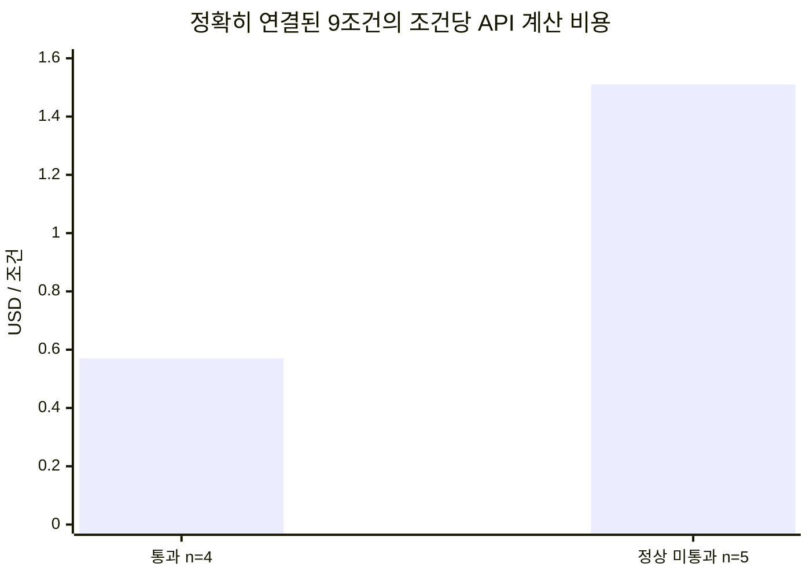

# 1차 실험 한 장 요약: 압축 적용에서 관측한 문자열 변화와 결과별 비용

> **숫자 읽기**
>
> 이 문서의 달러 금액은 읽기 쉽게 소수 둘째 자리까지 반올림했다.
> 정확한 계산값은 [결과별 비용 집계](../outcome-cost-accounting-20260918.md)와
> [공개 집계 JSON](../../../data/experiment/outcome-cost-accounting.json)에 남아 있다.
> 변경 구간의 로컬 토큰, 제공자 API 사용량, API 계산 비용, 직접 귀속 인프라 비용,
> 실제 청구서는 서로 다른 단위이며 바꾸어 읽지 않는다.

## 1차 실험에서 확인한 것

과거 목적 선정 5과제·15실행에서 수집한 56개 요청의 메시지 본문 UTF-8바이트를
분류했을 때 압축 후보는 전체의 15.42%였고, 과제별로 0.48%~35.29%였다.
이는 코드·코드 포함 혼합 구간·구조화 자료·지시와 불확실한 구간을 보호한 뒤
식별한 **후보 범위**다. 달성 압축률이나 검증된 상한은 아니다.

26과제에 세 압축 조건을 각각 한 번 적용한 78조건 중 23조건에서 기록된 변환
문자열이 실제로 달라졌고 55조건에서는 달라지지 않았다. 달라지지 않은 이유는
압축 후보가 없었기 때문일 수도 있고, 후보가 있어도 해당 프로필의 규칙이
문자열을 바꾸지 않았기 때문일 수도 있다. 현재 공개 집계로 두 경우를 나누지는
못한다.

달라진 23조건의 209구간을 `tiktoken 0.14.0`의 `o200k_base`로 다시 세면
`97,723 → 50,824`토큰으로 약 48% 줄었다. **48%의 분모는 문자열이 달라진
209구간만**이다. 모델이 읽은 전체 문맥이나 제공자가 청구한 전체 토큰이 48%
줄었다는 뜻은 아니다. 네 조건의 통과 수는 9~11개, API 계산 비용은
`$4.69~$6.66`이었지만 조건당 한 번만 실행해 차이를 압축 효과로 귀속할 수 없다.

## 이 기록을 활용하는 범위

| 구분 | 이 자료로 정리할 수 있는 내용 |
|---|---|
| 현재 자료로 확인한 범위 | 일부 보호된 구간에서 문자열과 로컬 토큰이 줄었다는 관측, 품질·비용 차이는 압축 인과로 가를 수 없다는 한계, 결과별 비용을 분리하는 기록 형식까지 정리할 수 있다. 기본 압축 도입 여부나 압축기 순위는 이 자료로 정하지 않는다. |
| 추가 확인이 필요할 때 | 공동으로 선정한 대표 업무 표본, 조건별 반복, 품질·업무 수락 기준, 캐시·동시성 통제, 비용 범위와 중단 기준을 실행 전에 정한다. 비용 범위는 API 계산 비용·직접 귀속 인프라 비용·청구서 대사액 가운데 무엇인지 명시한다. |

추가 검증 여부는 아직 정하지 않았다. 이 표는 선택을 촉구하는 것이 아니라 현재
자료로 확인한 범위와, 더 확인할 때 필요한 조건을 구분한 것이다.

## 무엇을 돌렸나

| 항목 | 이번 기록의 범위 |
|---|---|
| 실험 데이터 | Terminal-Bench 2.1의 [26과제](tasks.md) |
| 실행 기간 | 2026-09-16~17 UTC |
| 비교 조건 | `none`, squeez `1.48.4`, Headroom `0.36.5`, LLMLingua-2 `0.2.2` |
| 실행 횟수 | 과제별 조건당 1회, 모두 104조건 |
| 모델 | `gpt-5.4`; 제공자 보고 `gpt-5.4-2026-03-05` |
| 생성 설정 | `temperature=0`, `reasoning_effort=none`; 설정 기록일 뿐 같은 답을 보장하지 않음 |
| 품질 판정 | 과제 내장 채점과 작업공간 복원 뒤 재채점. 별도 기준선에서 확인된 채점기 거짓 실패 사례가 있어 `pass`와 `wrong_answer`는 해당 채점기의 판정으로만 읽음 |
| 비용 | 제공자 API 사용량에 고정 가격표를 적용한 계산값. 실제 청구서와 대사하지 않음 |

`none`은 모델이 문제를 풀지 않은 조건이 아니라 **추가 압축 없이 같은 과제를 푼
기준 조건**이다.

## 도구별 변화가 왜 보호 경계를 필요로 했나

아래는 모델을 호출하지 않은 정적 측정의 공개 전후 사례다. 104조건의 native 실행에서
확인한 것은 조건별 변경 수와 크기이며, 비공개 원문을 이 문서에 새로 공개하지 않는다.

| 프로필 | 공개 전후 사례(정적) | 확인한 위험 또는 성격 |
|---|---|---|
| squeez `1.48.4` | 설치 출력에서는 30번째 내용 줄 뒤의 진단·완료 신호가 사라졌다. 별도 복합 명령에서는 앞선 목록이 30줄을 채워 뒤따른 `find` 결과 10줄 전체가 사라졌다. | 뒤쪽 내용을 길이 기준으로 버리는 손실 압축 |
| Headroom `0.36.5` paths-only | `<LOG_DIR>/2025-07-03_api.log`처럼 반복되던 경로 접두어를 한 번만 두고 파일 이름은 남겼다. 정적 표본 107출현을 역변환했을 때 원문과 바이트 단위로 같았다. | 공통 경로를 묶는 무손실 변환. Headroom 제품 전체가 아니라 제한 프로필의 관측 |
| LLMLingua-2 `0.2.2` | `[ERROR]`·`[WARNING]`이 사라지고 `1.22.1`은 `. 22. 1`로 갈렸으며, 거부 상태의 `denied`가 사라졌다. | 줄 안 token을 고르는 손실 압축으로 심각도·식별자·버전·상태가 달라질 수 있음 |

**설계 제안.** 이 위험 사례를 근거로 추가 검증을 진행할 경우 압축 대상과 보호 대상을 실행
전에 고정해 따로 검증한다. 이번 1차는 시스템이 보호 구간과 로그 후보를 먼저
나눈 뒤 후보만 도구에 전달했다. 이 자료만으로 모든 제품과 설정에 같은 보호
방식이 필요하다고 일반화하지 않는다.

## 104조건의 관측

| 조건 | 통과 / 26조건 | 문자열이 바뀐 조건 | 변경 구간 | API 계산 비용 |
|---|---:|---:|---:|---:|
| `none` | 11 | 0 | 0 | `$5.62` |
| squeez | 10 | 1 | 2 | `$6.66` |
| Headroom | 9 | 4 | 53 | `$5.36` |
| LLMLingua-2 | 10 | 18 | 154 | `$4.69` |
| **합계** | **40 / 104조건** | **23조건** | **209** | **`$22.33`** |

실제 변경은 시스템의 보호 규칙을 통과한 로그 후보에서 일어났다. 공개 집계는
209구간을 파일 목록·설치 기록·명령 실행 결과 같은 종류별로 다시 나누지 않으므로,
앞 절의 전후 예시는 도구 동작을 보여 주는 정적 표본으로만 읽는다.

모델에 보낸 논리 요청, 외부 API 호출 시도, 성공 응답, 작업에 전달한 응답은 서로
다른 사건이다. 이번 104조건에서는 네 카운터가 관측상 각각 1,027회였지만 정의를
합치지 않는다.

### 한 번씩만 실행해서 가를 수 없었던 것

같은 과제를 `none`과 압축 조건으로 한 번씩 비교했다. `squeez`와 Headroom 조건에서
기록된 변환 문자열 변경이 0건인데도 무압축 기준과 판정이 달라진 짝이 7개였다.

| 압축 조건 | `pass→wrong_answer` | `wrong_answer→pass` | 판정 변화 |
|---|---:|---:|---:|
| squeez | 2 | 1 | 3 |
| Headroom | 3 | 1 | 4 |
| **합계** | **5** | **2** | **7** |

이는 동일한 무압축 조건을 반복한 결과가 아니며, 전체 요청 이력·요청 수·캐시·실행
경로가 같았다는 증거도 아니다. 조건당 1회 비교로는 실행 변동과 조건 효과를
분리할 수 없다는 관측이다. 반복 실행은 추가 검증을 진행할 때 필요한 설계 조건이지,
이번 1차에서 이미 수행한 절차가 아니다.

## 결과별 비용

### `$22.33`과 `$87.77`의 주어

| 실행 범위 | 요청·응답 사건 | 확인된 API 계산 비용 | 품질 상태 |
|---|---|---:|---|
| 26과제의 네 조건을 끝까지 실행·채점한 104조건 | 논리 요청·HTTP 시도·성공 응답·작업 전달이 각각 1,027회 | `$22.33` | 통과 40 · 정상 미통과 64 |
| 채점 전에 끝난 장기 실행 5시도 | 논리 요청 2,783회 · HTTP 시도 2,783회 · 성공 응답 2,782회 · 작업 전달 2,778회 | `$87.77` | 4개 운영자 중도 종료 · 1개 HTTP 응답 정체, 모두 미확정 |

장기 5시도는 각각 약 10시간 실행됐고, 확인된 API 계산 비용 합은 끝까지 채점한
104조건 전체 합의 약 3.9배였다. 실험 실행기가 비용·호출·시간 기준으로 자동
중단하는 상한을 두지 않은 상태에서 요청과 비용이 누적됐고, 운영자가 상태를 본
뒤 사후 종료했다. 상한 부재만이 비용 차이를 만들었다고 분리 측정한 것은 아니다.
관측은 두 범위의 요청·응답 수와 비용 차이까지이며, 사전 중단 기준은 추가 검증을
진행할 경우의 설계 제안이다.

> 끝까지 채점한 104조건의 API 계산 비용 `$22.33`을 내장 채점 통과 40조건으로
> 나눈 **통과 조건 1건당 산술값은 `$0.56`**이다. 분자에는 정상 미통과
> 64조건의 비용도 들어 있다. 장기 5시도의 비용은 포함하지 않았고, `pass`는
> 양사가 합의한 업무 수락 기준이 아니다.

### 결과와 비용을 정확히 연결한 9조건

| 정확히 연결된 범위 | 통과 | 정상 미통과 |
|---|---:|---:|
| 품질 결과 수 | 4조건 | 5조건 |
| API 계산 비용 합계 | `$2.28` | `$7.56` |
| 조건당 API 계산 비용 | **`$0.57`** | **`$1.51`** |
| 전체 분류에서 차지하는 범위 | 통과 40조건 중 4조건 | 정상 미통과 64조건 중 5조건 |

*그림 1. 막대는 결과와 비용을 정확히 연결한 9조건 안의 평균이다. 자료가 정확히
연결된 편의 표본이며 대표 표본이 아니다. 전체 104조건의 결과별 평균이나 실패의
일반 비용으로 넓히지 않는다.*

나머지 95조건의 API 계산 비용 `$12.49`는 결과별로 배분하지 않았다. 사용량을
받지 못한 장기 요청 1회의 입력 전용 추정 약 `$0.13`도 `$87.77`에서 제외했다.
따라서 프로그램 전체 통과 1건당 비용은 계산하지 않았다.

추가 검증을 진행한다면 비용 범위를 **API 계산 비용, 직접 귀속 인프라 비용, 청구서
대사액** 가운데 무엇으로 할지 먼저 고정한다. 그 범위 안에서 업무 기준을 통과한
결과 1건당 비용을 지표 후보로 정의할 수 있다. 분자에는 사전에 정한 귀속 범위
안에서 실제로 시작한 미통과·재시도·품질 판정 전 시도의 비용을 각각 한 번 포함한다.

## 핵심 한계

- 조건당 1회이고 전체 89과제를 대표하도록 무작위로 뽑은 표본이 아니다.
- 캐시, 요청 수, 모델이 밟은 실행 경로와 조건 간 동시성을 통제하지 못했다.
- `temperature=0`은 결정론을 보장하지 않고, 별도 기준선에서 채점기 거짓 실패도
  확인했다.
- 이 자료로 기본 압축 도입, 압축기 순위, 압축의 인과 효과, 품질 비열등성,
  전체 업무의 비용 절감률이나 합의된 업무 결과 1건당 비용을 주장하지 않는다.

상세 근거와 다시 계산하는 방법은 [26과제 설명](tasks.md),
[예비 비교 기술 증거](../preliminary-comparison-20260916.md),
[정적 압축기 측정](../compressors.md),
[결과별 비용 집계](../outcome-cost-accounting-20260918.md)에서 확인할 수 있다.
