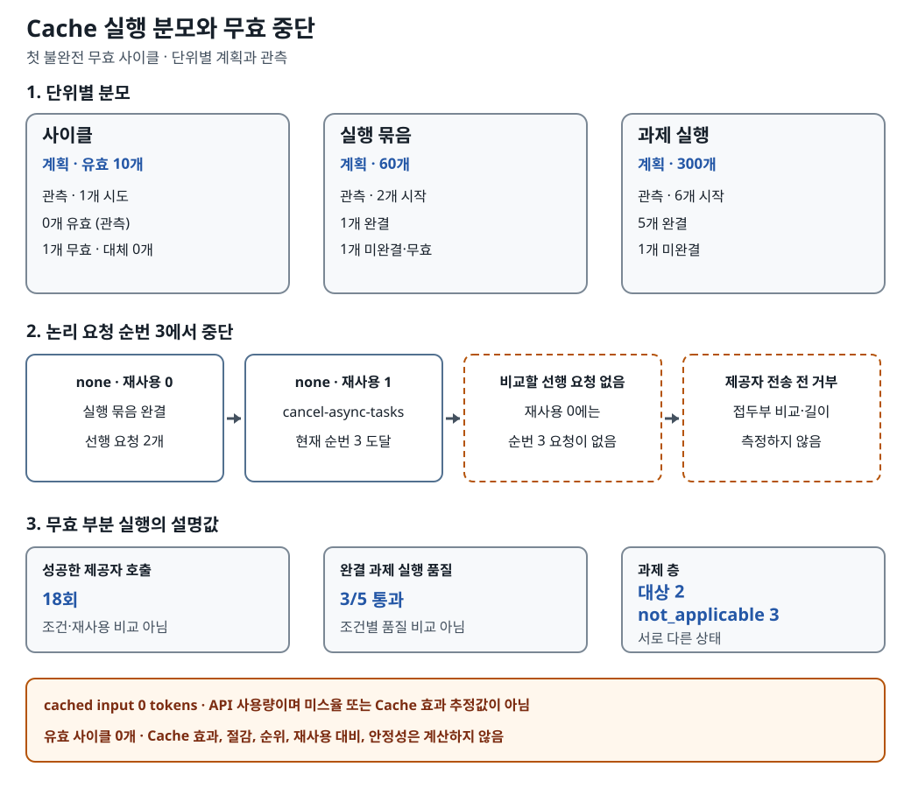

# Cache 재사용 실행: 첫 비교 사이클이 왜 유효해지지 못했나

> **문서 범위**
>
> 이 문서는 한국어 요약이며 전체 번역이 아니다. 인용 가능한 전체 측정 조건,
> 증거 해시와 공개 인용 경계는
> [영어 전체 보고서](../../../../docs_en/experiment/02-follow-up/cache-reuse/execution-20260923.md)에
> 있다.

## 무엇을 알아보려 했나

이 실험은 같은 과제를 여러 번 실행할 때 반복되는 입력 처리를 Cache로 재사용할 수
있는지, 그리고 입력을 `squeez`로 압축했을 때 그 결과가 달라지는지를 비교하려 했다.
여기서 프롬프트 캐시는 저장해 둔 답을 다시 꺼내 쓰는 기능이 아니다. 제공자가 한
요청의 앞부분에 반복해서 들어오는 입력을 같은 내용으로 인정할 때, 그 입력을 다시
처리하는 일을 줄일 수 있는 제공자별 기능이다. 실제 동작과 비용 효과는 제공자 조건에
따라 달라지므로, 캐시가 설정됐다는 사실만으로 절감을 약속할 수는 없다.

압축은 다른 개입이다. `none`은 입력을 압축하지 않는 조건이고 `squeez`는 요청을
보내기 전에 입력을 줄이는 조건이다. 압축은 입력 자체를 바꾸고, 프롬프트 캐시는
반복되는 입력 처리를 재사용한다. 두 효과를 비교하려면 같은 과제에서 같은 순번에 나온
개별 요청끼리 먼저 짝을 지을 수 있어야 한다.

재사용 `0`, `1`, `2`는 SDK 재시도 횟수나 서로 다른 세 과제를 뜻하지 않는다. 같은
사이클·압축 조건·과제·논리 요청 순번 안에서 재사용 `0`은 인정된 선행 요청이 없는 첫
관측이고, 재사용 `1`과 `2`는 각각 성공한 일치 선행 요청이 한 개와 두 개 쌓인 뒤의
관측이다. 재사용 수준을 비교할 때는 압축 조건을 고정하고, `none`과 `squeez`를
비교할 때는 재사용 수준을 고정한다. 압축 자체가 입력을 바꾸므로 `none`과 `squeez`
요청 내용이 서로 바이트 단위로 같아야 한다는 뜻은 아니다.

이번 실행에서는 제공자 호출이 실제로 일어났지만 그 비교가 성립하지 않았다. 첫 번째
사이클에서 `none`·재사용 `0` 실행 묶음은 끝났다. 다음 `none`·재사용 `1` 실행 묶음의
`cancel-async-tasks` 과제는 세 번째 논리 요청에 도달했지만, 앞선 재사용 `0` 실행에는
요청이 두 개뿐이었다. 같은 과제의 세 번째 요청이 없으니 비교할 쌍도 없었다. 검증기는
현재 세 번째 요청을 제공자에게 보내기 전에 실행을 멈췄고, 사이클은 무효로 남았다.
대체 실행은 없었다.

이번 기록에서 확인할 수 있는 범위는 여기까지다. 사이클 `1`개를 시도했지만 유효한
비교 사이클은 `0`개였고, Cache 효과, 캐시 미스율, 절감액, 재사용 수준 간 차이와
안정성은 계산하지 않았다. 계획했던 `squeez` 조건에도 도달하지 않았다.

## 18회 호출과 유효 사이클 0개가 함께 가능한 이유

이 수치들은 서로 다른 단위를 센다. **과제 실행(`task trial`)**은 과제 하나를 한 번
실행한 기록이고, **실행 묶음(`bundle`)**은 압축 조건 하나와 재사용 수준 하나에서
고정 5과제를 실행하는 단위다. **유효 사이클**은 `{none, squeez}`와 재사용
`{0, 1, 2}`를 조합한 실행 묶음 여섯 개가 모두 끝나고, 요청 접두부·사용량·출처·실행
조건 검증을 모두 통과한 경우에만 생긴다.

중단 전까지 제공자는 요청 `18`개에 성공적으로 응답했고, 과제 실행 `6`개가 시작되어
`5`개가 끝났다. 그러나 여섯 실행 묶음 가운데 하나만 완결됐고 다음 묶음은 도중에
멈췄다. 일부 요청과 과제가 성공했더라도 여섯 묶음을 모두 갖춘 비교 단위는 만들지
못했으므로 유효 사이클은 `0`개다. `18`, `5`, `0`은 서로 다른 성공률이 아니라 각각
제공자 호출, 완결된 과제 실행, 비교 가능한 전체 사이클의 개수다.

## 왜 세 번째 요청에서 멈춰야 했나

요청 접두부(`request prefix`)는 여러 요청을 앞에서부터 늘어놓은 열이 아니다. 한 개별
요청의 직렬화된 메시지 내용 안에서 앞부터 비교하는 부분이다. 과제 이름과 논리 요청
순번은 재사용 단계 사이에서 어느 개별 요청끼리 비교할지를 정한다. 요청 개수와 순번은
바이트 또는 토큰으로 잰 접두부 길이와도 다른 값이다.

재사용 `1`의 세 번째 요청을 비교하려면 같은 과제의 재사용 `0` 실행에도 세 번째
요청이 있어야 했다. 실제 선행 실행에는 요청이 두 개뿐이어서 세 번째 쌍은 존재하지
않았다. 이 자리에서는 서로 다른 접두부나 접두부 길이를 측정한 것이 아니다. 존재하지
않는 쌍을 비교할 수 없어 제공자 전송 전에 중단한 것이다. 앞선 구조 선별은 고정
5과제를 모두 검사했다. 공통 메시지 접두부가 사전에 정한 기준을 넘은 2과제만 주 캐시
분모의 구조적 대상이었고, 나머지 3과제는 `not_applicable`이었다. 이는 제공자 캐시
적중을 관측했다는 뜻이 아니며, 제외된 3과제에 숫자 0의 캐시 결과를 부여하지도 않는다.
이번 중단은 그 선별 결과를 뒤집거나, 이미 존재했던 다른 요청 쌍의 접두부 검증까지
없었다고 말해 주지 않는다.

## 실행 분모와 중단 흐름

아래 그림은 계획한 비교 단위 가운데 실제로 어디까지 완결됐고, 왜 유효 사이클이
`0`개로 남았는지를 보여 준다. 사이클, 실행 묶음, 과제 실행은 서로 다른 단위이므로
하나의 깔때기나 성공률처럼 읽지 않는다. 각 단위 안에서 계획과 관측을 비교한 다음,
재사용 `0` 실행 묶음의 완결에서 논리 요청 순번 `3`의 중단까지 이어지는 흐름을 읽으면
된다.

*부분 실행에서는 제공자 응답이 있었지만 비교 단위 전체는 완결되지 않았다. 이 중단은
비교 가능성을 지켰을 뿐 Cache·재사용·압축 효과를 추정하지 않는다. 링크를 열면 SVG를
원래 크기로 볼 수 있으며, 모든 값은 아래 텍스트 대안에 적었다.*

### 그림의 전체 텍스트 대안

- **사이클.** 계획은 유효 `10`개였다. `1`개를 시도했지만 유효 `0`개, 무효
  `1`개였고 대체 실행은 `0`개였다.
- **실행 묶음.** 계획은 `60`개였다. `2`개를 시작해 `1`개가 완결됐고, `1`개는
  미완결·무효로 남았다.
- **과제 실행.** 계획은 `300`개였다. `6`개를 시작해 `5`개가 완결됐고 `1`개는
  미완결이었다.
- **요청 접두부 중단.** `none`에서 재사용 `0 → 1 → 2` 순서를 계획했다. 재사용
  `0` 실행 묶음은 완결됐다. 재사용 `1`의 `cancel-async-tasks`가 논리 요청 순번
  (`ordinal`) `3`에 도달했지만 선행 실행에는 요청이 `2`개뿐이었다. 순번 `3`의 선행
  요청이 없어 접두부 차이나 길이는 측정하지 않았고, 현재 요청을 제공자 전송 전에
  거부했다.
- **설명값.** 성공한 제공자 응답은 `18`회였고 완결 과제 실행 품질은 `3/5`였다.
  둘 다 조건·재사용 효과의 분모가 아니다.
- **과제 층.** 셀마다 고정 `5`과제를 두었다. 주 캐시 분석 대상은 `2`과제였고
  `3`과제는 `not_applicable`이었다.
- **`cached input`.** 제공자 보고값은 `0` tokens였다. 효과 또는 미스율 지표로
  계획한 값이 아니며 Cache 효과 `0%`나 미스율을 뜻하지 않는다.
- **결론 경계.** 유효 사이클이 있어야 조건을 비교할 수 있다. 이 기록은 효과,
  재사용 대비, 절감, 순위와 안정성을 계산하지 않는다.

## 사용량, 계산 비용과 품질을 읽는 법

성공한 제공자 응답의 API 사용량은 input `65,423` tokens, cached input `0` tokens,
output `9,690` tokens였다. cached input은 input 안에 포함되는 하위 항목이지 input에
더하는 세 번째 합계가 아니다. 이 값이 `0`이라는 사실만으로 캐시 효과가 0%였다거나
모든 요청이 캐시 미스였다고 말할 수 없다. 유효한 조건 비교가 없었기 때문이다.

고정 가격표로 계산한 API 비용은 input USD `0.1635575`, output USD `0.14535`, 합계
USD `0.3089075`였다. 중단 전 성공한 호출의 사용량을 가격표에 곱해 얻은 값이다.
청구서와 대사하지 않았으므로 invoice는 `not_measured`다. 최대 설계의 안전 상한
USD `721,474.56`도 실제 지출이나 예측값이 아니라 실행을 막기 위한 한도다.

완결된 과제 실행 다섯 개에는 기존 과제 검증기를 적용했고 `3/5`가 통과했다. 여섯 번째
과제 실행은 시작했지만 끝나지 않았다. 이 `3/5`는 완결된 다섯 건의 설명값일 뿐,
`none`과 `squeez`의 품질 비교나 일반적인 모델 품질을 뜻하지 않는다. 검토한 확정
보고서에는 이 판정기를 독립적으로 검증한 증거가 남아 있지 않다.

## 무엇을 말할 수 있고 없는가

**관측.** 비교 가능성을 지키는 검증기가 선행 요청이 없는 세 번째 요청을 제공자 전송
전에 막았다. 그 결과 첫 사이클은 무효로 보존됐고, 실행 전체 재시도와 대체 실행은
수행하지 않았다.

**가능한 설명.** 두 과제 실행이 서로 다른 수의 요청을 만들었다. 비결정적 실행 경로도
이런 요청 수 차이를 만들 수 있지만, temperature `0`과 reasoning effort `none`을 설정했다는
사실만으로 요청 개수가 같아지는 것은 아니며 이번 실행은 그 설명을 시험하지 않았다.

**한계.** 요청 개수가 달라진 원인을 모델, 과제, 전송 계층, 격리 이름공간, 압축 또는
다른 기제로 분리하지 못했다. 유효 사이클이 `0`개이므로 Cache 효과, 재사용 대비,
절감, 순위, 비열등성, 일반 품질과 안정성을 주장할 수 없다.

## 측정 조건

| 항목 | 고정하거나 확인한 내용 |
|---|---|
| 실행 코드 | commit `e78a32edca9d5ce4f991700e3a299d72164e94be`; tree `63f969519c93a58faf800ed91cc464f9b955fe2b` |
| 실행 시각 | 공개 가능한 확정 증거에는 실행 날짜, 시간 구간, 시간대가 남아 있지 않다. 파일명이나 게시 시각으로 추정하지 않는다. |
| 제공자·모델 | `foundry`; `gpt-5.4`; 제공자 보고 리비전 `gpt-5.4-2026-03-05` |
| API 경계 | `openai_v1_chat_completions`; 프로젝트에 귀속된 Foundry 엔드포인트 연결. 엔드포인트 값과 자원 식별자는 공개하지 않는다. |
| 생성 설정 | temperature `0`; reasoning effort `none`; `determinism_claimed=false`. temperature `0`은 요청 수가 같음을 보장하지 않는다. |
| 조건·순서 | 계획은 `{none, squeez}`와 재사용 `{0, 1, 2}`를 `0 → 1 → 2` 순서로 실행하는 것이었다. 재사용 대비는 압축 조건을 고정하고 압축 대비는 재사용 수준을 고정한다. 실제로는 `none`·재사용 `0`만 완결됐고 `none`·재사용 `1`은 미완결이었다. |
| 과제 모집단 | 셀마다 고정 5과제. 그중 2과제만 주 캐시 분석 분모에 포함했고 3과제는 `not_applicable`이다. |
| 계획 규모 | 동시성 `1`; 처음 10개 유효 사이클, 60개 실행 묶음, 300개 과제 실행. 사전에 정한 안정성 규칙이 요구할 때만 최대 20개 유효 사이클로 한 번 연장 |
| 사용량·비용 출처 | 성공한 제공자 응답의 API 보고 사용량과 승인된 고정 가격표로 계산한 금액. 실제 청구서가 아니다. |
| 품질 판정 | 완결된 과제 실행에만 기존 과제 검증기(`native task verifier`)를 적용했다. 검토한 확정 보고서에는 독립적인 판정자 검증 증거가 남아 있지 않다. |

## 상세 사용량·비용·품질

| 관측값 | 값 | 읽는 범위 |
|---|---:|---|
| 성공한 제공자 호출 | 18 | 불완전한 무효 사이클의 5과제 설명값 |
| 제공자 보고 input | 65,423 tokens | API 보고 사용량 |
| 제공자 보고 cached input | 0 tokens | Cache 효과나 캐시 미스율이 아님 |
| 제공자 보고 output | 9,690 tokens | API 보고 사용량 |
| 계산한 input 비용 | USD 0.1635575 | 고정 가격표 계산값이며 청구서가 아님 |
| 계산한 output 비용 | USD 0.14535 | 고정 가격표 계산값이며 청구서가 아님 |
| 계산한 API 비용 | USD 0.3089075 | 고정 가격표 계산값이며 청구서가 아님 |
| 청구서 | `not_measured` | 청구 대사를 하지 않음 |
| 완결 과제 실행 품질 | 3/5 통과 | 여섯 번째 과제 실행은 시작했지만 미완결; 조건별 품질 비교가 아님 |

## 더 읽기

- [영어 전체 측정 보고서](../../../../docs_en/experiment/02-follow-up/cache-reuse/execution-20260923.md)
- [Cache 재사용 실행 계약](../../../cache-reuse.md)
- [2차 연구 한국어 입구](../README.md)
- [영어 하위 연구 요약](../../../../docs_en/experiment/02-follow-up/cache-reuse/README.md)
