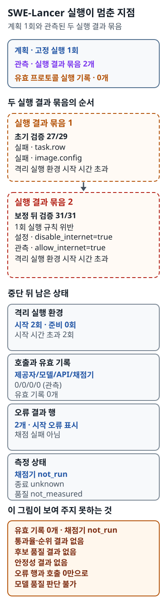

# SWE-Lancer 고정 실행: 유효 기록을 만들지 못하고 모델 평가 전에 멈춘 이유

> **문서 범위**
>
> 이 문서는 한국어 요약이며 전체 번역이 아니다. 전체 측정 조건, 수치, 증거 해시와
> 공개 인용 경계는
> [영어 전체 보고서](../../../../docs_en/experiment/02-follow-up/swe-lancer/fixed-trace-20260923.md)에
> 있다.

## 무엇을 확인하려 했나

소프트웨어 과제 실행은 과제와 작업 환경을 준비한 뒤, 해법 실행기가 모델과 도구를
사용해 작업하고, 마지막으로 채점기가 결과를 평가하는 순서로 진행된다. 이 실행은 그
전 과정이 정해진 조건 아래 한 번 이어지고 결과와 정리 상태까지 기록되는지 확인하려
했다. 환경 준비 단계에서 멈추면 모델 답이나 채점 결과를 평가한 실행으로 볼 수 없다.

여기서는 미리 고른 후보 `28565_1001` 하나를 대상으로 삼았다. 실행 전에 선택한 과제
행과 이미지, 해법 실행기(`solver`), 모델·API 설정을 확인하고 격리 실행 환경
(`sandbox`)을 준비하도록 했다. 그 뒤에야 해법 실행기가 모델과 필요한 도구를 쓰고,
채점기(`grader`)가 결과를 판정할 수 있었다. 이 순서와 실행 결과, 정리 상태까지 모두
묶여야 인용 가능한 프로토콜 실행 기록(`trace`) 한 건이 된다.

계획은 split `diamond`의 `ic_swe` 1과제, 고정 해법 실행기·과제 목록(`catalog`)·이미지,
동시성 `1`, 실행기와 SDK 재시도 `0`, 정확히 한 번의 실행이었다. 모델 리비전
`gpt-4o-2024-11-20`은 이 승인된 계약에서 제공자 전송 전에 고정하고 확인했다. 실제
추론 응답에서 리비전을 다시 관측한 것은 아니다. 유효한 기록이 되려면 모든 제공자
전송 전 조건을 통과한 뒤 한 번만 시작하고, 설정한 격리 조건을 지키며 결과와 정리를
확정해야 했다.

## 실제로 일어난 순서

처음 제공자 전송 전 검증은 `29`개 가운데 `27`개를 통과했고, `task.row`와
`image.config`가 실패했다. 그 실패 기록 뒤에 첫 번째 실행 결과 묶음(`runner group`)이
나타났지만, 격리 실행 환경의 컴퓨터가 준비되기를 기다리던 중
`computer_startup_timeout`으로 끝났다. 실행 결과 묶음은 실행기가 남긴 별도 비공개
출력 묶음일 뿐, 모델 호출이나 유효한 실행 기록을 뜻하지 않는다.

담당자가 통제할 수 있는 입력을 바로잡은 뒤 검증은 `31/31`을 통과했다. 그러나 계획에
없던 두 번째 실행 결과 묶음이 생겼고, 보호 절차가 적용된 시작에서 설정값
`disable_internet=true`와 모순되는 `allow_internet=true`가 관측됐다. 이 묶음도
격리 실행 환경 시작 중 같은 시간 초과로 끝났다. 뒤의 `31/31`은 앞선 `27/29` 실패나
두 번째 묶음이 생긴 사실을 지우지 않는다.

두 묶음 모두 논리 모델 요청, 제공자 HTTP 시도, API·도구·채점기 호출 전에 멈췄다.
따라서 유효 프로토콜 실행 기록은 `0`개다. 두 `correct=False` 행은 각 시작 오류를
남긴 자리이지 채점된 오답이 아니다. 이 기록으로 통과율, 후보 품질, 순위, 안정성 또는
대표 비용을 계산할 수 없다.

## 프로토콜 실행 흐름

아래 그림은 계획한 실행 `1`회가 왜 유효 기록이나 모델 평가로 이어지지 않았는지를
보여 준다. 먼저 계획과 관측된 실행 결과 묶음 수를 비교하고, 두 묶음을 시간 순서로
읽는다. 그다음 격리 실행 환경 준비, 호출, 채점 상태를 따로 보면 각 단계가 어디에서
멈췄는지 알 수 있다.

*두 실행 결과 묶음은 모두 격리 실행 환경 준비 단계에서 끝났다. 따라서 오류 행을
채점 실패로 읽거나 호출 `0`을 품질·비용 성과로 읽을 수 없다. 링크를 열면 SVG를 원래
크기로 볼 수 있으며, 모든 상태와 값은 아래 텍스트 대안에 적었다.*

### 그림의 전체 텍스트 대안

- **고정 실행.** 정확히 `1`회를 계획했지만 실행 결과 묶음은 `2`개가 관측됐다.
  두 번째 묶음은 1회 실행 규칙을 어겼다.
- **초기 검증과 첫 묶음.** 제공자 전송 전에 모든 조건을 통과해야 했다. 실제 검증은
  `27/29`였고 `task.row`, `image.config`가 실패한 뒤 첫 묶음이
  `computer_startup_timeout`으로 끝났다.
- **보정 검증과 둘째 묶음.** 담당자가 통제할 수 있는 입력을 보정한 뒤 검증은
  `31/31`이었다. 이후 두 번째 묶음이 생겼고 다시 `computer_startup_timeout`으로
  끝났다.
- **네트워크 조건.** 설정은 `disable_internet=true`였지만 보호 절차가 적용된
  시작에서 `allow_internet=true`가 관측됐다. 격리 조건은 성립하지 않았다.
- **격리 실행 환경.** 고정 실행 `1`회를 위해 환경을 준비하려 했다. 시작 시도는
  `2`회, 준비 완료는 `0`회, 시작 시간 초과는 `2`회였다.
- **호출.** 제공자·모델·API·채점기 호출은 `0/0/0/0`으로 관측됐다.
- **실행 기록과 채점.** 목표는 유효 프로토콜 실행 기록 `1`개였지만 유효 기록은
  `0`개였고 채점기는 `not_run`이다.
- **오류 결과 행.** `correct=False` 행 `2`개는 시작 오류 표시이며 채점 실패가 아니다.
  과제 품질은 `not_measured`다.
- **실행기와 비용 상태.** 실행기 종료는 `unknown`, API 계산 비용은
  `USD 0.000000`, 청구서와 호스트 비용은 각각 `not_measured`다. 이 계산값은 호스트
  비용 `0`을 뜻하지 않는다.
- **정리.** 컨테이너·프로세스·작업공간·네트워크 규칙 등 남은 항목은 `0`개였다.
- **결론 경계.** 품질 판정에는 유효 기록과 채점 결과가 필요하다. 이 기록은 통과율,
  순위, 후보 품질, 안정성과 대표 비용을 판단하지 않는다.

## 측정 조건

| 항목 | 고정하거나 확인한 내용 |
|---|---|
| 실행 저장소 | commit `cf8960a6121e91c8ec6a796d470009a27504bf61`; tree `70e0961bf2a3009d9a2c8e36471744be81775daa` |
| 상위 저장소·후보 | `openai/frontier-evals` commit `51052cede8cc608f95bb00346635e03759013e5a`; 후보 `28565_1001`; split `diamond`; `ic_swe`; 1과제 |
| 이미지·실행 환경 | 고정 Linux/amd64 이미지와 프로젝트 전용 비공개 Linux 실행 환경(`carrier`) |
| 제공자·모델 | `openai`; 모델 설정 `openai/gpt-4o`; 요청 모델 `gpt-4o`; 승인된 계약에서 고정·검증한 보고 리비전 `gpt-4o-2024-11-20`. 실제 추론 응답은 없었다. |
| API 경계 | `openai-v1-chat-completions`; 자격 증명과 격리 실행 환경 엔드포인트의 값·식별자는 공개하지 않는다. |
| 실행 설정 | 동시성 `1`; multiprocessing·Slack·registry pull 비활성; 실행기 재시도 `0`; SDK 재시도 `0`; 결정론 주장 없음 |
| 네트워크 조건 | 명령은 `disable_internet=true`로 설정했지만 보호 절차가 적용된 시작에서 `allow_internet=true`가 관측돼 격리 조건이 성립하지 않음 |
| 증거 시간 구간 | `2026-09-23T02:12:29Z`~`2026-09-23T02:18:27.355804Z`, UTC. UTC 실행 결과 묶음 이름과 비공개 실행 로그의 수정 시각에서 도출했다. 독립적으로 잰 작업 소요 시간이 아니다. |
| 판정자 | 벤치마크 채점기는 실행하지 않았다. 검토한 확정 증거에는 독립적인 채점기 검증 증거가 남아 있지 않다. |

후보는 고정된 상위 저장소 README의 `ic_swe` 예시 하나에서 과제 내용을 보기 전에
정했다. 앞선 [후보 검토](../../swe-lancer-candidate-evaluation-20260920.md)는 실행
허용 조건을 기록한 역사 자료이고, 이 프로토콜 무효 실행의 결과가 아니다.

## 사용량, 비용과 품질

| 항목 | 상태 | 의미 |
|---|---:|---|
| 제공자 입력 / 출력 토큰 | 0 / 0 | 제공자 요청을 전송하지 않아 관측된 0 |
| 캐시 입력 / 추론 토큰 | `not_applicable_no_provider_call` | 제공자 응답이 없어 적용 대상 아님 |
| 계산한 API 비용 | `USD 0.000000` | 제공자 사용량 기준 계산값이며 청구서가 아님 |
| 제공자 보고 비용 | `not_measured` | 비용 기록 없음 |
| 청구서 / 호스트 비용 | `not_measured` / `not_measured` | 이 기록에서 측정하지 않음 |
| 실행기 종료 상태 | `unknown` | 실행기 실행 기록이 확정되지 않음 |
| 채점기·과제 품질 | `not_run` / `not_measured` | 오류 행을 채점 결과로 바꾸지 않음 |

두 실행 결과 묶음 모두 제공자 전송 전에 멈췄으므로 사용량 필드를 담은 제공자 응답이
없었다. 따라서 입력·출력 집계 카운터는 `0`이다. 제공자 응답에서 읽어야 할
`cached input`과 `reasoning` 토큰은 `not_applicable_no_provider_call`이고, 기록된 제공자
사용량에 가격표를 적용한 API 계산값은 `USD 0.000000`이다. 이 계산값은 대사된 청구서가
아니며 호스트 비용이 `0`이라는 뜻도 아니다. 청구서와 호스트 비용은 모두
`not_measured`다. 모델/API 호출 `0`도 성공한 벤치마크나 품질 결과로 바꿔 읽을 수
없다.

## 관측에서 어디까지 해석할 수 있나

직접 관측한 사실은 계획보다 실행 결과 묶음이 하나 더 생겼고, 보호 절차가 적용된
시작에서 `allow_internet=true`가 나타났으며, 두 묶음이 모두 제공자와 채점기 전송 전
격리 실행 환경 시작 시간 초과로 끝났다는 것이다. 두 비공개 실행 로그가 모두 컴퓨터
시작을 기다리던 중 끝난 모양은 시작 단계의 문제와 맞는다. 다만 이미지 시작, 실행
환경 연결 구성, 컨테이너 상태, 네트워크 처리 또는 다른 원인 가운데 무엇이 시간
초과를 일으켰는지는 이 증거만으로 가려내지 못했다.

한 번만 실행한다는 계약과 격리 조건이 모두 성립하지 않았으므로 이 기록을 품질
판정으로 옮길 수 없다. 과제 통과·실패, 제공자 신뢰성, 모델 품질, 인과, 통과율, 순위,
안정성, 비열등성, 대표 성능과 모집단 비용을 주장하지 않는다. 초기·최종 검증, 실행
환경 승인, 실행 환경 자료(`carrier`)·해시·스키마 검사는 각자 맡은 증거 경계를 확인할 뿐,
모델이나 채점기의 품질을 독립적으로 검증하지 않는다.

## 더 읽기

- [영어 전체 측정 보고서](../../../../docs_en/experiment/02-follow-up/swe-lancer/fixed-trace-20260923.md)
- [역사적 후보 검토](../../swe-lancer-candidate-evaluation-20260920.md)
- [실행 환경 인계 안내](../../../runtime-owner-handoff.md)
- [2차 연구 한국어 입구](../README.md)
- [영어 하위 연구 요약](../../../../docs_en/experiment/02-follow-up/swe-lancer/README.md)
