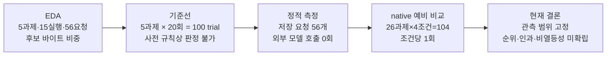
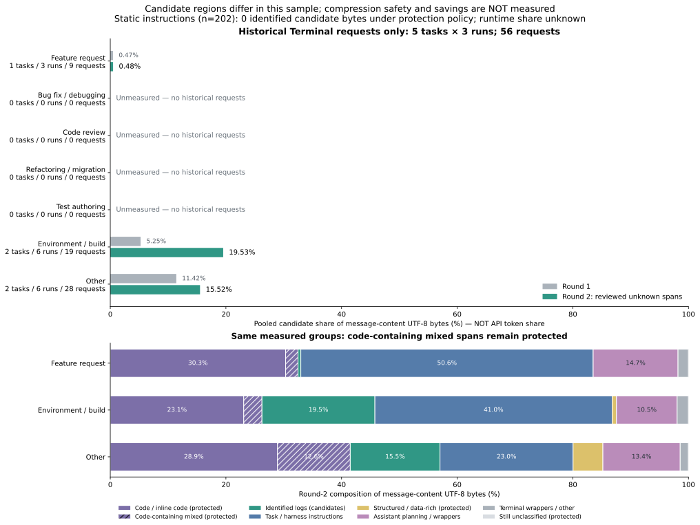

# KT 한 장 브리핑: 지금 확인한 것과 다음 결정

이 문서는 지금까지의 측정을 한 화면 흐름으로 읽기 위한 기본 자료다. **과제**는 풀어야 할 문제 1개이고, **조건**은 같은 문제를 푸는 방식이다. `none`은 아무 작업도 하지 않았다는 뜻이 아니라 **추가 압축 없이 모델이 문제를 푼 기준 조건**이다.

읽는 순서는 **이 30초 요약 → [전체 그림과 쉬운 해설](visualization-guide-20260919.md) → [기술 증거](preliminary-comparison-20260916.md) → [실제 1과제 YAML 안내](../../README.md#try-it-in-five-minutes)**다.

## 30초 요약

- 네 조건이 모두 끝난 범위는 **26과제 × 4조건 = 104조건**이다. 과제 내장 채점 결과는 `pass` 40조건, `wrong_answer` 64조건이었다. 104개의 독립 과제를 푼 것이 아니다.
- 실제 문자열은 23조건의 209구간에서 달라졌다. 그 209구간을 로컬 `o200k_base`로 다시 세면 `97,723 → 50,824`토큰이었다. 전체 API 입력 토큰이나 청구서가 이만큼 줄었다는 뜻은 아니다.
- 모델에 보낸 요청, 외부 API 호출 시도, 성공 응답, 작업에 돌려준 응답은 서로 다른 사건이다. 104조건에서는 네 카운터가 관측상 각각 1,027회로 같았고, API usage로 계산한 비용은 `$22.3333885`였다. 청구서 대사액은 아니다.
- 이 비교는 **조건당 1회**다. 캐시, 요청 수, 모델이 밟은 실행 경로, 조건 간 동시성은 통제하지 못했다. `temperature=0`도 같은 답을 보장하지 않는다. 실제 문자열 변경이 0건인데 판정이 달라진 사례와 채점기의 거짓 실패 사례도 있었다.
- 장기 실행 5개는 `2026-09-17 23:59 KST`에 진행 상태를 본 뒤 운영자가 사후 종료했다. 4개는 운영자 중도 종료, 1개는 HTTP 응답 대기 정체이며 모두 채점 전이라 품질 미확정이다. 확인된 API 계산 비용 `$87.771254`와 usage가 없는 요청 1회의 별도 입력 전용 추정 `$0.1294175`는 26과제 주 분석에 합치지 않는다.

> 이 자료로 제품 도입, 압축기 순위, 품질 비열등성, 전체 사용자 모집단의 비용 절감률을 정하지 않는다. 다음 통제 실험에서 무엇을 고정하고 무엇을 다시 잴지 정하는 데 쓴다.

## 이 자료로 정할 수 있는 것

| 지금 정할 수 있는 일 | 판단 근거 | 아직 필요한 것 |
|---|---|---|
| 다음 실험의 우선순위 | 실제 변경·무변경, 판정 전이, 요청·usage·비용을 함께 관측했다 | 반복 수와 사전 중단 기준 |
| 반드시 분리할 단위 | 변경 구간 로컬 토큰, 전체 API usage, API 계산 비용, 청구서는 범위가 다르다 | 실제 청구서 대사 |
| 실패 분류 방식 | 오답, 기술 미완료, 운영자 중도 종료가 서로 다르다 | 미완료 복구 규약 |
| 공개 결과의 고정 범위 | 증거가 완결된 26과제·104조건 | 대표 표본과 반복 평가 |

## 무엇을 어떤 순서로 쟀나

**그림 1 대체 텍스트.** 목적 선정 5과제의 입력 구성을 살핀 EDA에서 시작해, 5과제 100회 기준선, 모델 호출 없는 정적 측정, 26과제·104조건 native 예비 비교, 현재 결론으로 이어진다. 각 단계의 표본과 단위가 달라 수치를 한 분모로 합치지 않는다.

*그림 1. 단계별 표본은 5과제·15실행·56요청, 100 native trial, 저장 요청 56개, 26과제·104조건이다. 흐름은 증거가 쌓인 순서이지 성능 향상이나 압축 효과의 인과를 뜻하지 않는다.*

| 단계 | 무엇을 쟀나 | 핵심 관측 | 증명하지 않는 것 |
|---|---|---|---|
| 탐색적 데이터 분석(EDA) | 목적 선정 5과제·15실행의 성공 HTTP 56요청에서 압축 후보로 분류한 본문 UTF-8 바이트 비중 | 과제별 0.48%~35.29%, 전체 15.42%; 후보 전부 삭제 가정 22.83% | 달성 압축률, 안전성, 품질, 비용 절감 |
| 추가 압축 없는 기준선 | 같은 5과제를 20회씩 푼 100 native trial의 채점 흔들림 | 사전 규칙이 `stop_inconclusive`를 반환해 비교 허용폭 판정 불가 | 안정된 품질 기준선 |
| 정적 측정 | 저장 요청 56개에 압축기를 적용한 문자열·로컬 토큰 변화 | 외부 모델 호출 0회; 입력 변환의 크기와 표본을 확인 | native 품질, provider usage, 청구 비용 |
| native 예비 비교 | 26과제를 `none`·squeez·Headroom·LLMLingua-2로 각 1회 실행 | 104조건, 40 pass·64 wrong_answer; 23조건·209구간 실제 변경 | 압축기 순위, 인과, 비열등성, 모집단 절감률 |
| 장기 미완료 | 채점 전 끝나지 않은 5개 실행의 요청·응답·usage·종료 상태 | 4개 운영자 중도 종료, 1개 HTTP 정체; 품질 미확정 | pass 또는 wrong_answer |

**그림 2 대체 텍스트.** 과거 Terminal 5과제·15실행·56요청의 종류별 본문 UTF-8 바이트에서 1차와 2차 분류의 후보 비중을 비교한다. 과제가 없는 종류는 미측정이며 API 토큰 비중이 아니다.

*그림 2. 목적 선정 5과제·15실행·56요청에서 후보 바이트 비중은 과제별 0.48%~35.29%, 전체 15.42%였다. 분모는 메시지 본문 UTF-8 바이트이며, 후보 전부 삭제 가정 22.83%도 달성 가능한 압축률이나 검증된 상한이 아니다. 공개 SVG SHA-256은 `89cfaf57fc4c59ff8afd5c71fa6f64bf2c5c7fbf044fd799c21d29f0b0d3ff61`이다.*

## 측정 조건

| 구분 | 고정하거나 기록한 것 | 통제하지 못한 것 |
|---|---|---|
| 모델 | `gpt-5.4`, provider 보고 `gpt-5.4-2026-03-05`; `temperature=0`, reasoning effort `none` | 같은 입력의 결정론 |
| 과제 | Terminal-Bench 2.1 고정 revision과 과제 내장 채점 | 전체 89과제를 대표하는 무작위 표본 |
| 조건 | `none`, squeez `1.48.4`, Headroom `0.36.5`, LLMLingua-2 `0.2.2` | 조건별 반복 실행 |
| 실행 | 과제 이미지·manifest·원격 hash와 복원 재채점 기록 | 캐시, 요청 수, 실행 경로, 조건 간 동시성 |
| 단위 | UTF-8 바이트, 로컬 `o200k_base`, provider usage, usage×가격표 계산 비용을 분리 | 실제 청구서 대사와 조건별 VM 비용 배분 일부 |

`pass`는 실행과 증거 저장이 끝나고 과제 내장 채점을 통과한 상태다. `wrong_answer`는 실행이 끝났지만 그 채점을 통과하지 못한 상태다. 통신·실행·증거 저장이 끝나지 않은 **기술 미완료**와, 운영자가 실행 중 멈춘 **운영자 중도 종료**는 둘 다 품질 판정이 아니다.

기준선의 nginx 2건은 나중 정적 대조에서 동등한 문법을 원본 채점기가 거부한 거짓 실패로 확인됐다. 원래 측정값은 보존하지만 “실제 오답 37건”으로 일반화하지 않는다. 예비 비교도 복원 재채점과 원격 hash를 확인했지만, 이 한 사례만으로 모든 과제의 채점기가 완전히 검증됐다고 말할 수 없다.

## 관측, 가능한 설명, 한계

**관측.** 104조건에서 40개가 pass, 64개가 wrong_answer였다. 23조건의 209구간이 실제로 바뀌었고, 바뀐 구간의 로컬 토큰은 `97,723 → 50,824`였다. 논리 요청·provider HTTP 시도·성공 응답·작업 전달 응답은 각각 1,027회였으며 API usage 기반 계산 비용은 `$22.3333885`였다.

**가능한 설명.** 조건별 요청 수, 캐시 적중, 모델이 밟은 경로와 동시에 실행된 작업이 달라 품질·usage·비용 차이에 함께 섞였을 수 있다. 실제 변경이 0건인데 판정이 바뀐 사례는 이런 실행 변동 가능성과 맞지만, 어느 설명이 원인인지는 갈라 재지 못했다.

**한계.** 조건당 1회이고 목적·후보 중심으로 선택한 표본이다. 기준선 100 trial도 사전 안정 규칙을 통과하지 못했다. 이 자료로는 압축의 인과 효과, 압축기 순위, 품질 비열등성, 전체 모집단 절감률을 계산할 수 없다.

## 실험 설계 10문항

| 질문 | 현재 답 | 빈자리 |
|---|---|---|
| 1. 결과로 무엇을 정하나 | 다음 반복 실험에서 고정할 변수와 수집할 증거를 정한다 | 제품 도입 결정 기준은 없음 |
| 2. 무엇이 가설을 틀렸다고 하나 | 문자열이 안 바뀌거나 판정 차이가 반복 흔들림 안에 있으면 압축 인과 주장을 지지하지 않는다 | 사전 효과 문턱과 기각 규칙 미실행 |
| 3. 움직인 축은 몇 개인가 | 압축 조건 외에 요청 수·캐시·실행 경로·동시성이 함께 움직일 수 있었다 | 한 축만 바꾸는 재설계 필요 |
| 4. 흔들림을 먼저 쟀나 | 5과제×20회 기준선을 쟀지만 사전 규칙상 판정 불가였다 | 26과제 조건별 반복 없음 |
| 5. 판정자를 검증했나 | 내장 채점·복원 재채점·원격 hash를 연결했다 | 거짓 실패 사례가 있어 독립 검증 미완료 |
| 6. 설정이 실제로 통제됐나 | 설정값과 provider 보고 모델을 기록했다 | `temperature=0`도 결정론을 보장하지 않음 |
| 7. 도구가 무엇을 재나 | 변경 구간 로컬 토큰, 전체 API usage, 계산 비용을 분리했다 | 청구서 대사와 VM 사후 배분 일부 미확정 |
| 8. 입력이 개입에 유리한가 | 목적 선정·허용 로그 후보 중심 표본임을 공개했다 | 대표 표본과 외부 타당성 없음 |
| 9. 언제 멈추나 | 과거 규약은 있었지만 장기 5개는 상태 관측 뒤 사후 종료했다 | 재개한다면 사전 중단·검열 처리 규칙 필요 |
| 10. 고객 환경에 묶였나 | 환경값은 새 YAML에서 변수 이름으로 분리한다 | 다른 provider·업무·조직으로의 일반화 미측정 |

## 말할 수 있는 것과 없는 것

| 말할 수 있는 것 | 말할 수 없는 것 |
|---|---|
| 26과제·104조건의 관측 품질 판정은 40/64였다 | 특정 압축기가 더 정확하다 |
| 실제 변경은 23조건·209구간이었다 | 변경이 품질 차이의 원인이다 |
| 변경 구간 로컬 토큰은 `97,723 → 50,824`였다 | API 입력이나 청구액도 같은 비율로 줄었다 |
| 네 요청 카운터는 서로 다른 사건이며 각각 1,027회였다 | 요청 수가 진행률이나 정답 접근도를 뜻한다 |
| API usage 기반 계산 비용은 `$22.3333885`였다 | 청구서 대사액 또는 모집단 절감률이다 |

## KT 논의 순서

1. 먼저 **어떤 결정을 내리려는지** 합의한다. 제품 도입인지, 다음 실험 설계인지 범위를 가른다.
2. 26과제·104조건의 관측과 장기 미완료 5개를 분리해 본다.
3. 변경 구간 로컬 토큰, 전체 API usage, 계산 비용, 청구서의 단위를 섞지 않는다.
4. 실제 변경 0건 판정 전이와 채점기 거짓 실패를 보고 반복·판정자 검증을 설계한다.
5. 반복 수, 캐시·동시성 통제, 사전 중단 기준을 고정한 뒤에만 다음 실행 여부를 정한다.

## 공개 근거

- [KT 쉬운 결과 설명](kt-sharing-20260917.md) — 26과제·104조건의 품질·변경·요청·usage·비용
- [전체 그림과 쉬운 해설](visualization-guide-20260919.md) — EDA 10개, 측정 흐름, 단위별 예비 비교 차트
- [예비 비교 기술 증거](preliminary-comparison-20260916.md) — 조건별 실행 식별자, 원격 hash와 상세 표
- [EDA 원문과 그림 계보](../eda/README.md) · [그림 manifest](../eda/manifest.json) — 5과제·15실행·56요청의 분모와 SVG hash
- [기준선](baseline.md) · [정적 측정](compressors.md) — 100 native trial과 모델 호출 없는 변환 측정
- [실험 기록 색인](README.md) — 현재 결정, 과거 규약과 공개 문서 순서
- [실제 1과제 YAML](../../examples/experiment/benchmark.yaml) · [5분 안내](../../README.md#try-it-in-five-minutes) — 기본 무호출 확인과 명시적 실제 실행 경계

공개 근거는 원문 prompt, credential, endpoint 주소, 비공개 실행 경로를 포함하지 않는다.
