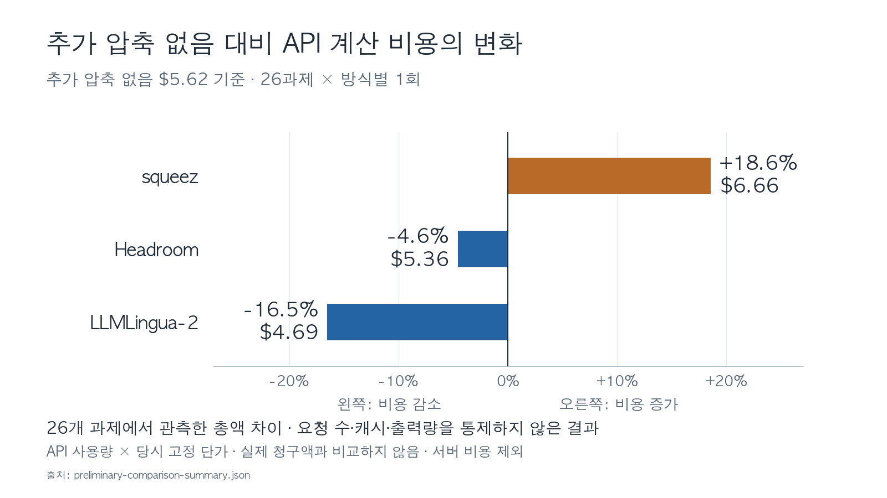
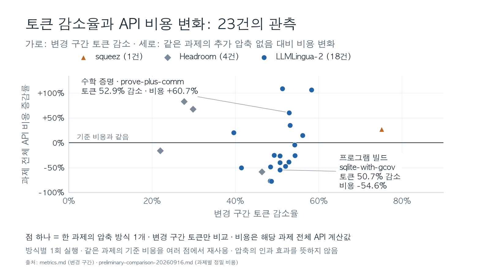
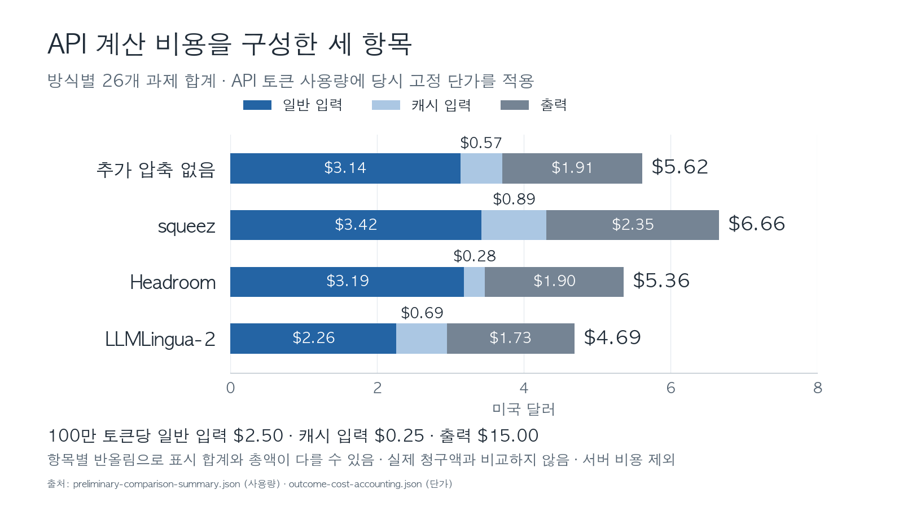
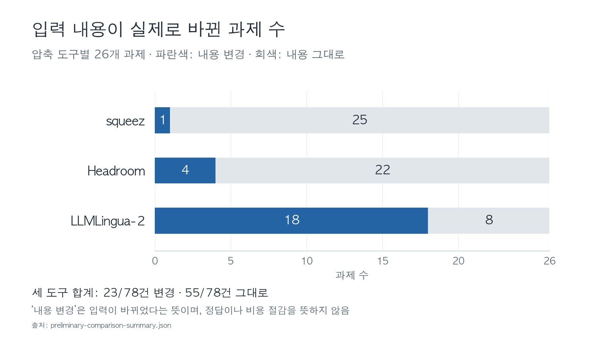
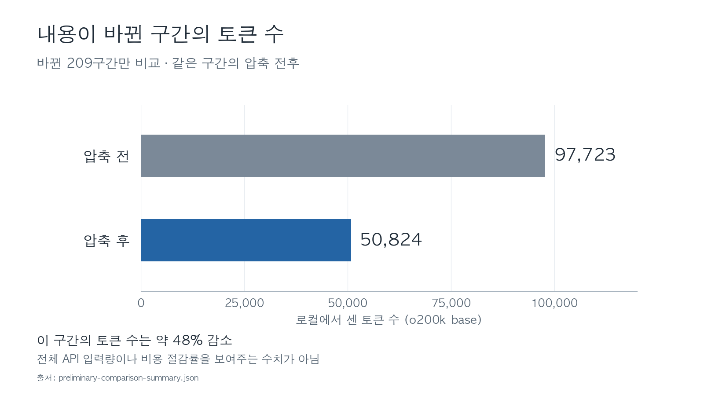
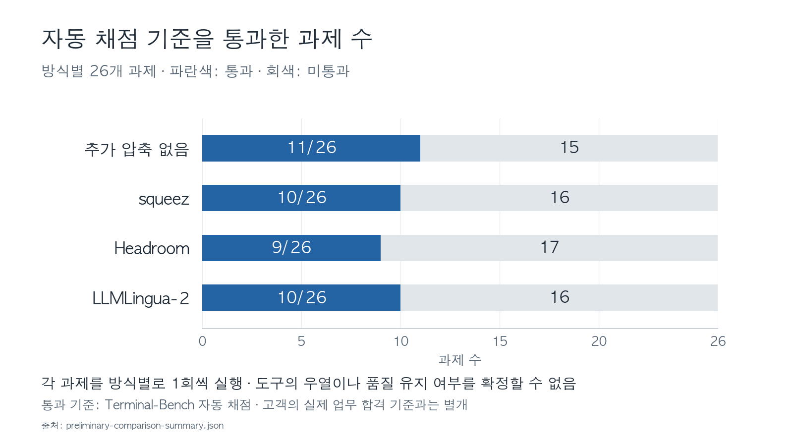
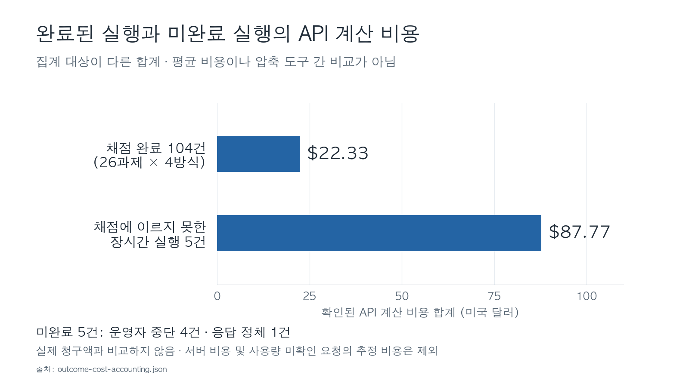

# 토큰 압축과 비용의 관계: KT 공동 실험 결과

**추가 압축 없는 조건보다 API 계산 비용은 LLMLingua-2에서 16.5%, Headroom에서 4.6% 낮았고, squeez에서는 18.6% 높았습니다.**

이번 26과제에서 관측한 차이입니다. 비용이 얼마나 달랐는지부터 보고,
토큰을 줄인 정도와 비용 변화가 함께 움직였는지 확인합니다.
AI가 과제를 풀며 읽는 실행 기록 일부에 세 압축 도구를 적용했습니다.

> **수치 기준:** 2026-09-16~17 UTC, `gpt-5.4`, 같은 26과제를 네 방식으로 각각 1회 실행.
> API 사용량에 당시 고정 단가를 적용한 비용이며 서버 비용은 제외했고 실제 청구액과 비교하지 않았습니다.
> 아래 증감률은 이번 실행의 차이입니다. 압축만의 효과나 KT 운영 업무의 절감률로 확정한 값은 아닙니다.

## 1. 압축 도구를 적용한 뒤 비용은 얼마나 달랐는가

| 방식 | 26과제 API 계산 비용 | 추가 압축 없는 조건 대비 |
|---|---:|---:|
| 추가 압축 없음 | $5.62 | 기준 |
| squeez | $6.66 | **18.6% 높음** |
| Headroom | $5.36 | **4.6% 낮음** |
| LLMLingua-2 | $4.69 | **16.5% 낮음** |

이번 실행에서는 비용이 낮아진 방식과 높아진 방식이 모두 있었습니다.
비용 차이는 반올림 전 금액으로 계산했습니다.

근거: [사용량·비용 집계](../../data/experiment/preliminary-comparison-summary.json).

## 2. 토큰을 더 줄인 실행에서 비용도 더 낮았는가

점 하나는 **한 과제에 압축 방식 하나를 적용한 결과**입니다.
가로축은 바뀐 구간의 토큰 감소율(%)입니다. 오른쪽일수록 많이 줄였습니다.
세로축은 같은 과제의 추가 압축 없는 실행 대비 API 계산 비용 변화율(%)입니다.
0선 아래면 비용이 낮고, 위면 비용이 높습니다.

**입력이 바뀐 23건 중 비용은 14건에서 낮고, 9건에서 높았습니다.**
이 표본에서는 바뀐 구간의 토큰 감소율이 클수록 비용도 더 낮아지는 일정한 관계가 보이지 않았습니다.

*비교 범위: 18개 과제의 변경 23건, 각 1회. 가로축은 바뀐 구간만 다시 센 토큰의 감소율이며,
세로축은 해당 과제를 끝까지 실행한 API 계산 비용의 기준 대비 변화율입니다. 같은 과제의 기준 비용을
여러 압축 방식과 비교한 경우가 있어 23개의 독립 과제는 아닙니다.*

근거: [23건의 변경 구간](01-preliminary-comparison/metrics.md),
[같은 과제의 정밀 비용](01-preliminary-comparison/preliminary-comparison-20260916.md).

## 3. 토큰을 비슷하게 줄여도 비용 방향은 달랐다

아래는 모두 LLMLingua-2를 적용했고, 추가 압축 없는 실행과 압축한 실행이 모두
자동 채점을 통과한 두 사례입니다. 비용이 낮아진 예와 높아진 예를 함께 골랐습니다.

| 과제 | 바뀐 구간의 토큰 감소율 | API 계산 비용: 기준 → 압축 적용 | 비용 변화 |
|---|---:|---:|---:|
| 데이터베이스 프로그램 빌드 (`sqlite-with-gcov`) | 50.7% | $0.22910 → $0.10411 | **54.6% 낮음** |
| 수학 증명 (`prove-plus-comm`) | 52.9% | $0.02682 → $0.04309 | **60.7% 높음** |

바뀐 부분은 두 사례 모두 절반가량 줄었습니다. 그런데 과제 전체에 든 비용은 반대 방향으로
움직였습니다. **줄인 부분의 토큰 수만으로 과제 전체 비용을 예상하기는 어렵습니다.**

*각 사례는 한 번씩 실행한 관측입니다. 표시 금액은 반올림했으며 변화율은 정밀 원값으로 계산했습니다.
두 사례의 채점 결과가 같았다는 사실이 전반적인 품질 유지를 뜻하지는 않습니다.*

근거: [변경 구간과 채점](01-preliminary-comparison/metrics.md),
[과제별 정밀 비용](01-preliminary-comparison/preliminary-comparison-20260916.md).

## 4. 전체 입력 토큰과 비용도 같은 비율로 움직이지 않았다

| 방식 | 전체 API 입력 토큰 변화 | API 계산 비용 변화 |
|---|---:|---:|
| squeez | 39.2% 증가 | 18.6% 증가 |
| Headroom | 32.2% 감소 | 4.6% 감소 |
| LLMLingua-2 | 4.1% 증가 | 16.5% 감소 |

*모두 추가 압축 없는 조건 대비, 같은 26과제의 합계입니다. 여기의 입력 토큰은
API가 보고한 전체 입력량으로, 앞 차트의 ‘바뀐 구간 토큰’과 범위가 다릅니다.*

LLMLingua-2에서는 전체 입력 토큰이 4.1% 많았는데도 계산 비용은 16.5% 낮았습니다.
Headroom에서는 전체 입력 토큰이 32.2% 적었지만 비용은 4.6% 낮았습니다.
비용을 계산할 때 입력 토큰에 모두 같은 단가를 적용하지 않고, 출력 토큰 비용도 더하기 때문입니다.

캐시는 반복되는 입력 처리를 재사용하는 기능입니다. 이번 계산에서는 캐시로 인정된
입력에 더 낮은 단가를 적용했습니다.

**비용 계산에서 확인되는 차이:** LLMLingua-2의 일반 입력 비용은 $3.14에서 $2.26으로,
출력 비용은 $1.91에서 $1.73으로 낮았고 캐시 입력 비용은 $0.57에서 $0.69로 높았습니다.
각 항목을 반올림하기 전에 합하면 앞에서 본 약 $5.62와 $4.69가 됩니다.

*계산 기준: 100만 토큰당 일반 입력 $2.50, 캐시 입력 $0.25, 출력 $15.00.
일반 입력은 전체 입력에서 캐시 입력을 뺀 값입니다. 당시 실험의 고정 단가이며 현재 견적이 아닙니다.*

요청 수도 추가 압축 없음 253회, squeez 277회, Headroom 208회,
LLMLingua-2 289회로 달랐습니다. 이 차트는 비용을 구성한 항목을 보여줍니다.
압축이 요청 수나 캐시 사용량을 바꾼 원인인지는 이번 실험에서 분리해 측정하지 않았습니다.

근거: [API 보고 토큰](../../data/experiment/preliminary-comparison-summary.json),
[당시 고정 단가](../../data/experiment/outcome-cost-accounting.json).

## 5. 이번 비용 관측에서 가져갈 내용

- **방식별 합계:** 이번 26과제의 API 계산 비용은 LLMLingua-2에서 16.5%, Headroom에서 4.6% 낮았고 squeez에서 18.6% 높았습니다.
- **과제별 관계:** 실제 입력이 바뀐 23건에서도 비용이 낮은 14건과 높은 9건이 함께 있었습니다.
- **비용을 설명하는 값:** 압축한 부분의 토큰 감소율과 함께 전체 일반 입력·캐시 입력·출력, 요청 수를 봐야 합니다.

고객 업무의 예상 절감액을 계산할 때는 이 관측값을 그대로 적용하기보다,
해당 업무의 입력·캐시·출력 사용량과 실제 과금 조건에 연결해 확인할 수 있습니다.
이번 결과의 범위는 공개 과제의 예비 관측입니다.

---

측정 범위와 계산 방법

### 무엇을 비교했는가

AI가 문제를 풀면서 읽는 실행 기록 중, 보호 규칙에 따라 압축 대상으로 분류한 후보 구간에만 도구를 적용했습니다.
코드, 구조화된 자료, 지시와 분류가 불확실한 구간은 보호했습니다.
토큰은 AI가 글을 처리할 때 나누는 단위입니다. 글자 수와 정확히 같지는 않습니다.

| 방식 | 이번 실험에서 한 일 |
|---|---|
| 추가 압축 없음 | 입력을 추가로 줄이지 않고 같은 과제를 풀게 함 |
| squeez | 긴 출력의 앞 30개 내용 줄을 남기고 뒤를 줄임 |
| Headroom | 반복되는 파일 경로의 공통 부분을 묶음. 이번에는 이 기능만 사용 |
| LLMLingua-2 | 줄 안에서 남길 토큰을 선택하고 나머지를 줄임 |

> **측정 조건** — 2026-09-16~17 UTC, `gpt-5.4` 사용.
> Terminal-Bench 2.1의 26과제를 네 방식으로 각각 한 번 실행해 104건을 끝까지 채점했습니다.
> 예를 들어 오래된 코드를 새 환경에서 실행하거나, 문서에서 값을 추출하는 과제입니다.
> 통과는 과제에 포함된 자동 채점기의 판정이며, 고객 업무의 수락 판정과는 다릅니다.
> 전체 89과제를 대표하는 무작위 표본은 아닙니다.

같은 문제를 네 방식으로 풀어 본 예비 비교입니다. 104개의 서로 다른 문제를 푼 것은 아닙니다.

근거: [실험 조건과 요약](01-preliminary-comparison/README.md), [26과제 설명](01-preliminary-comparison/tasks.md).

### 이번 문서에서 추가 계산한 값

- 방식별 비용 변화율 = `(압축 방식의 26과제 비용 ÷ 추가 압축 없는 방식의 26과제 비용 − 1) × 100`
- 과제별 비용 변화율 = `(해당 과제의 압축 방식 비용 ÷ 같은 과제의 추가 압축 없는 방식 비용 − 1) × 100`
- 변경 구간 토큰 감소율 = `(변경 전 토큰 − 변경 후 토큰) ÷ 변경 전 토큰 × 100`
- 전체 입력 토큰 변화율 = `(압축 방식의 전체 API 입력 ÷ 추가 압축 없는 방식의 전체 API 입력 − 1) × 100`

과제별 비용은 요약표의 소수 셋째 자리 값 대신 기술 증거의 과제별 정밀 비용을 연결했습니다.
산점도의 비용이 낮거나 높은 건수는 이 비용을 비교한 값이며, 비용 절감의 성공 확률이 아닙니다.
표본 23건에는 같은 과제가 여러 번 포함됩니다. 품질 판정이 동일한 비교는 20건이고,
달라진 비교는 3건입니다. 비용이 낮다는 이유만으로 업무가 성공한 것으로 세지 않았습니다.

비용 구성 차트는 API 토큰 집계에 고정 단가를 곱해 다시 계산했습니다.
이 재계산값과 공개 정밀 비용 합계 사이에는 $0.000007 차이가 있습니다.
원인은 확인하지 못했으나 소수 둘째 자리 표시는 같습니다. 방식별 변화율과 과제별 비교는
공개 정밀 비용을 사용했고, 비용 구성은 토큰으로 다시 계산한 값을 사용했습니다.

차트별 입력과 산식은 [차트 수치·출처](../../figures/briefing-ko/chart-data.json)에 남겼습니다.

입력 변화의 전체 범위와 채점 결과

### 입력이 바뀐 범위

도구를 적용한 78건 중 23건에서 입력 문자열이 바뀌었습니다.
도구를 켰다는 사실만으로 매번 입력이 줄어든 것은 아닙니다.

후보 구간이 없었는지, 후보가 있어도 도구의 규칙이 바꾸지 않았는지는 이 집계만으로 나누지 못합니다.

바뀐 부분만 모아서 다시 세면 약 48% 줄었습니다.
입력과 답변 사용량을 함께 반영한 API 계산 비용은 비용 차트에서 따로 보겠습니다.

*측정 범위: 전후를 다시 계산할 수 있었던 변경 209구간.
원문 쌍이 없는 166건은 계산에서 제외했으며 0으로 채우지 않았습니다.
`tiktoken 0.14.0 / o200k_base`로 센 로컬 토큰입니다.*

근거: [문자열 변화와 측정 범위](01-preliminary-comparison/plain-language-results-20260917.md),
[과제별 변경 대조표](01-preliminary-comparison/metrics.md).

### 과제 통과 수

통과 수는 9~11개였습니다. 이 정도로 품질이 유지됐다고 확정할 수는 없습니다.
한 번씩만 실행해서 원래 실행할 때마다 생기는 차이와 압축 때문에 생긴 차이를 구분하지 못했습니다.

**관측:** squeez와 Headroom에서는 기록된 입력 문자열 변경이 없는데도
추가 압축 없는 기준과 채점 판정이 달라진 비교가 7개 있었습니다.

**가능한 설명:** AI가 문제를 풀어 가는 순서와 요청 수 등이 달라졌을 수 있습니다.
**한계:** 그 원인을 따로 측정하지 않았습니다. 이번 차트로 도구 순위나 품질 유지 여부를 정하지 않습니다.

*측정 조건: 같은 26과제, 방식별 1회. 통과 40건·채점 미통과 64건.
별도 기준선 실험에서 채점기의 거짓 실패 사례도 확인돼, 이 수치는 채점기의 판정으로 읽습니다.*

근거: [채점 결과와 판정 변화](01-preliminary-comparison/plain-language-results-20260917.md).

별도 미완료 비용과 후속 실험 기록

### 채점 전 끝난 실행의 비용

끝까지 채점한 104건의 계산 비용은 22.33달러였습니다.
별도로 오래 진행되다 채점 전에 끝난 5건에서는 확인된 비용만 87.77달러였습니다.
비용을 볼 때는 끝난 작업과 끝나지 않은 작업을 함께 기록할 필요가 있습니다.

5건 중 4건은 운영자가 중도 종료했고 1건은 응답 대기 중 정체됐습니다.
모두 채점 전이므로 오답으로 세지 않습니다.

*측정 범위: 두 막대는 서로 다른 집단의 합계입니다. 장기 5건을 앞의 104건 품질 비교에
합치지 않았습니다. 사용량이 없는 요청 1회의 입력 전용 추정 약 $0.13은 $87.77에 포함하지
않았습니다. 서버 등 전체 운영 비용이나 실험 전체의 최종 지출액을 나타내지 않습니다.*

**추가 검증을 할 경우:** 시작 전에 비용·요청 수·시간의 중단 기준을 정하고,
미완료 비용도 따로 남기는 것이 필요합니다. 이 자료는 중단 기준의 절감 효과까지 측정한 결과는 아닙니다.

근거: [결과별 비용 집계](01-preliminary-comparison/outcome-cost-accounting-20260918.md).

### 후속 실험의 현재 상태

| 후속 실험 | 실제 도달한 단계 | 현재 결과 |
|---|---|---|
| 캐시 재사용과 압축 비교 | 성공 응답 18회를 받았으나 앞선 실행에 대응할 세 번째 요청이 없어 첫 비교를 무효로 중단 | 유효한 비교 0회. 캐시·압축의 비용 효과 미확정 |
| SWE-Lancer 소프트웨어 과제 1개 실행 | 환경 시작이 시간 초과로 끝나 모델 호출과 채점에 도달하지 못함 | 유효한 실행 기록 0개. 품질과 대표 비용 미측정 |

후속 실험도 진행했지만 효과를 비교할 수 있는 결과는 확보하지 못했습니다.
첫 실험에서 확인한 입력 변화는 남아 있고, 비용 절감과 품질 유지의 추가 근거는 아직 없습니다.

*측정 조건: 캐시 실험은 고정 5과제·`gpt-5.4`에서 추가 압축 없음/압축과 입력 재사용 횟수를
비교하려던 별도 실행입니다. 실제로는 추가 압축 없는 첫 실행 묶음만 마쳤고 압축 비교까지 가지 못했습니다.
공개 확정 증거에 실행 시각이 없어 문서 파일명의 날짜를 실행일로 쓰지 않았습니다.*

*SWE-Lancer는 고정 1과제·`gpt-4o` 설정의 실행입니다. 증거 시간 구간은 2026-09-23 UTC입니다.
한 번 실행하기로 했으나 결과 묶음이 2개 생겼고 격리 조건도 성립하지 않아 유효 기록으로
인정하지 않았습니다. 모델과 채점기 호출은 모두 0회였습니다.*

근거: [캐시 후속 결과](02-follow-up/cache-reuse/README.md),
[SWE-Lancer 후속 결과](02-follow-up/swe-lancer/README.md).

정확한 수치와 원문

### 1차 실험의 고정 조건

| 항목 | 원문 기록 |
|---|---|
| 실행일 | 2026-09-16~17 UTC |
| 과제 | Terminal-Bench 2.1, 26과제. 고정 판본 `7131e4375048a0e408a8fb404b5f499d726b695b` |
| 모델 | 요청 `gpt-5.4`, 제공자 보고 `gpt-5.4-2026-03-05` |
| 생성 설정 | `temperature=0`, `reasoning_effort=none`. 같은 답·요청 수를 보장하지 않음 |
| 도구 버전 | squeez `1.48.4`, Headroom `0.36.5`의 경로 묶기 기능, LLMLingua-2 `0.2.2` |
| 반복 | 과제별·방식별 1회, 104건 완결 |
| 입력 언어 | 본 요약의 근거 문서에서 단일 언어 조건을 확인하지 못함. 한국어 업무 검증으로 해석하지 않음 |
| 서비스 연결 | 모델 API의 사용량 기록을 사용. 연결 환경의 상세는 기술 증거에서 확인 |
| 품질 | 과제 내장 채점, 작업공간 복원 뒤 재채점과 원격 자료 검증 |
| 미통제 조건 | 캐시, 요청 수, 실행 경로, 조건 간 동시성 |
| 금액 표기 | 달러 소수 둘째 자리 반올림. 합계는 반올림 전 원본으로 계산 |

### 수치 확인

| 표시 값 | 정확한 값 또는 산식 | 근거 |
|---|---|---|
| 변경 23 / 압축 적용 78건 | `(1 + 4 + 18) / (26 × 3)` | [집계 JSON](../../data/experiment/preliminary-comparison-summary.json) |
| 바뀐 구간 약 48% 감소 | `(97,723 − 50,824) ÷ 97,723 × 100` | 같은 집계의 `changes` |
| 통과 11 / 10 / 9 / 10건 | 방식별 분모 26건 | 같은 집계의 `quality` |
| 비용 $5.62 / $6.66 / $5.36 / $4.69 | `$5.61866 / $6.663187 / $5.3620835 / $4.689458` | 같은 집계의 `calculated_cost` |
| 완결 104건 $22.33 | `$22.3333885` | [비용 JSON](../../data/experiment/outcome-cost-accounting.json) |
| 장기 미완료 5건 $87.77 | `$87.771254`. 사용량 없는 1요청의 입력 전용 추정 `$0.1294175` 제외 | 같은 집계의 `pre_quality` |
| 무변경인데 판정이 달라진 7개 비교 | squeez 3개 + Headroom 4개 | [쉬운 설명](01-preliminary-comparison/plain-language-results-20260917.md) |

### 더 자세한 근거

- [1차 한 장 요약](01-preliminary-comparison/README.md), [26과제 목록](01-preliminary-comparison/tasks.md)
- [1차 기술 증거](01-preliminary-comparison/preliminary-comparison-20260916.md), [결과별 비용](01-preliminary-comparison/outcome-cost-accounting-20260918.md)
- [후속 캐시 전체 보고서](../../docs_en/experiment/02-follow-up/cache-reuse/execution-20260923.md)
- [후속 SWE-Lancer 전체 보고서](../../docs_en/experiment/02-follow-up/swe-lancer/fixed-trace-20260923.md)
- [차트 수치와 출처 해시](../../figures/briefing-ko/chart-data.json), [차트 생성 코드](../../scripts/render_briefing_charts.py)

### 문서 범위

실행 명령, 로그 식별자·해시, 전체 과제별 표, 초기 입력 분류의 세부 차트,
부분적으로만 연결된 결과별 비용 평균은 원문에 남겼습니다.
해석에 필요한 표본·개입·분모·계산 방식·미확정 범위는 본문과 부록에 유지했습니다.
본문은 비용 차이와 토큰 감소의 관계 순으로 재구성했고 품질·미완료 비용·후속 상태는 부록에 옮겼습니다.
기존 실험 색인에는 후속 실행 전 설명이 남아 있어, 후속 상태는 위의 개별 보고서를 기준으로 했습니다.

<!-- 원본 근거: repository commit 1677a54cced87b8b8aad7128760608c92a0a9ee3.
비용 중심 개편: 기존 공개 집계와 과제별 정밀 비용에서 증감률·산점도·비용 구성을 추가 계산함.
새 실험 실행 없음. 품질·미완료·후속 기록은 삭제하지 않고 부록에 유지함.
-->
