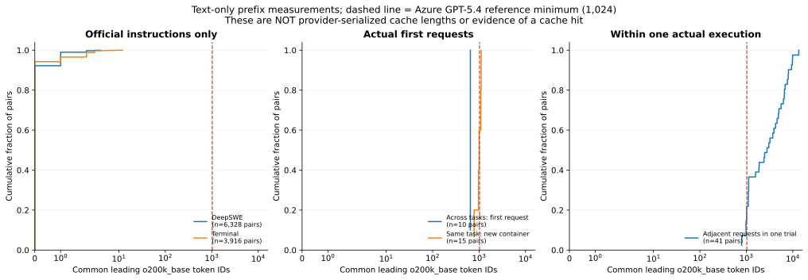
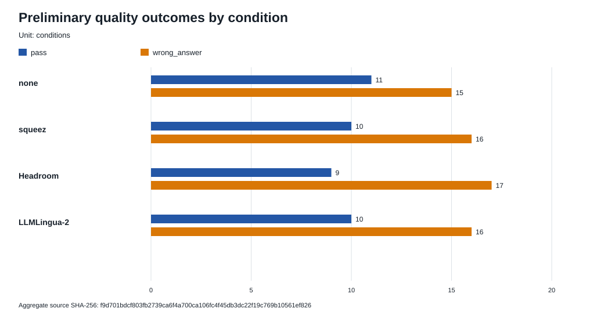
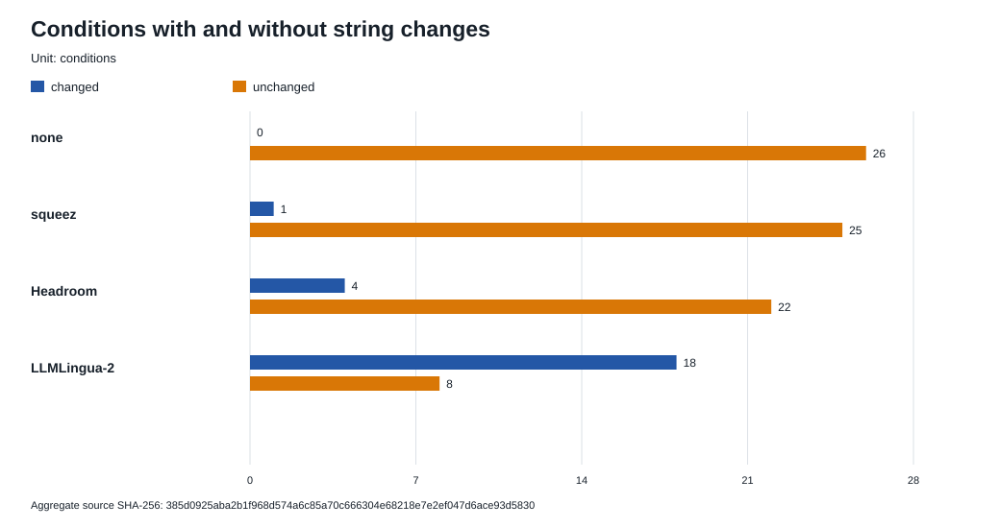
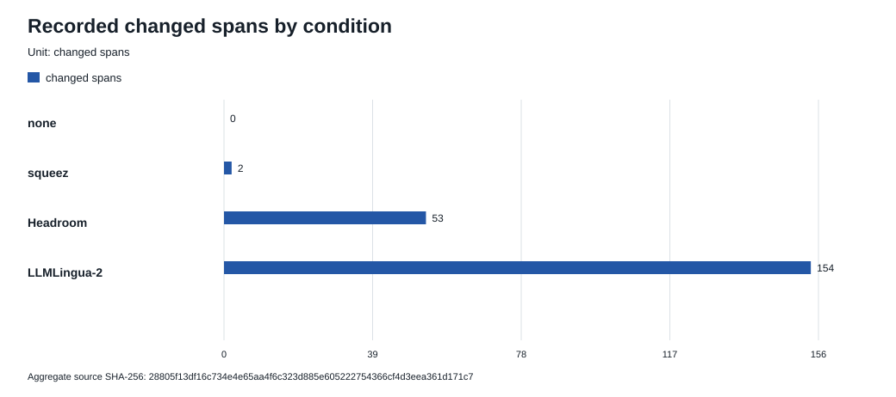
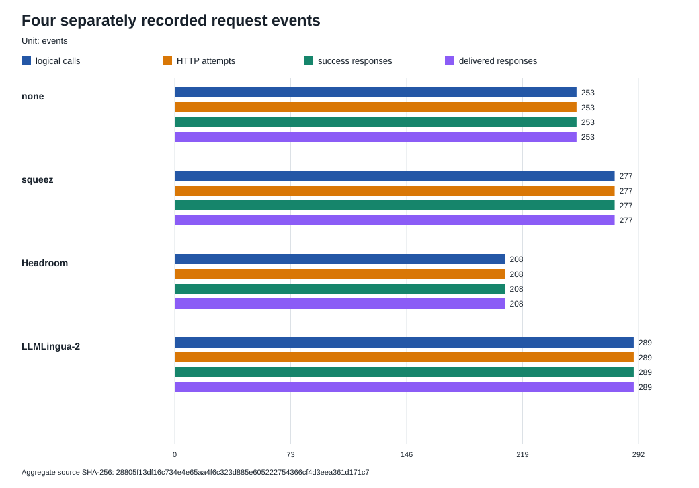
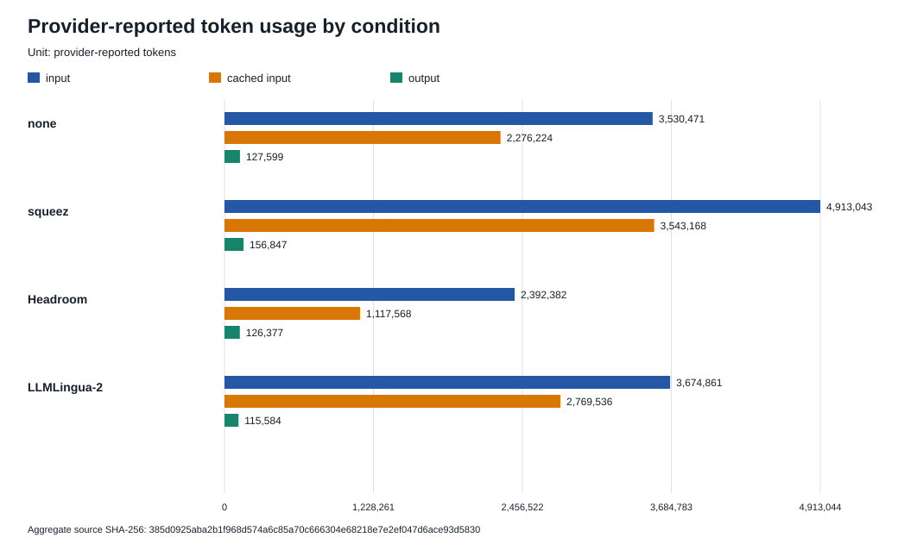
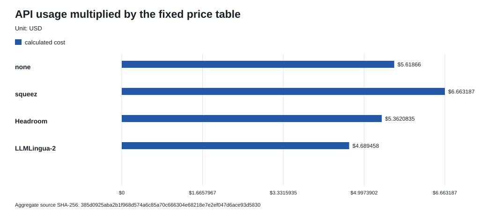

# KT 시각화 부록: 그림을 오해 없이 읽는 법

이 문서는 [KT 공유용 쉬운 설명](kt-sharing-20260917.md)과 [30초 브리핑](kt-briefing-20260919.md)을 본 뒤 전체 그림을 확인하는 곳이다. **탐색적 데이터 분석(EDA)**은 본 실험 전에 입력의 크기와 구성을 살펴보는 작업이다. **native 실행**은 실제 모델이 과제를 풀고 과제 내장 채점기가 답을 확인하는 실행이다. **조건**은 같은 문제를 푸는 방식이며, `none`은 아무 작업도 하지 않았다는 뜻이 아니라 추가 압축이 없는 기준이다. **외부 모델 서비스(provider)**는 요청을 처리하는 API 제공자다. **API 사용량**은 이 서비스가 보고한 전체 입력·캐시·출력 토큰이다.

## 30초 읽는 법

1. 먼저 측정 흐름을 본다. 단계마다 표본과 단위가 달라 숫자를 서로 더하지 않는다.
2. EDA 그림 10개는 과거 입력의 구성과 후보 범위를 보여 준다. 달성 압축률이나 품질 결과가 아니다.
3. 예비 비교 그림 6개는 증거가 완결된 **26과제·104조건**만 보여 준다. 조건당 1회라 순위·인과·비열등성을 말할 수 없다.
4. 변경 구간의 로컬 토큰, 전체 API 사용량, 사용량에 가격표를 곱한 계산 비용은 서로 다른 측정값이다. 청구서와도 다르다.

> **인용 규칙:** 그림 번호만 떼어 인용하지 않는다. 반드시 표본·분모·단위와 “증명하지 않는 것”을 함께 쓴다. `0`은 실제로 0을 관측한 자리에서만 쓰며, 미측정·무표본·원문 누락을 0으로 바꾸지 않는다.

## 측정 흐름

[브리핑의 글자 기반 흐름도(Mermaid)](kt-briefing-20260919.md#무엇을-어떤-순서로-쟀나)는 EDA → 기준선 → 정적 측정 → native 예비 비교 → 현재 결론의 순서를 보여 준다.

| 항목 | 내용 |
|---|---|
| 표본 | EDA 5과제·15실행·56요청, 기준선 5과제×20회, 정적 저장 요청 56개, 예비 비교 26과제·104조건 |
| 분모·단위 | 단계별로 다름. 과제·실행·요청·조건을 합치지 않음 |
| 관측 | 서로 다른 질문에 답한 증거가 이 순서로 쌓임 |
| 증명하지 않는 것 | 단계가 뒤로 갈수록 성능이 좋아졌다는 뜻이나 압축 효과의 인과 |

파일이 바뀌지 않았는지 확인하는 브리핑의 **SHA-256 검증값**: `b3de69bf11bce4d53042233d038441ca1909df72997e04db74befc803c866661`

## EDA 그림 10개

다음 그림은 [EDA 그림 목록 파일](../eda/manifest.json)에 고정된 순서와 SHA-256을 그대로 따른다.

### EDA 1. 과제 종류 분포

*DeepSWE 113과제와 Terminal-Bench 2.1 89과제를 같은 주 종류 기준으로 나눈 그림이다.*

| 항목 | 내용 |
|---|---|
| 표본 | DeepSWE 113과제·Terminal 89과제 |
| 분모·단위 | 각 벤치마크 과제 수·과제/% |
| 관측 | 두 과제 집합의 종류 구성이 같지 않고, 혼합 과제에는 분류 모호함이 남음 |
| 증명하지 않는 것 | 모델 성능, 압축률, 두 벤치마크의 우열 |
| 원본 SHA-256 | `8a2f83048fcdc865b36152c96ead0f796a125bb5e208af9483bda14f51328236` |

### EDA 2. 저장소·언어·작성자 분류

*과제가 어느 저장소·언어·작성자 분류에 몰려 있는지 보여 주는 메타데이터 집계다.*

| 항목 | 내용 |
|---|---|
| 표본 | DeepSWE 113과제·Terminal 89과제 |
| 분모·단위 | 각 벤치마크 과제 수·과제/% |
| 관측 | 저장소·언어·종류·작성자 난이도 분포가 고르지 않음 |
| 증명하지 않는 것 | 이번 모델이 쉽거나 어렵게 느낀 정도, 모집단 대표성 |
| 원본 SHA-256 | `29e95d987133ac1405a85a0d77a9249783eb7136d16242d8b66cf66cc14887f7` |

### EDA 3. 공식 지시문 크기

*공식 지시문의 파일 크기와 로컬 토큰 수 분포를 따로 그렸다.*

| 항목 | 내용 |
|---|---|
| 표본 | 공식 DeepSWE 113과제·Terminal 89과제 |
| 분모·단위 | 지시문 파일·UTF-8 바이트/로컬 `o200k_base` 토큰 |
| 관측 | 과제별 지시문 크기와 로컬 토큰 수가 넓게 퍼져 있음 |
| 증명하지 않는 것 | API 청구 토큰, 실제 모델 요청 전체 크기, 비용 |
| 원본 SHA-256 | `0e031cbf23bcfdfb4ed0f689c484fde0d185d88fc7e65730032bb18851c0dd7f` |

### EDA 4. 과제 종류별 입력 크기

*공식 지시문과 과거 실제 요청을 섞지 않고 종류별 크기 분포로 나눴다.*

| 항목 | 내용 |
|---|---|
| 표본 | 공식 DeepSWE 113과제·Terminal 89과제·과거 Terminal 56요청 |
| 분모·단위 | 지시문/요청 본문·UTF-8 바이트/로컬 토큰 |
| 관측 | 입력 종류와 과제 종류에 따라 크기 분포가 다름 |
| 증명하지 않는 것 | API 입력 토큰, 청구 비용, 압축 가능성 |
| 원본 SHA-256 | `e86b10585914a2d2e8f70c2ddfaaebb1d3bc1ac9729d4429a9bc000a431abf60` |

### EDA 5. 입력 본문 구성

*지시문과 요청 본문을 구간 종류로 분류해 UTF-8 바이트 비중을 비교했다.*

| 항목 | 내용 |
|---|---|
| 표본 | 공식 지시문 113개·89개, Terminal 실제 요청 56개 |
| 분모·단위 | 각 입력층 본문 UTF-8 바이트 합계·% |
| 관측 | 공식 지시문과 실제 요청의 본문 구성이 서로 다름 |
| 증명하지 않는 것 | 각 구간을 안전하게 삭제할 수 있음, 달성 압축률 |
| 원본 SHA-256 | `57aa286750015af99651a230834ed458a20936a0afa189cbcb8c32bb9a98440c` |

### EDA 6. 과제별 1차 후보 비중

*목적에 맞춰 고른 5과제에서 1차로 식별한 후보·미분류·보호 구간을 나눴다.*

| 항목 | 내용 |
|---|---|
| 표본 | 5과제·각 3실행·56요청 |
| 분모·단위 | 과제별 본문 UTF-8 바이트 합계·% |
| 관측 | 후보로 분류된 바이트 비중이 과제마다 크게 다름 |
| 증명하지 않는 것 | 실제 압축 결과, 안전성, 품질, 대표 표본의 절감률 |
| 원본 SHA-256 | `dea914de8808b7ec7746d01f0b60af449a38ada5473cfce3f3ca4f49ee52f5f6` |

### EDA 7. 미분류 구간 재검토

*처음에 미분류였던 158,258바이트를 7개 범주로 다시 나눈 기록이다.*

| 항목 | 내용 |
|---|---|
| 표본 | 서로 다른 58종·재전송 포함 168회·56요청·5과제 |
| 분모·단위 | 미분류 158,258바이트/전체 본문 824,301바이트 |
| 관측 | 과거 미분류 영역 안에도 후보와 보호 대상이 함께 있었음 |
| 증명하지 않는 것 | API 토큰 비중, 실제 절감률, 다른 요청에 대한 분류 정확도 |
| 원본 SHA-256 | `47970d1c9203dc4d838930271e9e8c6518725c1289aa77fd4d5d6a04a07bc841` |

### EDA 8. 과제 종류별 후보 비중

*1차와 2차 분류의 후보 비중을 과제 종류별로 비교하되 코드가 섞인 구간은 보호했다.*

| 항목 | 내용 |
|---|---|
| 표본 | Terminal 5과제·15실행·56요청 |
| 분모·단위 | 종류별 본문 UTF-8 바이트 합계·% |
| 관측 | 이 목적 표본의 후보 비중은 과제별 0.48%~35.29%, 전체 15.42%였음 |
| 증명하지 않는 것 | 무표본 종류의 값, 달성 압축률, 후보 전부 삭제 가능성 |
| 원본 SHA-256 | `89cfaf57fc4c59ff8afd5c71fa6f64bf2c5c7fbf044fd799c21d29f0b0d3ff61` |

### EDA 9. 로컬 토큰과 API 입력 토큰

*같은 과거 요청의 로컬 본문 토큰과 provider가 보고한 API 입력 토큰을 대조했다.*

| 항목 | 내용 |
|---|---|
| 표본 | Terminal 5과제·15실행·56요청 |
| 분모·단위 | 요청/실행·API 사용량 토큰/로컬 본문 토큰 |
| 관측 | 두 토큰 수는 가깝지만 동일하지 않음 |
| 증명하지 않는 것 | 청구서 대사, 새 실행의 토큰 수, 압축 절감률 |
| 원본 SHA-256 | `70b9a531e5bfa66d5264fd04241c229f0b4ac04b03f923373a567ed11ae48cca` |

### EDA 10. 공통 선두 토큰 길이

*지시문 쌍과 요청 쌍이 앞에서부터 몇 개의 로컬 토큰 ID를 공유하는지 계산했다.*

| 항목 | 내용 |
|---|---|
| 표본 | 정적 지시문 쌍 6,328/3,916·과거 요청 쌍 41/10/15 |
| 분모·단위 | 비교층별 쌍 수·공통 선두 로컬 토큰 ID 길이 |
| 관측 | 비교층마다 공통 선두 길이 분포가 다름 |
| 증명하지 않는 것 | 실제 캐시 적중, 캐시 청구, 독립 표본 |
| 원본 SHA-256 | `94f9a6f0c510530c676bafffd5f059e81a31345f9454510192a5f6c649a724e4` |

## 예비 비교 결과 차트 6개

모든 차트는 [공개 집계 JSON](../../data/experiment/preliminary-comparison-summary.json)을 [생성 코드](../../src/experiment_figures.py)로 그렸다. 집계 JSON SHA-256은 `f9d701bdcf803fb2739ca6f4a700ca106fc4f45db3dc22f19c769b10561ef826`이며, 원문은 [KT 쉬운 결과 설명](kt-sharing-20260917.md)의 표다.

### 결과 1. 품질 판정

*증거가 완결된 104조건에서 `pass` 40개와 `wrong_answer` 64개를 조건별로 나눴다.*

| 항목 | 내용 |
|---|---|
| 표본 | 26과제×4조건=104조건·조건당 1회 |
| 분모·단위 | 완결 조건 104개·조건 수 |
| 관측 | 조건별 통과 수는 none 11, squeez 10, Headroom 9, LLMLingua-2 10 |
| 증명하지 않는 것 | 압축기 순위, 품질 비열등성, 압축이 판정을 바꾼 원인 |
| SVG SHA-256 | `8893f95f4735855cbcc37ccab9a214f3c4efb9764ee1527a07f052e807ed97d4` |

### 결과 2. 문자열 변경이 있었던 조건

*104조건 중 23조건에서 실제 문자열이 달라졌고 81조건에서는 달라지지 않았다.*

| 항목 | 내용 |
|---|---|
| 표본 | 26과제×4조건=104조건·조건당 1회 |
| 분모·단위 | 완결 조건 104개·조건 수 |
| 관측 | 변경 조건은 none 0, squeez 1, Headroom 4, LLMLingua-2 18 |
| 증명하지 않는 것 | 변경 크기, 품질 영향, API 사용량 감소 |
| SVG SHA-256 | `33b33909d5ca42467fb0d03a5dc898ef203f3c9f0bce093c9df3b27922faf411` |

### 결과 3. 실제 변경 구간 수

*실제로 달라진 구간 209건을 조건별로 나눴다. 계산 가능한 738쌍 중 529쌍은 같았고 원문이 없는 166건은 미측정이다.*

| 항목 | 내용 |
|---|---|
| 표본 | 보존 원문으로 대조 가능한 738쌍, 변경 209건 |
| 분모·단위 | 조건별 확인된 변경 구간·구간 수 |
| 관측 | 변경 구간은 none 0, squeez 2, Headroom 53, LLMLingua-2 154 |
| 증명하지 않는 것 | 누락 166건의 값, 전체 요청 토큰 감소, 안전성 |
| SVG SHA-256 | `7c0bf97593ba3b7209787a7efdbf2f64976b3301368d92171d1eaf8150f0a59b` |

변경된 209구간만 로컬 `o200k_base`로 다시 세면 `97,723 → 50,824`토큰이다. 이 값은 다음 API 사용량 차트의 분모가 아니다.

### 결과 4. 요청과 응답 사건

*네 카운터는 관측상 조건별 값과 총합이 같았지만, 요청 수신·외부 전송·성공 수신·작업 전달이라는 서로 다른 사건이다.*

| 항목 | 내용 |
|---|---|
| 표본 | 증거가 완결된 104조건 |
| 분모·단위 | 각 사건을 기록한 횟수·사건 수 |
| 관측 | 네 카운터의 총합이 관측상 각각 1,027회였음 |
| 증명하지 않는 것 | 작업 완료율, 답에 가까워진 정도, 네 사건이 같은 개념임 |
| SVG SHA-256 | `8f351a39e1e9d8c919025b0411c0d7e0f5ab56241efe94cd3b843cd0ef6c3c3d` |

### 결과 5. 전체 API 사용량

*전체 API 사용량은 입력 14,510,757토큰, 그중 캐시 입력 9,706,496토큰, 출력 526,407토큰이었다.*

| 항목 | 내용 |
|---|---|
| 표본 | 증거가 완결된 104조건 |
| 분모·단위 | 조건별 전체 provider 보고 사용량·토큰 |
| 관측 | 조건별 요청 수와 입력·캐시·출력 토큰이 달랐음 |
| 증명하지 않는 것 | 변경 구간만의 토큰, 캐시 통제, 청구서 대사 |
| SVG SHA-256 | `fb5c582fc34d8e309abf6031406e37197245618fd87a380659245e7c2be9a647` |

### 결과 6. API 계산 비용

*API 사용량에 고정 가격표를 곱한 합은 `$22.3333885`였다. 실제 청구서와 대사하지 않았다.*

| 항목 | 내용 |
|---|---|
| 표본 | 증거가 완결된 104조건 |
| 분모·단위 | 조건별 API 사용량×가격표·USD |
| 관측 | none `$5.6186600`, squeez `$6.6631870`, Headroom `$5.3620835`, LLMLingua-2 `$4.6894580` |
| 증명하지 않는 것 | 청구서 금액, 압축이 만든 절감, 제품 도입 순위 |
| SVG SHA-256 | `cfcde78ed13c120d934b51cf3f606d99e620edfe80af7be1d7a81de67b4e1696` |

## 이 그림으로 말할 수 있는 범위

| 말할 수 있는 것 | 아직 말할 수 없는 것 |
|---|---|
| 목적 표본의 입력 구성과 후보 바이트 범위 | 대표 모집단의 달성 압축률 |
| 26과제·104조건에서 관측한 판정·변경·요청·사용량·계산 비용 | 압축기 순위·인과 효과·품질 비열등성 |
| 단위와 분모가 다른 측정값의 구분 | 변경 구간 토큰을 API 사용량이나 청구서로 환산 |
| 장기 5개가 주 분석과 분리된 품질 미확정 실행이라는 사실 | 중도 종료 실행의 pass 또는 wrong_answer |

## 다음 읽기 순서

1. [예비 비교 기술 증거](preliminary-comparison-20260916.md)에서 조건별 실행 식별자·복원 재채점·원격 hash를 확인한다.
2. [실제 1과제 YAML 실행 안내](../../README.md#try-it-in-five-minutes)에서 기본 무호출 확인과 명시적 `--execute` 경계를 확인한다.
3. 실행 전에는 [공개·비공개 등급](../publication.md)과 [현재 미지원 범위](../../STATUS.md)를 함께 확인한다.
