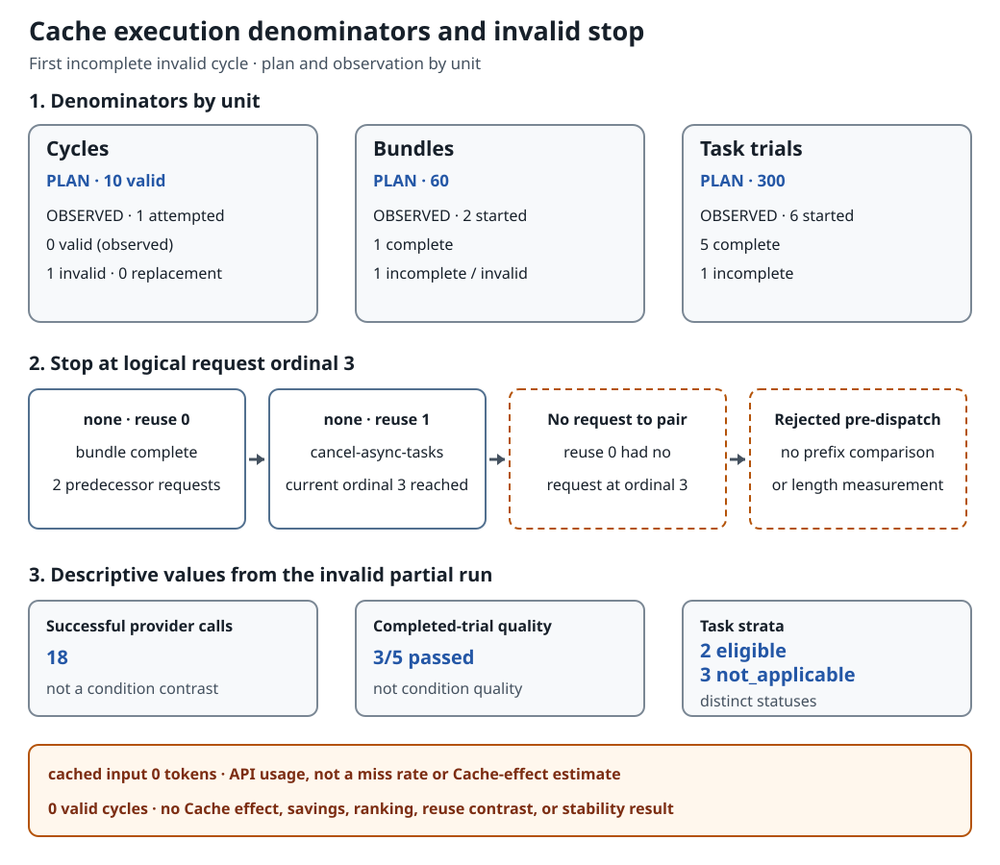

# Cache Reuse Execution: Why the First Comparison Cycle Was Invalid

This page is a short substudy summary and reading guide. The
[complete measured report](execution-20260923.md) remains the evidence source for exact
conditions, hashes, controls, and the public quotation boundary.

## What the run was trying to learn

The run was meant to compare whether repeated input processing could be reused across
requests, and whether compressing the input with `squeez` changed that result. Prompt
caching does not mean replaying a stored answer. It is a provider-specific mechanism that
may avoid reprocessing repeated leading input when the provider recognizes that input as
the same. Its behavior and financial effect depend on provider conditions, so enabling a
cache-related path does not promise savings.

Compression changes the input before a request is sent. In this plan, `none` left the
input uncompressed and `squeez` was the compression intervention. Because compression and
caching act at different stages, the run first had to pair comparable individual requests
from the same task and logical request ordinal. Without those pairs, a difference could not
be interpreted as a reuse or compression effect.

Reuse `0`, `1`, and `2` are not SDK retry counts or three unrelated tasks. Within the same
cycle, compression condition, task, and logical request ordinal, reuse 0 is the first
observation with no admitted predecessor. Reuse 1 follows one successful matching
predecessor, and reuse 2 follows two. Reuse contrasts hold the compression condition fixed;
compression contrasts hold the reuse level fixed. Because compression is the intervention,
this does not require `none` and `squeez` request contents to be byte-identical to each
other.

The provider received real requests, but the run never produced a valid comparison. The
first `none`/reuse-0 bundle completed. In the next `none`/reuse-1 bundle,
`cancel-async-tasks` reached its third
logical request while the reuse-0 predecessor had produced only two requests. There was no
third predecessor request to pair with the current one. Validation therefore stopped the
current request before provider dispatch, preserved the cycle as invalid, and made no
replacement attempt.

The record supports a narrower conclusion: one cycle was attempted and zero valid
comparison cycles were produced. The run did not reach the planned `squeez` condition and
produced no
Cache-effect estimate, cache miss rate, savings estimate, reuse contrast, or stability
result.

## How 18 calls and zero valid cycles can both be true

Those numbers are not contradictory because they count different things. A **task trial**
is one execution of one task. A
**bundle** is the five fixed task trials for one compression condition and one reuse level.
A **valid cycle** requires all six bundles in `{none, squeez}` × reuse `{0, 1, 2}` to
complete and pass the prefix, usage, provenance, and execution checks.

Before the stop, 18 provider calls succeeded. Six task trials had started and five had
completed. Those calls and trials belonged to an incomplete first cycle: only one bundle
completed, and the second bundle stopped partway through. Successful requests do not make
a complete six-bundle comparison, so `18` successful calls, `5` completed trials, and `0`
valid cycles are not competing success rates. They are counts at three different levels.

## Why request three could not be compared

A **request prefix** is the leading compared portion within one individual request's
serialized message content. It is not the leading part of a sequence of whole requests.
The task and logical request ordinal select which individual requests are paired across
reuse levels; request count and ordinal are separate from prefix length in bytes or tokens.

The third request in reuse 1 needed a third request from the same task in reuse 0. The
predecessor execution had only two. No differing prefix or prefix length was measured for
the absent pair; the pair did not exist. This stop also does not erase the earlier
structural screening of common message-content prefixes or imply that every other local
prefix check was absent.

## Execution denominators and stop flow

The figure answers one question: how far did the planned comparison get before it lost a
matching request? Read each denominator on its own row by comparing plan with observation,
then follow the stop sequence from the completed reuse-0 bundle to the rejected ordinal-3
request. The rows are different units, not a funnel or a set of success rates.

*The partial run produced provider responses but never completed the comparison unit. The
stop protected comparability; it did not estimate Cache, reuse, or compression effects.
Open the linked SVG at its source size; every value is retained in the text alternative
below.*

### Complete text alternative

- **Cycles.** The plan called for `10` valid cycles. One was attempted, `0` were valid,
  `1` was invalid, and there were `0` replacements.
- **Bundles.** The plan called for `60`. Two started; `1` completed and `1` remained
  incomplete and invalid.
- **Task trials.** The plan called for `300`. Six started; `5` completed and `1` remained
  incomplete.
- **Request-prefix stop.** The planned order within `none` was reuse `0 → 1 → 2`. The
  reuse-0 bundle completed. In reuse 1, `cancel-async-tasks` reached logical request ordinal
  `3`, but the predecessor execution had only `2` requests. With no predecessor request at
  ordinal `3`, no prefix difference or length was measured; validation rejected the
  current request before provider dispatch.
- **Descriptive values.** The provider returned `18` successful responses, and `3/5`
  completed task trials passed. Neither is a condition- or reuse-effect denominator.
- **Task strata.** Each cell contained five fixed tasks. Two were in the primary
  cache-analysis denominator; three were `not_applicable`.
- **`cached input`.** The provider reported `0` tokens. This was not planned as an effect
  or miss-rate measure and does not mean a Cache effect of `0%` or a miss rate.
- **Claim boundary.** A comparison required valid cycles. The record computed no effect,
  reuse contrast, savings, ranking, or stability result.

## Reading usage, cost, and quality

Across the successful calls, the API reported 65,423 input tokens, 0 cached-input tokens,
and 9,690 output tokens. Cached input is a subset of input, not a third amount to add to
the total. The reported zero does not establish a 0% Cache effect or a cache miss rate,
because there was no valid comparison cycle.

Applying the admitted fixed price schedule produced a calculated input cost of USD
0.1635575, output cost of USD 0.14535, and total API cost of USD 0.3089075. These are
calculations from API-reported usage, not a reconciled invoice; invoice status is
`not_measured`. The maximum-design safety ceiling of USD 721,474.56 is also a control,
not a forecast or actual spend.

The native task verifier passed 3 of the 5 completed task trials. The sixth started trial
did not complete. That `3/5` describes only the completed trials before the integrity stop;
it is not a comparison between `none` and `squeez`, a condition-level quality result, or a
general model-quality claim. The sealed report inspected for this summary contains no
evidence of independent judge validation.

## What the result can and cannot support

**Observation.** The comparability guard rejected the unmatched third request before
provider dispatch. The first cycle remained invalid, with no outer retry or replacement.

**Possible explanation.** The two task executions produced different request counts. A
non-deterministic execution path could produce that pattern, but temperature `0` and
reasoning effort `none` do not establish identical request counts, and this run did not
test that explanation.

**Limit.** The evidence did not isolate whether the request-count difference came from
the model, task, transport, namespace, compression, or another mechanism. With zero valid
cycles, it cannot support an effect, reuse contrast, savings, ranking, non-inferiority,
general quality, or stability claim.

## Measurement conditions

| Item | Fixed or observed condition |
|---|---|
| Execution source | Commit `e78a32edca9d5ce4f991700e3a299d72164e94be`; tree `63f969519c93a58faf800ed91cc464f9b955fe2b` |
| Execution time | The public-safe sealed evidence retains no execution date, time window, or timezone. None is inferred from the filename or publication date. |
| Provider and model | `foundry`; `gpt-5.4`; provider-reported revision `gpt-5.4-2026-03-05` |
| API boundary | `openai_v1_chat_completions` through a project-scoped Foundry endpoint binding; endpoint values and resource identifiers are not published |
| Generation settings | Temperature `0`; reasoning effort `none`; `determinism_claimed=false`. Temperature `0` does not establish identical request counts. |
| Conditions and order | The plan was `{none, squeez}` with reuse `{0, 1, 2}` in the order `0 → 1 → 2`. Reuse contrasts hold compression fixed; compression contrasts hold reuse fixed. In the observed sequence, `none`/reuse `0` completed and `none`/reuse `1` remained incomplete. |
| Task population | Five fixed tasks per cell; two were included in the primary cache-analysis denominator and three were `not_applicable` |
| Planned denominator | Concurrency `1`; initially 10 valid cycles, 60 bundles, and 300 task trials; one extension to at most 20 valid cycles only if the predeclared stability rule required it |
| Usage and cost source | API-reported usage from successful calls, multiplied by the admitted fixed price schedule; not an invoice |
| Judge | The native task verifier applied only to completed trials. The sealed report inspected for this summary contains no evidence of independent judge validation. |

## Detailed usage, cost, and quality

| Observation | Value | Scope |
|---|---:|---|
| Successful provider calls | 18 | Five-task descriptive total from the partial invalid cycle |
| API-reported input | 65,423 tokens | Provider usage |
| API-reported cached input | 0 tokens | Not a Cache-effect estimate or miss rate |
| API-reported output | 9,690 tokens | Provider usage |
| Calculated input cost | USD 0.1635575 | Fixed-price calculation, not an invoice |
| Calculated output cost | USD 0.14535 | Fixed-price calculation, not an invoice |
| Calculated API cost | USD 0.3089075 | Fixed-price calculation, not an invoice |
| Invoice | `not_measured` | No billing reconciliation was performed |
| Completed-trial quality | 3/5 passed | Five completed trials only; the sixth started trial was incomplete |

## Further reading

- [Complete Cache execution report](execution-20260923.md)
- [Public Cache execution contract](../../../../docs/cache-reuse.md)
- [Follow-up study entry](../README.md)
- [한국어 요약](../../../../docs/experiment/02-follow-up/cache-reuse/README.md)
