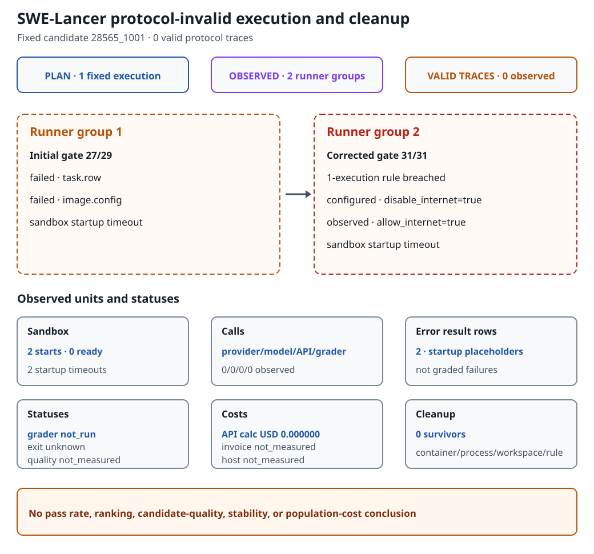

# SWE-Lancer Fixed Execution: Why It Stopped Before Model Dispatch

This page is a short substudy summary and reading guide. The
[complete measured report](fixed-trace-20260923.md) remains the evidence source for exact
conditions, hashes, controls, and the public quotation boundary.

## What the execution was meant to establish

The fixed candidate was supposed to follow one complete path. Before execution, the
selected task row, image, solver, model, and API settings would be checked. The sandbox
would then start, the solver would use the model and any required tools, the grader would
evaluate the result, and the runner would seal both the trace and cleanup state. A valid
protocol trace records that whole chain; it is not merely a directory or an error row left
by the runner.

The plan fixed candidate `28565_1001`, split `diamond`, one `ic_swe` task, the solver,
catalog, selected row, and image. It also fixed concurrency `1`, runner retries `0`, SDK
retries `0`, and exactly one execution. Revision `gpt-4o-2024-11-20` was pinned and
verified in the admitted contract before dispatch. It was not observed in an inference
response, because no inference response occurred.

## What actually happened

Initial pre-dispatch verification passed `27` of `29` checks and failed `task.row` and
`image.config`. A first **runner group** nevertheless appeared after that failed record and
ended in `computer_startup_timeout` while waiting for the sandbox computer to become ready.
A runner group is a separate private output group left by the runner. It is not a provider
request, a model call, or a valid trace.

After owner-controlled inputs were corrected, verification passed `31/31`. The later
green record did not erase the earlier failure. A second runner group then appeared even
though the plan allowed only one execution. During that guarded start, the observer saw
`allow_internet=true` against configured `disable_internet=true`. The second group also
ended in startup timeout.

Both groups stopped before any logical model request, provider HTTP attempt, API or tool
call, or grader call. The valid-protocol-trace count was therefore `0`. The two
`correct=False` rows are startup-error placeholders, not graded failures. They cannot be
used to calculate task quality, pass rate, ranking, stability, or population cost.

## Protocol execution flow

The figure answers why one planned execution produced no valid trace or model evaluation.
First compare the plan with the observed number of runner groups, then read the two groups
in time order. The final status blocks separate sandbox preparation, dispatch, and grading
so that one zero is not mistaken for another.

*Both runner groups ended during sandbox preparation. The error rows are therefore not
graded failures, and zero calls do not establish model quality or total execution cost.
Open the linked SVG at its source size; every status and value is retained in the text
alternative below.*

### Complete text alternative

- **Fixed execution.** Exactly `1` was planned, but `2` runner groups were observed. The
  second group breached the one-execution rule.
- **Initial gate and group 1.** Every pre-dispatch predicate had to pass. Verification was
  `27/29`; `task.row` and `image.config` failed, and the first group then ended in
  `computer_startup_timeout`.
- **Corrected gate and group 2.** Owner-controlled inputs were rechecked at `31/31`. A
  second group then appeared and also ended in `computer_startup_timeout`.
- **Network isolation.** The command configured `disable_internet=true`, while the guarded
  start observed `allow_internet=true`. The isolation predicate did not hold.
- **Sandbox.** The plan was to prepare the sandbox for the one fixed execution. There were
  `2` startup attempts, `0` ready states, and `2` startup timeouts.
- **Calls.** Provider/model/API/grader calls were observed at `0/0/0/0`.
- **Trace and grader.** The target was `1` valid protocol trace. There were `0` valid traces,
  and the grader was `not_run`.
- **Error result rows.** The `2` `correct=False` rows are startup-error placeholders, not
  graded failures. Task quality is `not_measured`.
- **Runner and cost status.** Runner exit is `unknown`; calculated API cost is
  `USD 0.000000`; invoice and host cost are each `not_measured`. This does not establish
  zero host cost.
- **Cleanup.** There were `0` container, process, workspace, Docker-network, or network-rule
  survivors.
- **Claim boundary.** Quality claims require a valid trace and grader result. The record
  supports no pass-rate, ranking, candidate-quality, stability, or population-cost
  conclusion.

## Measurement conditions

| Item | Fixed or observed condition |
|---|---|
| Repository source | Commit `cf8960a6121e91c8ec6a796d470009a27504bf61`; tree `70e0961bf2a3009d9a2c8e36471744be81775daa` |
| Upstream and candidate | `openai/frontier-evals` commit `51052cede8cc608f95bb00346635e03759013e5a`; candidate `28565_1001`; split `diamond`; type `ic_swe`; one task |
| Image and runtime | Pinned Linux/amd64 image on a project-owned private Linux carrier |
| Provider and model | `openai`; model setting `openai/gpt-4o`; request model `gpt-4o`; reported revision `gpt-4o-2024-11-20`, pinned and verified in the admitted contract. No inference response occurred. |
| API boundary | `openai-v1-chat-completions`; credential and sandbox endpoint values and identities are not published |
| Execution settings | Concurrency `1`; multiprocessing, Slack, and registry pull disabled; runner retries `0`; SDK retries `0`; no determinism claim |
| Network condition | The command set `disable_internet=true`; the guarded start observed `allow_internet=true`, so the isolation predicate did not hold |
| Evidence window | `2026-09-23T02:12:29Z` to `2026-09-23T02:18:27.355804Z`, UTC; derived from UTC runner-group names and private run-log modification times, not an independently timed workload duration |
| Judge | The benchmark grader was not invoked. The sealed evidence inspected for this summary contains no independent grader-validation evidence. |

The candidate was fixed from the one `ic_swe` example in the pinned upstream README
before task content was viewed. The earlier
[candidate evaluation](../../swe-lancer-candidate-evaluation-20260920.md) records the
historical admission boundary, not the later protocol-invalid execution result.

## Usage, cost, and quality

| Item | Status | Meaning |
|---|---:|---|
| Provider input / output tokens | 0 / 0 | Observed zero because no provider request was dispatched |
| Cached / reasoning tokens | `not_applicable_no_provider_call` | No provider response existed |
| Calculated API cost | `USD 0.000000` | Provider-usage calculation, not an invoice |
| Provider-reported cost | `not_measured` | Not measured in this record |
| Invoice / host cost | `not_measured` / `not_measured` | Neither was measured in this record |
| Runner exit | `unknown` | No runner-execution record was sealed |
| Grader / task quality | `not_run` / `not_measured` | Error rows are not grader outcomes |

Neither runner group reached provider dispatch, so no provider response existed from which
to read usage fields. The input and output zeros are aggregate counters for that state;
cached and reasoning tokens are `not_applicable_no_provider_call` because those fields
would have come from a provider response. Applying the admitted price schedule to the
recorded provider usage yields `USD 0.000000`. That calculated amount is not a reconciled
invoice and does not establish zero host cost; invoice and host cost are both
`not_measured`. Zero model or API calls also do not make this a successful benchmark or a
quality result.

## What the observations can support

The record directly shows an extra runner group, a guarded start with
`allow_internet=true`, and two sandbox startup timeouts before provider and grader
dispatch. Both private run logs ended while waiting for the sandbox computer to start.
That pattern is consistent with a startup-stage problem, but the evidence did not isolate
image startup, runtime wiring, container health, network handling, or another mechanism as
the cause.

The two-group history breached the one-execution contract, and the network flag breached
the isolation condition. The record therefore cannot establish task pass or failure,
provider reliability, model quality, causality, pass rate, ranking, stability,
non-inferiority, representative performance, or population cost. Admission, carrier,
hash, schema, and cleanup checks validate their own evidence boundaries; they are not
independent model- or grader-quality validation.

## Further reading

- [Complete SWE-Lancer execution report](fixed-trace-20260923.md)
- [Historical candidate evaluation](../../swe-lancer-candidate-evaluation-20260920.md)
- [Runtime-owner handoff](../../../../docs/runtime-owner-handoff.md)
- [Follow-up study entry](../README.md)
- [한국어 요약](../../../../docs/experiment/02-follow-up/swe-lancer/README.md)
